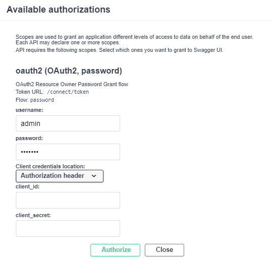
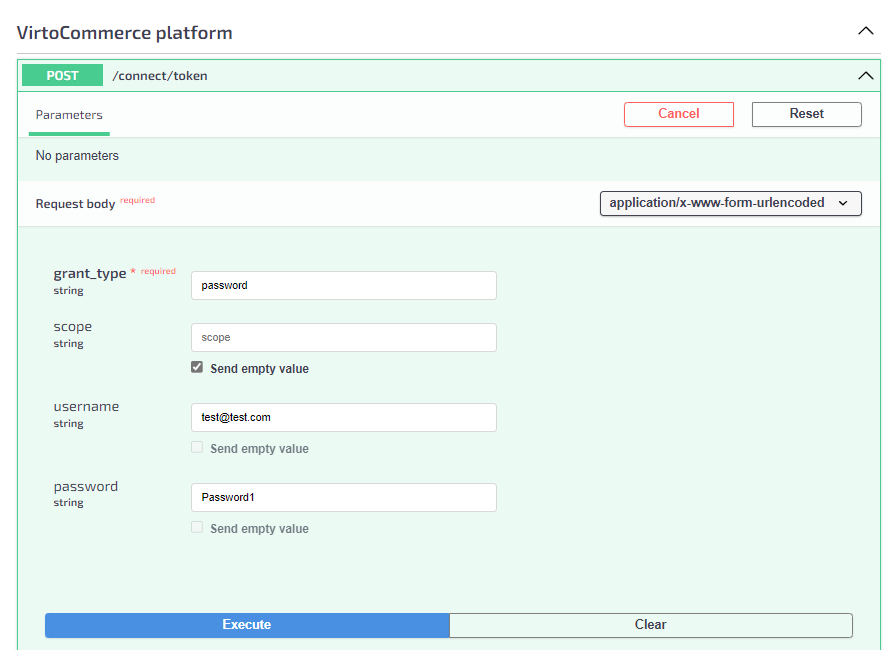
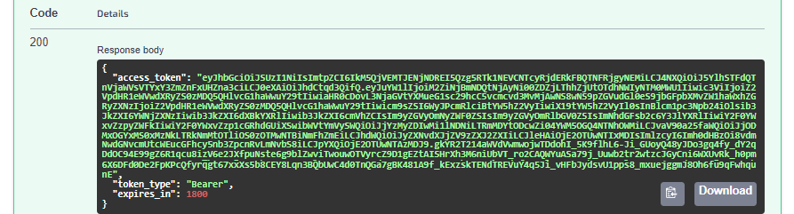

# Authentication

Most xAPI operations run without authentication, but some queries and mutations require a signed-in user. Authorized requests use a bearer token (JWT) issued by the Platform through the OAuth `connect/token` endpoint. The token is sent in the `Authorization` header of the request to the `/graphql` endpoint.

## Get token

To obtain a token:

1. Open the [Virto Commerce API Docs (v1)](https://virtostart-demo-admin.govirto.com/docs/index.html) in your browser.
1. **Authorize** as an administrator or manager.

    {: style="display: block; margin: 0 auto;" }

1. Expand the **VirtoCommerce platform/POST/connect/token** section, fill in the required fields with valid credentials, then click **Execute**.

    {: style="display: block; margin: 0 auto;" }

1. Copy the token that appears in the response field.

    {: style="display: block; margin: 0 auto;" }

You now have a bearer token to authorize xAPI requests.

## Use token

Pass the token in the `Authorization` header as `Bearer <token>`. How you set the header depends on the tool:

* **GraphiQL**: paste the token into the Headers panel, see [GraphiQL](graphiql.md).
* **Postman**: set the token as an environment variable, see [Postman](postman.md#authorization-and-token-usage).
* **Curl**: add the header to the request, see [Curl](curl.md).

The token is now applied, and authorized queries and mutations run without authorization errors.

 
 
********

    <a href="../getting-started">← Getting started </a>
    <a href="../tools-overview">Tools to explore GraphQL →</a>

