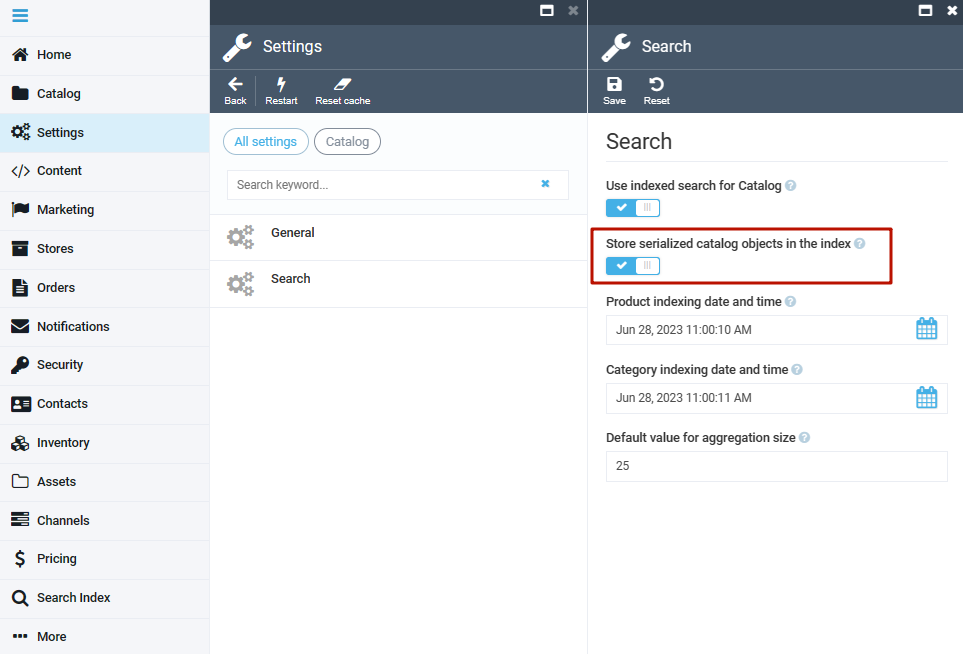

# Get Started

This section explains how to prepare your environment for testing xAPI.

## Prerequisites

* VC Platform 3.0 or higher.
* The Platform is configured to use Elasticsearch engine.
  ```json title="appsettings.json"
  "Search": {
      "Provider": "ElasticSearch",
      "Scope": "default",
      "ElasticSearch": {
          "Server": "localhost:9200",
          "User": "elastic",
          "Key": "",
          "EnableHttpCompression": ""
      },
      "OrderFullTextSearchEnabled": true
  }
  ```

## Presettings

To start using xAPI:

1. In the Platform, open **Settings**.
1. Select **Catalog**.
1. Select **Search**.
1. Enable the **Store serialized catalog objects in index** option:

    {: style="display: block; margin: 0 auto;" }

1. Rebuild the index.

xAPI is now configured and ready for testing.

## Make your first API call

!!! note
    If the xAPI module is not installed out-of-the-box, you can [install it](https://github.com/VirtoCommerce/vc-module-x-api) on the Platform (version 3.0) or higher by following [this guide](../Tutorials-and-How-tos/Tutorials/deploy-module-from-source-code.md). Then restart the Platform.

With the index built, run your first query in the GraphiQL playground:

1. Open **http://{platform url}/ui/graphiql** in your browser.
1. Paste one of the queries below into the left pane.
1. Click the **Play** button to run the query and see the response on the right.

=== "Example 1"
    <div class="grid" markdown>

    ```graphql title="Query 1"
    query {
      product(
        storeId: "B2B-store"
        id: "cc81104c-8528-490b-a7a8-d1fb53ca164b"
        cultureName: "en-US"
        currencyCode: "USD"
      ) {
        id
        name
        descriptions {
          content
        }
      }
    }
    ```

    ```json title="Return 1"
    {
      "data": {
        "product": {
          "id": "cc81104c-8528-490b-a7a8-d1fb53ca164b",
          "name": "Affligem Blond 6x75cl Bottle",
          "descriptions": [
            {
              "content": "qwetest123"
            }
          ]
        }
      }
    }
    ```

    </div>

=== "Example 2"

    <div class="grid" markdown>

    ```graphql title="Query 2"
    query {
      products(
        query: "test"
        storeId: "B2B-store"
        currencyCode: "USD"
        cultureName: "en-US"
      ) {
        items {
          id
          name
          seoInfo {
            metaDescription
          }
        }
      }
    }
    ```

    ```json title="Return 2"
    {
      "data": {
        "products": {
          "items": [
            {
              "id": "05a51f40-c26d-47d4-a0c5-c13ab8f644d9",
              "name": "TEST stock < min",
              "seoInfo": {
                "metaDescription": ""
              }
            },
            {
              "id": "cb05e425-ced1-41bb-a28a-a1d592551bbf",
              "name": "TEST min  < max < stock",
              "seoInfo": {
                "metaDescription": ""
              }
            },
            {
              "id": "b0be673b-61bc-4912-b207-f4c3336f86e7",
              "name": "TEST min < stock < max",
              "seoInfo": {
                "metaDescription": ""
              }
            }
          ]
        }
      }
    }
    ```

    </div>


You have now made your first xAPI call.

## Authorization and token usage

Some GraphQL queries and mutations require a signed-in user. See [Authentication](authentication.md) for how to obtain a token and pass it in your requests.


<br>
<br>
********

<div style="display: flex; justify-content: space-between;">
    <a href="../overview">← Overview </a>
    <a href="../authentication">Authentication →</a>
</div>