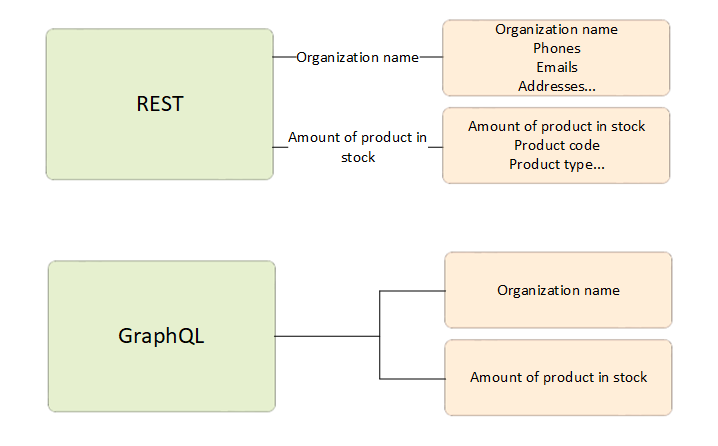
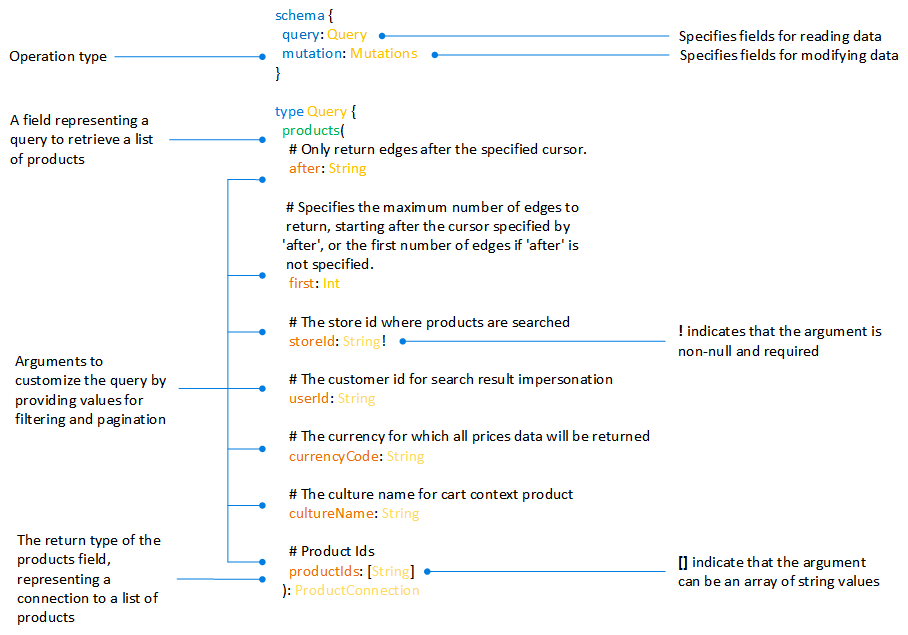
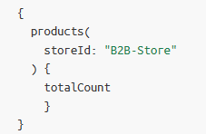
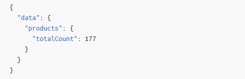
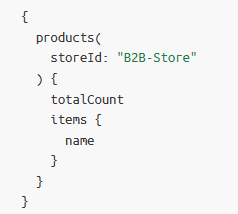
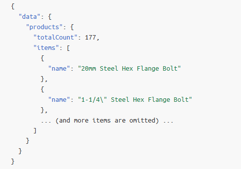
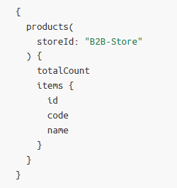
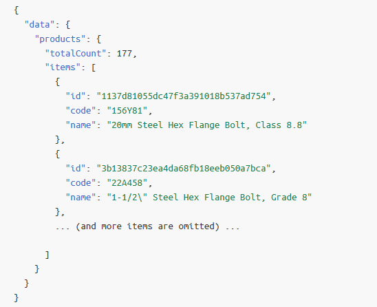
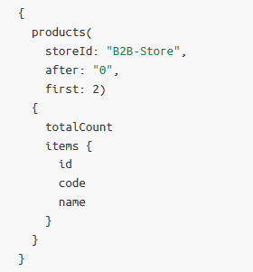
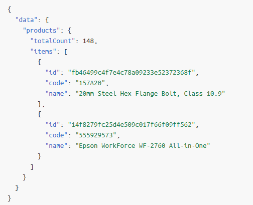

# Overview

The main function of the **Experience API (xAPI)** module is to serve as a middle layer connecting clients and enterprise services using the GraphQL protocol. 

It is closely associated with a particular user or touchpoint experience and ensures quick and dependable access. Additionally, it serves as an implementation of the back end for front end (BFF) design pattern.

# GraphQL core ideas

GraphQL is a new API standard that provides a more efficient, powerful and flexible alternative to REST. When the concept of REST was developed, client applications were relatively simple, and the development pace wasn't nearly where it is today. However, the API landscape has radically changed over the last couple of years. In response to these evolving demands, GraphQL has emerged as a more adaptable solution. With GraphQL, each client can request precisely the data it needs, allowing for more tailored responses. In contrast, REST APIs often provide fixed sets of data, potentially leading to over-fetching or under-fetching of information. 

With GraphQL, clients can optimize their data queries, reducing network load, improving performance, and addressing the more complex and specific data requirements of modern applications. Client customize the endpoints using schema, which provides a description of how the data is structured and contains. Here is an part from Virto Commerce schema:

!!! info
    Another concept to know is a **Variable**. Is is placeholder that allows clients to pass values as arguments to a query or mutation without hard-coding those values directly into the query. Variables are defined in the query or mutation. They are then referenced in the query using the dollar sign ($). This feature makes GraphQL queries more reusable and flexible, as clients can change variable values when making requests.

Our insrtuction provides Virto Commerce related guidelines. 

{: width="25"} [Extensive GraphQL guide](https://graphql.org/learn/)

??? "Sample queries"

    | Query                              	| Sample query                         	                        | Sample return                 	                        |
    |------------------------------------	|--------------------------------------------------------------	|--------------------------------------------------------	|
    | Total amount of items in B2B-store 	|  	          |  	  |
    | Names of all products in B2B-store 	|  	              |  	      |
    | Names, codes, ids of products in B2B-store |           |          | 
    | Show first 2 products from the list |              |  |

## Key сoncepts

* Utilize GraphQL protocol for precise and flexible data retrieval control from the API.
* Achieve fast and dependable indexed search through integration with:
    * [Elasticsearch 8.x](https://www.elastic.co/downloads/elasticsearch)
    * [Elastic App Search](https://www.elastic.co/downloads/app-search)
    * [Azure Search]()
* Maintain autonomy by exclusively relying on the index data source, separate from the rest of the VC data infrastructure.
* Capture tracing and performance metrics for request monitoring.

## Key features

The xAPI project provides the following major features:

- [Catalog](Catalog/overview.md)
- [Cart](Cart/overview.md)
- [Content](Content/overview.md)
- [File](File/overview.md)
- [Marketing](Marketing/overview.md)
- [Order](Order/overview.md)
- [Profile](Profile/overview.md)
- [Push messages](Push-messages/overview.md)
- [Recommend](Recommend/overview.md)
- [Store](Store/overview.md)
- [Quote](Quote/overview.md)

