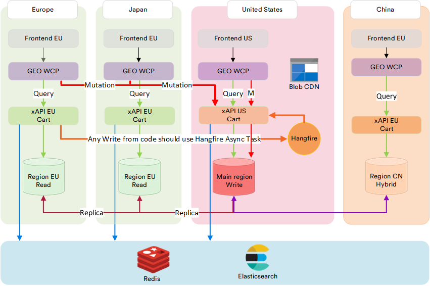

# Multiregional Development

As Virto Commerce deployments grow globally, traffic patterns change. Frontend applications, customer portals, and integrations start generating load from different geographic regions, often far from the primary data center. In such setups, latency, availability, and resilience become just as important as functional correctness.

GraphQL multiregionality in Virto Commerce addresses these concerns by allowing the platform to serve read-heavy workloads locally, while still preserving data consistency and control over writes.

The key idea is simple: not all regions need write access, and not all requests need to hit the primary database.

## Regional Roles: Read-Write and Read-Only Zones

In a multiregional setup, Virto Commerce distinguishes between regions based on their responsibilities:

* Primary (read-write) region: The authoritative region where mutations are executed and where the master database resides.
* Secondary (read-only) regions: The regions serve queries only. They are backed by replicated, read-only databases and are optimized for low-latency access close to users.

This separation is not hardcoded in application logic. Instead, it is achieved through deployment-time configuration, database replication, and traffic routing. No custom code is required to define regions or their roles: this is handled by IT administrators or solution architects as part of infrastructure setup.

## GraphQL’s place Within the architecture

GraphQL already enforces a strong conceptual distinction between queries (read operations) and mutations (write operations). Virto Commerce leverages this distinction directly at the infrastructure level.

GraphQL queries can be safely routed to read-only regions. GraphQL mutations are always routed to the primary, read-write region.

{: style="display: block; margin: 0 auto;" }

Because xAPI is the single business-facing entry point, routing decisions can be made consistently and transparently, without frontend or integration clients needing to understand database topology.

This is one of the key reasons multiregional routing was difficult to implement in earlier REST-centric architectures: REST endpoints often mixed reads and writes, making safe routing far more complex.

 
 
********

    <a href="../update-xapi-modules">← Updating xAPI modules </a>
    <a href="../best-practices">Best practices  →</a>

