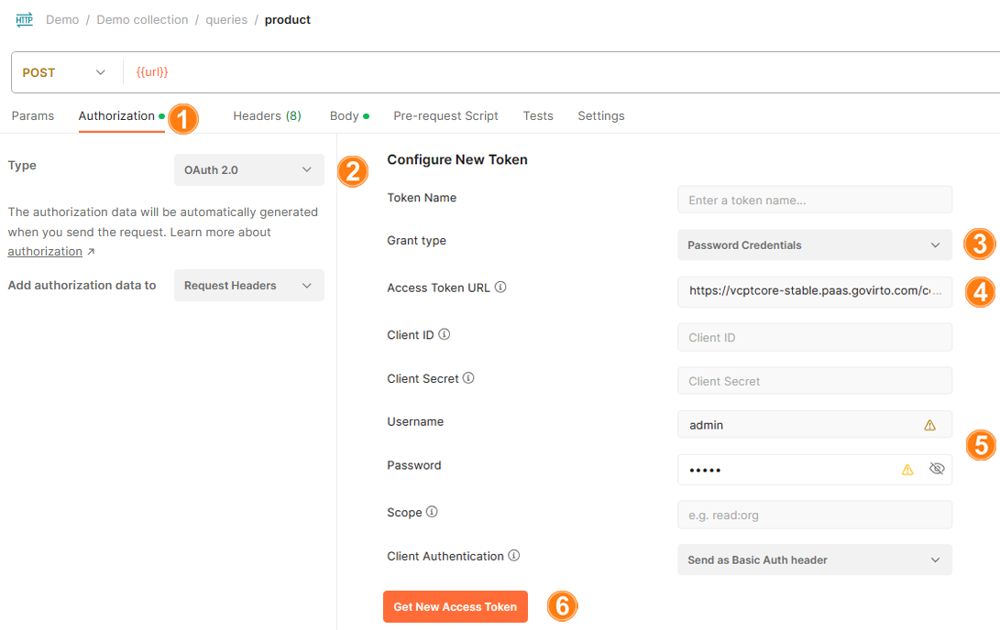
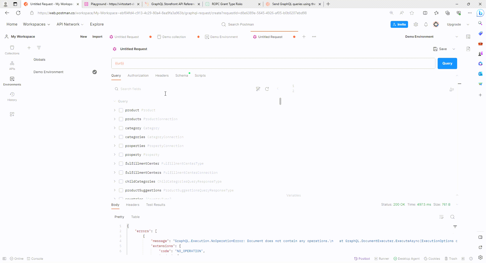
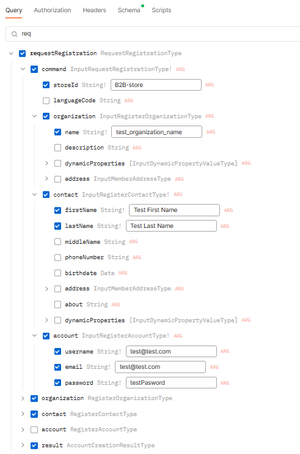
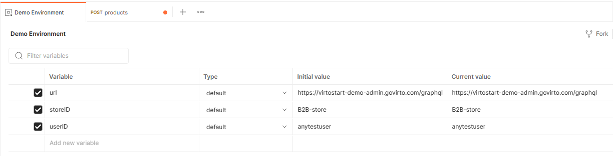
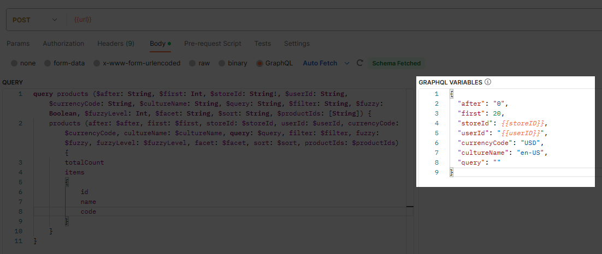
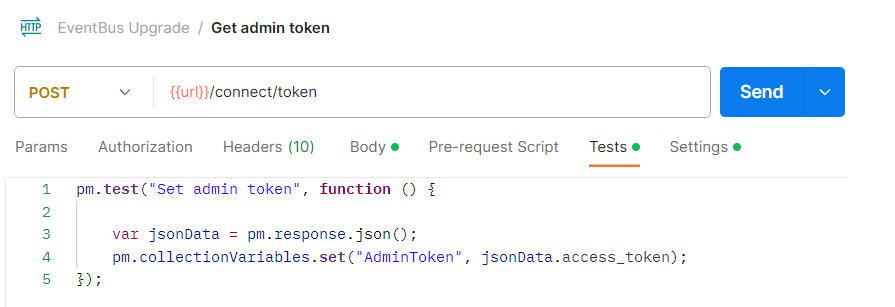
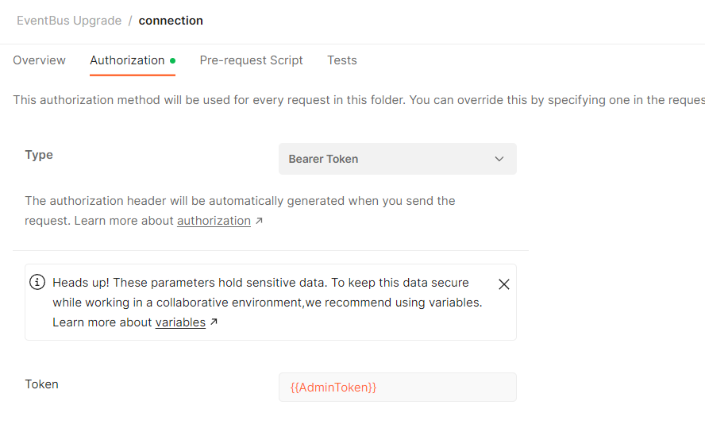

# GraphQL API call from Postman
Many developers use both Postman and GraphiQL to work with GraphQL based on the specific tasks they need to accomplish. Postman provides a wide range of tools for creating, sending, and tracking requests to APIs. Postman allows you to create collections of requests, automate API testing, set up environments, work with variables, create scripts for more complex tests. This guide explains how to make GraphQL API calls using Postman. 

Our instruction contains fundamental guidelines. For more information, refer to the extensive [Postman guide](https://learning.postman.com/docs/introduction/overview/). 

Exploring GraphQL via Postman includes:

* [Importing GraphQL schemas from GraphiQL.](#import-graphql-schemas-from-graphiql)
* [Creating environments.](#create-environment)
* [Using tokens.](#authorization-and-token-usage)
* [Building queries](#build-queries) and [mutations.](#build-mutations)
* [Use variables.](#use-variables)

## Import GraphQL schemas from GraphiQL

Importing schemas is the crucial initial step to begin working with Postman for GraphQL. To import schemas:

1. Open Postman and create a new **Graphql Request**.
1. Enter URL to import GraphQL schema from. 

The schema will be imported in a couple of seconds. In the **Schema** tab, you can refresh your schema at any time.


!!! note
    Postman cannot update your schema automatically. You have to update it manually on a regular basis.


## Create environment

Environments are predefined sets of variables that allow you to configure and switch between different testing and development environments easily. To create an environment:

1. Click on the **Environments** tab in the sidebar. 
1. Click {: width="20"} to create a new environment. 
1. Enter its name. 
1. Copy address from GraphiQL and paste it as initial value.
1. In the APIs tab, select your newly created environment from the dropdown list.


**Example**

This example illustrates how query responses can be adapted to meet specific requirements using variables.

=== "Query" 

    Show total products amount in B2B-store with their:

    * Ids.
    * Names.
    * Images urls.
    * Images ids.
    * Descriptions.

    ```json
    query products ($after: String, $first: Int, $storeId: String!, $userId: String, $currencyCode: String, $cultureName: String, $query: String, $filter: String, $fuzzy: Boolean, $fuzzyLevel: Int, $facet: String,   
        $sort: String, $productIds: [String]) {
        products (after: $after, first: $first, storeId: $storeId, userId: $userId, currencyCode: $currencyCode, cultureName: $cultureName, query: $query, filter: $filter, fuzzy: $fuzzy, fuzzyLevel: $fuzzyLevel, 
            facet: $facet, sort: $sort, productIds: $productIds) {
            totalCount
            items
            {
                id
                name
                images
                {
                    url
                    id
                }
                descriptions
                {
                    languageCode
                    content
                }
            }
        }
    }
    ```

=== "Variables. Sample 1"

    Show first 10 required products in B2B-store.

    ```json
    {
    "after": "0",
    "first": 10,
    "storeId": "B2B-store",
    "query": "",
    "filter": ""
    }
    ```

=== "Variables. Sample 2"

    Show first two Epson products in B2B-Store.

    ```json
    {
    "after": "0",
    "first": 2,
    "storeId": "B2B-store",
    "query": "epson",
    "filter": ""
    }
    ```

=== "Variables. Sample 3"
    
    Filter products by Epson brand. 

    ```json
    {
    "after": "0",
    "first": 2,
    "storeId": "B2B-store",
    "query": "",
    "filter": "brand:epson"
    }
    ```

## Authorization and token usage

In Postman, there are generally two common ways to use tokens, which can be used for authentication in API requests:

* [Generate token via OAuth 2.0 Postman functionality.](#generate-token)
* [Use token as a variable.](#preset-token-as-variable)

### Generate token

To generate token via OAuth 2.0 Postman functionality:

1. Open the **Authorization** tab.
1. From a dropdown list, select **OAuth 2.0** type.
1. Set **Password Credentials** as **Grant Type** to allow exchanging username and password for an access token directly.
1. Enter **Access token URL**. It can be taken:

    * From Swagger.
    * From Platform backend.

1. Enter username and password.
1. Click **Get new access token**.

    

1. The token appears in the new window. Click **Use token** to start using it.

Now all the queries and mutations can use this token.

!!! note
    In the **Authorization** tab, check that the variables are inherited from parent.


## Build queries

In the **Query** tab, let's build a query asking for the total number of products from the **B2B-store** that contain the word **bolt** in their names or descriptions.

1. Check **Products** query in the list of queries and mutations. 
1. Fill in the required fields that are checked automatically (i.e. **B2B-Store**).
1. Add **query** field to narrow down the results. Fill it in with **bolt**.
1. Click **Query** in the top right corner.

There are 26 products in B2B-store that contain the term "bolt" in their names or descriptions.



## Build mutations

In the **Query** tab, let's build a [requestRegistration](Profile/Mutations/requestRegistration.md) mutation to register a **test_organization_name** company and its user named **Test First Name Test Last Name**. 

1. Click **requestRegistration** and fill in the following fields:

    

1. The resulting mutation looks as follows:

    ```json
    mutation RequestRegistration {
        requestRegistration(
            command: {
                organization: { name: "test_organization_name" }
                contact: { firstName: "Test First Name", lastName: "Test Last Name" }
                account: {
                    username: "test@test.com"
                    email: "test@test.com"
                    password: "testPassword"
                }
                storeId: "B2B-Store"
            }
        ) {
            result {
                succeeded
                requireEmailVerification
            }
        }
    }
    ```

1. Click **Query** to execute the mutation.
1. To check the result, open the Platform and click **Contacts** in the main menu.
1. The **Test organization name** company has been successfully created with the user **Test first name Test last name**.

    

## Preset variables

In Postman, you can preset frequently used variables to streamline the process of sending requests and testing APIs:

1. Click **Environments** in the sidebar to select the required environment.
1. Add frequently used variables and their values.

    

1. Click **Save** to save the changes.

Now you do not need to enter the values for each query and mutation. Enter preset variables in double curly brackets, e.g. **{{StoreID}}**.



!!! info
    Some variables can be obtained from other queries. For example, you can retrieve the user ID by executing the `createUser` mutation, and to obtain the cart ID, you can use the `cart` query.

### Preset token as variable 

You can set variables programmatically in your request scripts. For more information, refer to the extensive [Postman guide](https://learning.postman.com/docs/sending-requests/variables/#defining-variables-in-scripts). To set your access token as a variable:

1. Execute the following query and provide a variable (e.g., `AdminToken`) to save the response value to in the **Tests** tab. 

    

1. In the **Authorization** tab, set the **Token** field as **{{AdminToken}}**.

    

Now you can use your token as a variable.


<br>
<br>
********

<div style="display: flex; justify-content: space-between;">
    <a href="../graphiql">← GraphiQL </a>
    <a href="../curl">Curl  →</a>
</div>