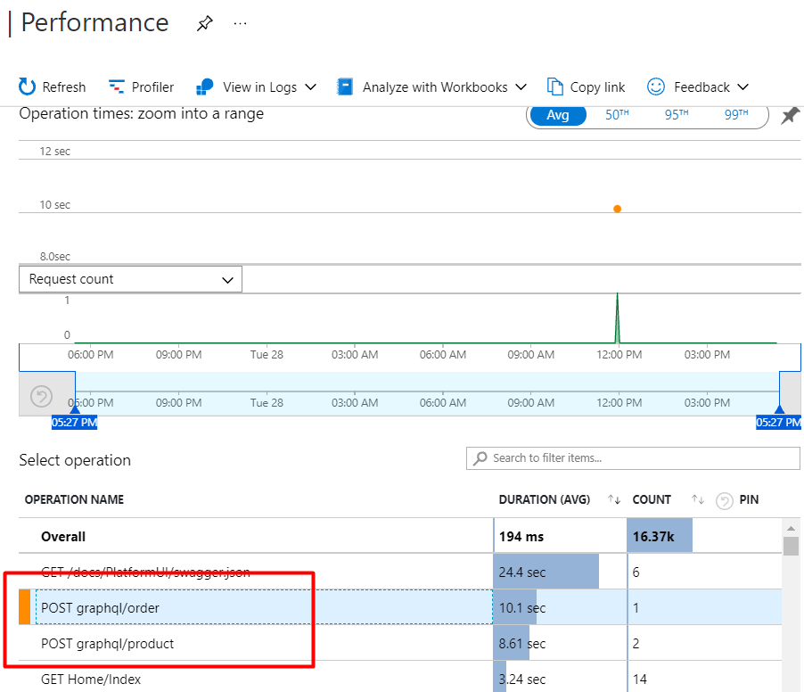
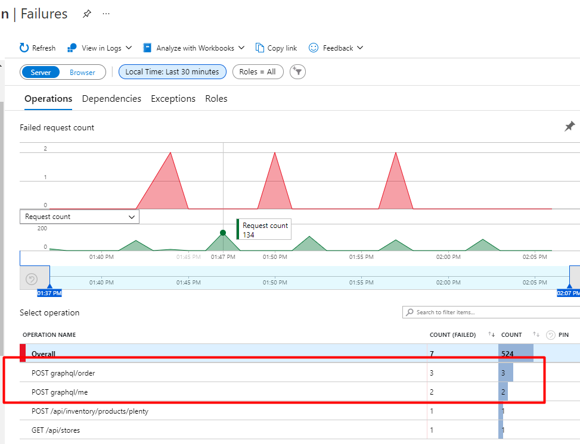

# Troubleshooting

By default, all GraphQL requests are sent via HTTP `POST /graphql` endpoint method and all the information about the request is included in the POST request body, therefore the ability to see in [Application Insights](../Fundamentals/Logging/application-insights.md) what query or mutation was executed is lost.

By [overriding](https://github.com/VirtoCommerce/vc-module-experience-api/blob/dev/src/VirtoCommerce.ExperienceApiModule.Core/Infrastructure/CustomGraphQLExecuter.cs) the default GraphQL executor we can send our custom telemetry to Application Insights and see what mutation or query was executed and what errors, if any, were handled by GraphQL.

* General list of requests can be seen in the **Performance** tab:

    

* Information about failed requests and associated exceptions can be found in the **Failures** tab:

    

 
 
********

    <a href="../best-practices">← Best practices </a>
    <a href="../graphiql">GraphiQL  →</a>

