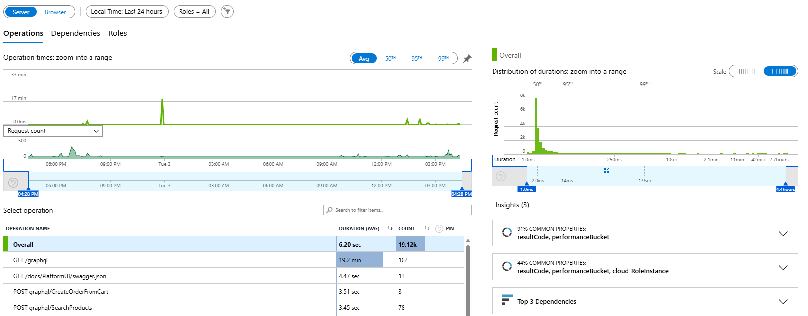
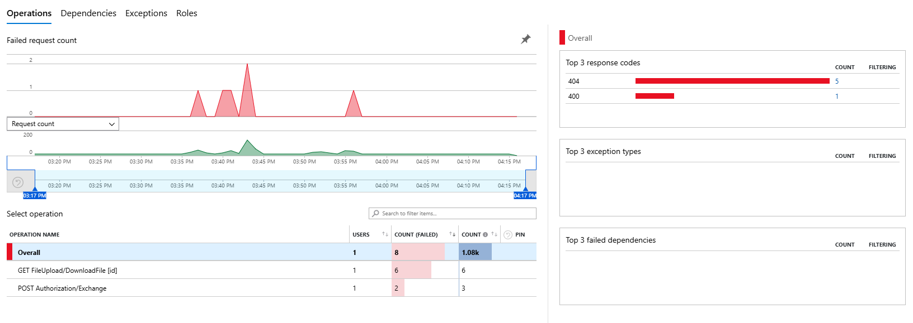

# Errors and troubleshooting

This section covers the errors you are most likely to hit when working with xAPI and how to inspect what a request actually executed.

## Common errors

| Symptom | Cause and fix |
| --- | --- |
| `401 Unauthorized`. | The operation requires a signed-in user, but no valid token was sent. Obtain a token and add it to the request, see [Authentication](authentication.md). |
| `403 Forbidden`. | The token is valid, but the user lacks the required permissions. Authorize as a user with sufficient rights. |
| A query returns empty results or missing products. | The catalog index is not built, or the **Store serialized catalog objects in index** option is disabled. Enable the option and rebuild the index, see [Getting started](getting-started.md#presettings). |
| A mutation returns a validation error. | The input failed validation. Read the error code and message in the response `errors` array to see which field is invalid. |
| A query fails on missing arguments. | Required arguments are not supplied. Most catalog queries require `storeId`, `cultureName`, and `currencyCode`. |

## Inspecting requests in Application Insights

By default, all GraphQL requests are sent via the HTTP `POST /graphql` endpoint, and all information about the request is included in the POST request body. As a result, the ability to see in [Application Insights](../Fundamentals/Logging/application-insights.md) which query or mutation was executed is lost.

By overriding the default GraphQL executor, you can send custom telemetry to Application Insights and see which mutation or query was executed and which errors, if any, were handled by GraphQL.

* The general list of requests can be seen in the **Performance** tab:

    

* Information about failed requests and associated exceptions can be found in the **Failures** tab:

    

 
 
********

    <a href="../multiregional-development">← Multiregional development </a>
    <a href="../PurchaseRequest/overview">AI document processing →</a>

