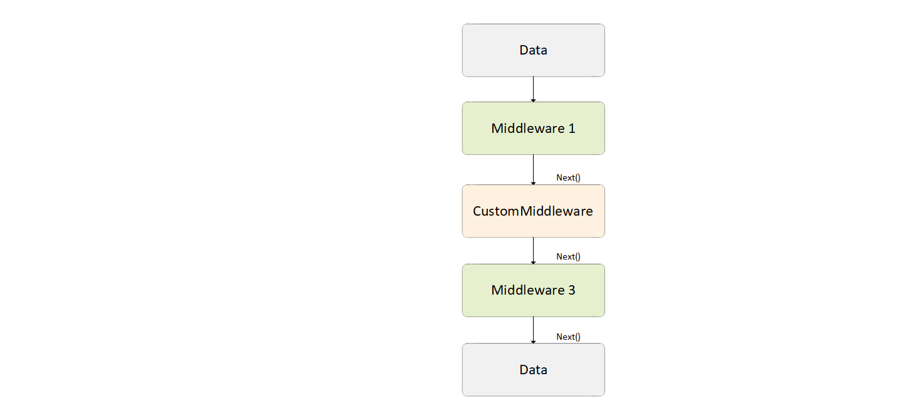

# How to extend

The xAPI offers default GraphQL schemas for objects, queries, and mutations. However, as every project has unique requirements, it's impossible to anticipate and include them all in the base schema. Fortunately, the xAPI provides extension points that allow you to modify the baseline behavior and data structures. In this article, we explore the key extension points and techniques available for customizing your projects.

In addition to the extension points that platform provides, the xAPI project has the following main [extensions points](https://virtocommerce.com/docs/latest/fundamentals/extensibility/overview/). However, there is no opportunity to extend AutoMapper's profiles using `AbstractTypeFactory<>` type.

[](https://github.com/VirtoCommerce/vc-module-experience-api/tree/dev/samples/VirtoCommerce.Exp.ExtensionSamples)

## Extend root GraphQL schema

Within the xAPI, we have the flexibility to choose between the: 

* Schema-first approach.
* Graphtype-first approach. 

We've opted to focus exclusively on the graphtype-first approach, for it:

* Aligns more naturally with .NET development practices.
* Provides access to all the properties of your GraphTypes and Schema. 
* Is better suited for extending the model through type overrides.

To register a new query or mutation:

1. Derive a custom schema type from `ISchemaBuilder`. The `ISchemaBuilder` interface is designed to dynamically add new queries to the root GraphQL schema. Multiple `ISchemaBuilder` instances are used to add the queries to the root schema when the application starts. The example below shows how to define schema types for existing domain types. Here, we create a new GraphQL schema object type, `InventoryType`, for the underlying domain type, `Inventory`, from the inventory module.

2. Define a new type that implements this interface 

    ```csharp title="CustomSchema.cs" linenums="1"
    public class CustomSchema : ISchemaBuilder
        {
            public void Build(ISchema schema)
            {
                var inventoryQueryField = new FieldType
                {
                    Name = "inventory",
                    Arguments = new QueryArguments(
                        new QueryArgument<NonNullGraphType<StringGraphType>> { Name = "id" },
                    ),
                    Type = typeof(InventoryType),
                    Resolver = new  FieldResolver<Inventory>(context =>
                    {
                        return new Inventory { ProductId = "1", FulfillmentCenterId = "center1" };
                    })
                };
                schema.Query.AddField(inventoryQueryField);
            }
        }
    ```

3. Register your custom schema type in the Dependency Injection (DI) container. In your `module.cs` file, initialize and register the custom schema using the `services.AddSchemaBuilder<CustomSchema>()` method:

    ```csharp title="module.cs" linenums="1"
    public class Module : IModule
    {
        public void Initialize(IServiceCollection services)
        {
            //Register custom schema
            services.AddSchemaBuilder<CustomSchema>();
        }
    }
    ```

## Extend existing schema type with new properties

To extend the existing GraphQL type:

1. Create a new schema type that derives from the existing type you want to extend. This allows you to build upon the existing structure:

    ```csharp title="CartType2.cs" linenums="1"
    public class CartType2 : CartType
        {
            public CartType2(ICartAvailMethodsService cartAvailMethods) : base(cartAvailMethods)
            {
                Field<StringGraphType>("myCoolScalarProperty", resolve: context => "my cool value" );
            }
        }
    ```

1. Register your type override using the appropriate syntax in the `module.cs` file. This step is crucial to ensure that your extension is recognized and integrated into the GraphQL schema:

    ```csharp title="module.cs" linenums="1"
    public class Module : IModule
    {
        public void Initialize(IServiceCollection services)
        {
            //GraphQL schema overrides
            services.AddSchemaType<CartType2>().OverrideType<CartType, CartType2>();
        }
    }
    ```

## Extend validation logic/ replace validators

In the system, the Platform's abstract type factory is employed to create instances of validators. Consequently, the approach for extending validation logic is similar to other cases, such as extending domain models:

1. Create your custom validator by deriving it from the original one. This allows you to build upon the existing validation logic:

    ```csharp title="CartValidator2.cs" linenums="1"
        public class CartValidator2 : CartValidator
        {
            public CartValidator2()
            {
                // Some additional rules (to the basic) can be provided there
                RuleFor(x => x.CartAggregate.Cart.Id).NotEmpty(); // Just example
            }
        }
    ```

1. Override the original validator type with your custom validator. This step is crucial to inform the factory that CartValidator2 should replace the original validator, ensuring that your custom logic is used:

    ```csharp title="module.cs" linenums="1"
        public class Module : IModule
        {
            public void PostInitialize(IApplicationBuilder appBuilder)
            {
                ...
                // Example: replace cart validator
                AbstractTypeFactory<CartValidator>.OverrideType<CartValidator, CartValidator2>();
                ...
            }
        }
    ```

## Extend generic behavior pipelines

xAPI extension points extend beyond data structure modifications. You can also modify behavior and business logic without altering the original source code.

**Generic behavior pipelines** are primarily designed to break down complex logic into loosely coupled stages (middleware). These middleware stages can be defined in various locations and combined into a single logical pipeline that can be executed in response to specific system events or requests.

{: width="900"}

You can extend the existing generic pipelines with you custom middlewares or even replace the existing middleware with your custom version.

In the example below, you will replace the existing generic pipeline responsible for enriching the `ProductSearchResult` with pricing and availability data from different sources.

```csharp linenums="1"
 //the generic pipeline that is used  for on-the-fly additional data evaluation (prices, inventories, discounts and taxes) for resulting products
services.AddPipeline<SearchProductResponse>(builder =>
{
    builder.AddMiddleware(typeof(EvalProductsPricesMiddleware));
    builder.AddMiddleware(typeof(EvalProductsDiscountsMiddleware));
    builder.AddMiddleware(typeof(EvalProductsTaxMiddleware));
    builder.AddMiddleware(typeof(EvalProductsInventoryMiddleware));
});
```

1. Define the new middleware:

    ```csharp title="MyCoolMiddleware.cs" linenums="1"
    public class MyCoolMiddleware : IAsyncMiddleware<SearchProductResponse>
    {
        //code skipped for better clarity
    }
    ```

1. Register it for the generic behavior pipeline:

    ```csharp title="module.cs" linenums="1"
    public class Module : IModule
    {
        public void Initialize(IServiceCollection services)
        {
            services.AddPipeline<SearchProductResponse>(builder =>
            {
                    builder.AddMiddleware(typeof(MyCoolMiddleware));
            });
        }
    }
    ```

1. To replace the existing middleware with the new one, use the following syntax:

    ```csharp linenums="1"
    services.AddPipeline<SearchProductResponse>(builder =>
                {
                    builder.ReplaceMiddleware(typeof(EvalProductsTaxMiddleware), typeof(MyCoolMiddleware));
                    //this line replaced the EvalProductsTaxMiddleware with the MyCoolMiddleware for GenericPipeline<SearchProductResponse>
                });
    ```

## Replace command/ query handlers

xAPI is built using the clean architecture based on CQRS and DDD principles, where each command and query has its own handler responsible for processing incoming actions. You can easily override and substitute any existing handler with your implementation, thereby changing the default behavior.

It is just enough to replace the required handler in the DI container with your own implementation:

```csharp linenums="1"
public class Module : IModule
{
    public void Initialize(IServiceCollection services)
    {
        //use such lines to override exists query or command handler
        services.AddTransient<IRequestHandler<GetCartQuery, CartAggregate>, CustomGetCartQueryHandler>();
    }
}
```

To replace an existing command with your implementation:

1. Register and override your input type:

    ```csharp title="module.cs" linenums="1"
    services.AddSchemaType<InputRemoveCartType2>().OverrideType<InputRemoveCartType, InputRemoveCartType2>();
    ```

1. Register your implementations of the command and handler:

    ```csharp title="module.cs" linenums="1"
    services.OverrideCommandType<RemoveCartCommand, RemoveCartCommandExtended>().WithCommandHandler<RemoveCartCommandHandlerExtended>();
    ```
