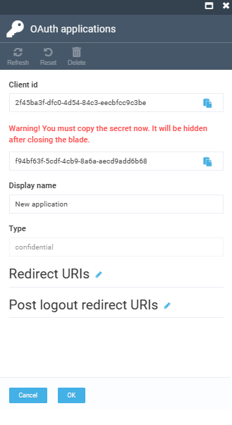

# JSON Web Token Authorization Mechanism

Our Platform uses OAuth2 protocol with JSON Web Tokens (JWT) for authentication. This mechanism supports Password, RefreshToken, and ClientCredentials flows. Tokens issued by the Platform are signed with a private key and can be validated using either a public certificate or an Authority URL. Configuration for certificates and Authority URL is specified in the **Auth** section of the **appsettings.json** file.

The guide includes the following steps:

1. [Creation of self-signed certificates for signature and validation of tokens using OpenSSL.](authorization-using-jwt.md#create-self-signed-certificates-for-signature-and-validate-tokens-using-openssl)
1. [OAuth2 authorization using client credential flow.](authorization-using-jwt.md#oauth2-authorization-using-client-credential-flow)

## Create self-signed certificates for signature and validate tokens using openSSL

To create self-signed certificates for signature and validate tokens:

1. Generate a private key:

    1. Run:

        ```cmd
        openssl.exe genpkey -outform PEM -algorithm RSA -pkeyopt rsa_keygen_bits:4096 -pass file:certpass.txt -des3 -out virtocommerce.key
        ```

    1. Specify a password for the private key in the **certpass.txt** file.

1. Generate a certificate by running:

    ```cmd
    openssl.exe req -x509 -nodes -days 3650 -key virtocommerce.key -config certconfig.txt -extensions req_ext -passin file:certpass.txt -out virtocommerce.crt
    ```

    ??? "Example of **certconfig.txt** file"
        ```
        [ req ]
        default_md = sha256
        prompt = no
        req_extensions = req_ext
        distinguished_name = req_distinguished_name
        [ req_distinguished_name ]
        commonName = virtocommerce.com
        countryName = RU
        stateOrProvinceName = Kaliningrad
        organizationName = Virtocommerce
        [ req_ext ]
        subjectKeyIdentifier = hash
        authorityKeyIdentifier = keyid:always,issuer
        keyUsage=critical,digitalSignature,keyEncipherment
        extendedKeyUsage=critical,serverAuth,clientAuth
        subjectAltName = @alt_names
        [ alt_names ]
        DNS.0 = virtocommerce.com
        ```

1.  Create PFX container for private key and certificate by running:

    ```
    openssl.exe pkcs12 -export -out virtocommerce.pfx -inkey virtocommerce.key -in virtocommerce.crt
    ```

    !!! note
        The system does not accept private keys smaller than 2048 Bits.

## OAuth2 authorization using client credential flow

To authorize client applications (for example, Frontend Application), use the **Client credential flow** mechanism of OAuth2 protocol:

1. In the main menu, click **Security**. 
1. In the next blade, select **OAuth applications**.
1. In the next blade, click **Add** in the toolbar.
1. In the next blade, fill in the following fields:

    {: style="display: block; margin: 0 auto;" }

    !!! note
        **Client Id** and **Client secret** are generated automatically. Save them, as the system will not allow you to view already saved **Client secret**. 

    !!! note
        You can change **Client Id** and **Client secret** only during the creation of a new application (you will not be able to change them later). You can also specify a **Display Name** for more information.

1. Click **OK** to save the changes. 

New OAuth2 client has been created. Now the client application is able to authorize requests to the API using the previously created **Client Id** and **Client secret**.

In the Frontend Application, all you need to do is specify the **Client Id**, **Client secret** created earlier, and the **authorization server** in the **Endpoint** section of the **appsettings.json** file.


<br>
<br>
********

<div style="display: flex; justify-content: space-between;">
    <a href="../health-checks">← Health checks </a>
    <a href="../sharing-bearer-tokens">Sharing bearer tokens  →</a>
</div>