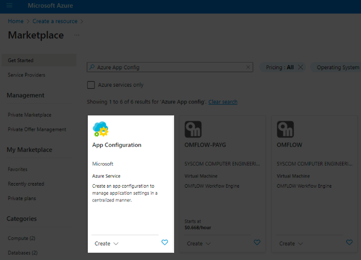
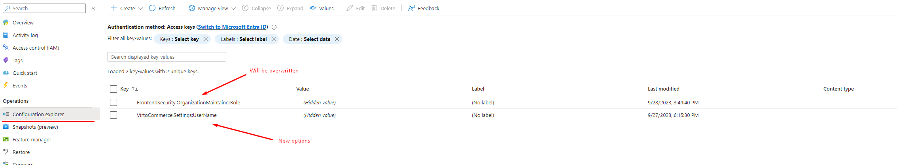
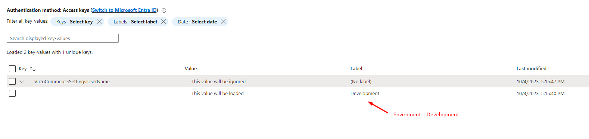
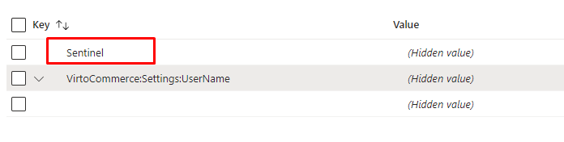

# Azure App Configuration

Azure App Configuration is a service that enables centralized management of application settings and feature flags. Azure App Configuration offers the following benefits:

* **​Fully managed service**: It can be set up in minutes​.
* **Flexible key representations and mappings​**: You can define keys and how they are structured, allowing for flexibility in managing configurations.
* **Tagging with labels​**: Organize your configurations by applying labels to make them easier to manage.
* **Point-in-time replay of settings​**: Easily revert to previous configurations with the ability to replay settings from a specific point in time.
* **Dedicated UI for feature flag management​**: A user-friendly interface for managing feature flags, making it simpler to control feature rollout.
* **Comparison of two sets of configurations on custom-defined dimensions​**: Compare different sets of configurations based on custom-defined criteria to assess changes and their impact.
* **Enhanced security through Azure-managed identities​**: Benefit from enhanced security using Azure-managed identities to control access.
* **Encryption of sensitive information at rest and in transit​**: Sensitive information is encrypted when stored and during transmission, ensuring data security.

{: width="25"} [Microsoft Guide on Azure App configuration](https://learn.microsoft.com/en-us/azure/azure-app-configuration/overview)

{: width="25"} [Configuring and Managing Azure AD Authentication in Virto Commerce Platform](../../Fundamentals/Security/extensions/adding-azure-as-sso-provider.md)

To add Azure App Configuration:

1. Register new Azure App Resource:

    

1. Go to the Azure Portal and locate your newly created resource. 
1. In the Azure App Configuration settings, navigate to the **Access Keys** section, which provides you with essential connection details.
1. Copy the full connection string from the **Access Keys** section in the Azure Portal.
1. Open your project's **appsettings.json** file in the root directory of your application and locate the `ConnectionStrings` section.
1. Paste the copied full connection string inside the double quotes:

    ```json
    "ConnectionStrings": {
    "AzureAppConfigurationConnectionString": "Endpoint=<your Azure App endpoint>;Id=lHYD;Secret=<your key>"
    }
    ```

1. Register your key-values inside **Operations --> Configuration Explorer**. Existing keys values will be overwritten with ones from your Azure App Configuration.

    

1.  Bind a new options class inside the **module.cs** Initialize method:
    1. Locate the **module.cs** file where you initialize your application's settings and configurations and define a new options class within the **module.cs** file.

        ```csharp
            public class Settings
            {
                public string UserName { get; set; }
            }
        ```
        
    1. Within the Initialize method of the **module.cs** file, configure and bind the options class to your application's configuration. Ensure that the section name matches the structure of your **appsettings.json** file.

        ```csharp
            public void Initialize(IServiceCollection serviceCollection)
            {
                serviceCollection.Configure<Settings>(Configuration.GetSection("VirtoCommerce:Settings"));
            }
        ```

    !!! info
        Key values can be obtained by injecting `IOptions<YourOptionsClassName>`. In the example above, inject `IOptions<Settings>` for the new options, `IOptions<FrontendSecurityOptions>` for the existing ones.

1. Configure labels for environment-specific configurations. You can load keys with or without labels based on specific environments (e.g., Development, Production, etc.).

    

1. Configure auto-reload. The configuration supports **Sentinel**, a special key which functions as a versioning key for the list of configuration values. The application monitors the value of this key. When it changes, the configuration values are automatically reloaded. By default, the application checks the Sentinel key every 30 seconds.

    

!!! info
    To use current values of the configuration, inject `IOptionsMonitor<T>` instead of `IOptions<T>` and access `CurrentValue` property.


<br>
<br>
********

<div style="display: flex; justify-content: space-between;">
    <a href="../type-inheritance-support-in-swagger">← Type inheritance support in Swagger </a>
    <a href="../setting-up-prerender-io-with-azure-app-gateway">Setting up Prerender.io with Azure App gateway  →</a>
</div>