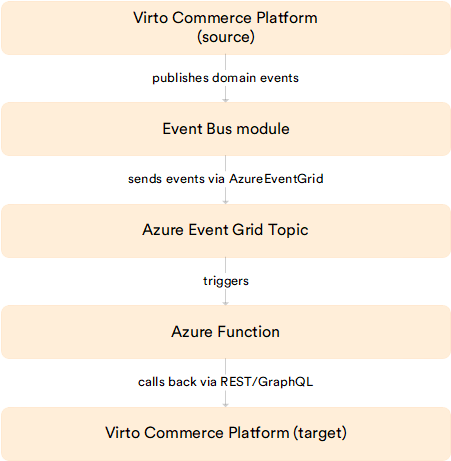

# Connect Azure Functions to Virto Commerce Events

This guide describes how to process Virto Commerce domain events in an Azure Function. The Function receives events through Azure Event Grid; Virto Commerce publishes to Event Grid using the built-in Event Bus destination provider, and the Function subscribes to that topic with an Event Grid trigger.

!!! note
    Azure Functions are not installed into the Virto Commerce Platform. They run separately in Azure, and Virto delivers events to them over Azure Event Grid. This guide covers the Virto side and the Function side of the wiring, in that order.

## Architecture

{: style="display: block; margin: 0 auto;" }

The Virto-side wiring is documented in [Event Bus configuration](../../Fundamentals/Event-Driven-Development/event-bus-configuration.md). This guide assumes you have read that page or are working through it in parallel.

To connect an Azure Function to Virto Commerce events:

1. [Publish Virto events to Azure Event Grid](#publish-virto-events-to-azure-event-grid).
1. [Understand the CloudEvent payload](#understand-cloudevent-payload).
1. [Create the Azure Function with an Event Grid trigger](#create-azure-function-with-event-grid-trigger).
1. [Subscribe the Function to the Event Grid topic](#subscribe-function-to-event-grid-topic).
1. [Call back into Virto Commerce from the Function](#call-back-into-virto-commerce-from-function) (optional).
1. [Verify the connection](#verify-connection).

## Prerequisites

Before connecting an Azure Function to Virto Commerce events, make sure you have:

* A running Virto Commerce Platform instance with the [Event Bus module](../../Fundamentals/Event-Driven-Development/event-bus.md) installed.
* An Azure subscription with permission to create Event Grid topics and Function Apps.
* An Azure Event Grid topic provisioned with input schema **CloudEvents v1.0**.
* The topic's endpoint URL and access key from the **Access Keys** section of the topic in the Azure Portal.
* Local tooling for Function development: Azure Functions Core Tools (`func`), the Azure CLI (`az`), and the runtime for your chosen language (.NET, Node.js, Python).

## Publish Virto events to Azure Event Grid

On the Virto Commerce side, configure the Event Bus module to push the events you care about to your Event Grid topic.

1. Open the Platform Admin UI.
1. Open the **Event Bus** module and create a new connection with provider name `AzureEventGrid`. Paste the topic endpoint and access key into the `ConnectionOptionsSerialized` field:

    ```json
    {
      "ConnectionString": "https://<your-topic>.eventgrid.azure.net/api/events",
      "AccessKey": "<topic-access-key>"
    }
    ```

1. Create a subscription on that connection and pick the event types you want to forward, for example, `VirtoCommerce.OrdersModule.Core.Events.OrderChangedEvent` or `VirtoCommerce.CatalogModule.Core.Events.ProductChangedEvent`.

{: width="25"} [Event Bus configuration](../../Fundamentals/Event-Driven-Development/event-bus-configuration.md)

## Understand CloudEvent payload

Virto's default payload follows the CloudEvents 1.0 envelope. The `data` field carries the Virto-specific structure:

```json
{
  "id": "9ec0a767-5789-4149-83ea-bd227570e54a",
  "source": "399c9dda-aff9-4bd9-87b4-326dbe2815a9",
  "data": {
    "ObjectId": "4038511b-604a-4031-9aba-775bbac43a39",
    "ObjectType": "VirtoCommerce.OrdersModule.Core.Model.CustomerOrder",
    "EventId": "VirtoCommerce.OrdersModule.Core.Events.OrderChangedEvent"
  },
  "type": "VirtoCommerce.OrdersModule.Core.Events.OrderChangedEvent",
  "time": "2026-02-26T08:45:57.3896153Z",
  "specversion": "1.0"
}
```

The Function receives a pointer (the `ObjectId`) by default, not the full object. To act on the order or product itself, call the Virto Commerce REST or GraphQL API from the Function handler using that ID. If your Function needs the full object inline, configure a Scriban `payloadTransformationTemplate` on the subscription instead.

{: width="25"} [Event Bus configuration](../../Fundamentals/Event-Driven-Development/event-bus-configuration.md)

## Create Azure Function with Event Grid trigger

The Function receives Virto events through an Event Grid trigger. A minimal C# isolated-worker example:

```csharp title="OrderChangedFunction.cs"
using Azure.Messaging;
using Microsoft.Azure.Functions.Worker;
using Microsoft.Extensions.Logging;

public class OrderChangedFunction
{
    private readonly ILogger _logger;

    public OrderChangedFunction(ILoggerFactory loggerFactory)
    {
        _logger = loggerFactory.CreateLogger<OrderChangedFunction>();
    }

    [Function(nameof(OrderChangedFunction))]
    public void Run([EventGridTrigger] CloudEvent cloudEvent)
    {
        var data = cloudEvent.Data?.ToObjectFromJson<EventData>();

        _logger.LogInformation(
            "Received {EventType} for {ObjectType} {ObjectId}",
            cloudEvent.Type,
            data?.ObjectType,
            data?.ObjectId);

        // Branch on cloudEvent.Type and act accordingly.
    }

    private record EventData(string ObjectId, string ObjectType, string EventId);
}
```

JavaScript and Python equivalents follow the same shape: bind an `eventGridTrigger`, deserialize `cloudEvent.data` into a struct with `ObjectId`, `ObjectType`, and `EventId`, and branch on `cloudEvent.type` to route to the right handler.

{: width="25"} [Azure Event Grid trigger for Azure Functions](https://learn.microsoft.com/azure/azure-functions/functions-bindings-event-grid-trigger)

## Subscribe Function to Event Grid topic

After the Function is deployed:

1. Open the Event Grid topic in the Azure Portal.
1. Click **+ Event Subscription**.
1. Set **Endpoint Type** to **Azure Function** and select your deployed Function.
1. Set **Event Schema** to **CloudEvent Schema v1.0** to match Virto's outgoing format.
1. Add filters on `eventType` if you only care about specific Virto event types.
1. Click **Create**.

Event Grid begins delivering Virto events to the Function immediately.

## Call back into Virto Commerce from Function

This step is optional. Because the default payload carries only an `ObjectId`, most non-trivial handlers need to call the Virto API to fetch the full object or to mutate state. Use a Virto Commerce [API key](/platform/user-guide/latest/security/api-key/) and the REST or GraphQL endpoints documented under Virto's API reference. Set the API key in the `api_key` header on outbound requests from the Function.

For long-running work, queue the work onto Azure Queue Storage or Service Bus from the Function handler and return quickly. Event Grid's delivery retry triggers if the Function returns a non-success status, so do not rely on retries to absorb slow handler work.

## Verify connection

1. From the Admin UI, perform an action that fires the subscribed event, for example, change an order status to trigger `OrderChangedEvent`.
1. Open the Azure Function's monitoring blade. Look for an invocation within seconds of the Virto action.
1. Inspect the invocation logs. The `cloudEvent.type` should match the Virto event class name; the `cloudEvent.data.ObjectId` should match the ID of the object you mutated.
1. If no invocation appears, check the Event Grid topic's **Metrics** blade for delivery failures. Common causes are: the Function deployment slot is not running, a schema mismatch (Virto sending CloudEvents 1.0 but the topic configured for the legacy Event Grid schema), or Function authentication blocking inbound Event Grid traffic.


## Next steps

1. Stand up an Event Grid topic and a minimal Function in a non-production Azure subscription.
1. Wire the Virto Event Bus to the topic and subscribe to one low-volume event for testing.
1. Confirm end-to-end delivery before adding more event types or fanning out to additional subscribers.
1. Plan for monitoring and retention: Function invocation logs land in Application Insights, and Event Grid topic metrics surface delivery health.


<br>
<br>
********

<div style="display: flex; justify-content: space-between;">
    <a href="../deploy-platform-on-gcp">← Deploy on Google Cloud</a>
    <a href="../upgrading-to-dot-net-10">Upgrading to .NET10 →</a>
</div>
