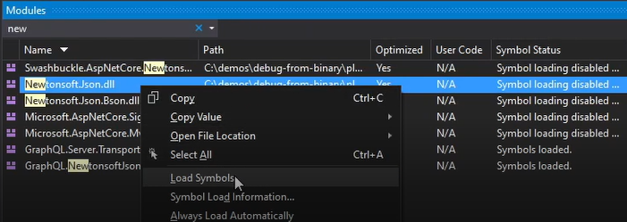

# Debug VC Code without Source Code

Debugging VC source code is sometimes necessary, since the preferred mode of operation is to work with VC as precompiled binary components when the source is not available.

This section describes the techniques related to debugging that enhance development productivity while working with VC and third-party components:

* Debugging VC components with using [Source Link](https://github.com/dotnet/sourcelink/blob/main/README.md) technology.
* Loading a PDB directly from public symbol servers.

The example below demonstrates debugging a third party NuGet package without having acceess to the source code of the library and the local project that references it as a package.

## Debug with Source Link

!!! note
    Source Link technology facilitates .NET assembly debugging of NuGet packages by embedding source control metadata inside the assemblies and package during their creation. This enables developers to debug the package's source code by stepping into it using Visual Studio, provided they have enabled Source Link.

Source Link is the preferred way to debug the VC components because:

* All VC platform and modules components already support the Source Link technology.
* You can step into framework methods as if you were debugging with your own code.
* You can inspect all variables and set breakpoints.

To start using Source Link for debugging:

1. Configure Visual Studio to support NuGet.org symbol sources:
    1. In Visual Studio, go to **Tools** > **Options** > **Debugging** > **Symbols**. 
    1. Check **NuGet.org Symbol Server** to allow VS load symbols from public NuGet servers.
    1. Select the option **Load only specified modules** to speed up the launch of a debug session.

    

1. Configure Visual Studio debugging general options:

    1. In Visual Studio, go to **Tools** > **Options** > **Debugging** > **General**.
    1. Select the options according to the screenshot:

        

        1. Uncheck **Enable Just My Code** to allow stepping into third-party code.
        1. Uncheck **Enable .NET Framework source stepping**  not to prevent debugging .NET classes.
        1. Check **Enable source server support** to enable loading symbols from public places.
        1. Check **Enable Source Link support** to activate Source Link.    

1. Step into third-party code:

    1. Set the breakpoint in our code in the line where we call '_searchService.SearchCustomerOrdersAsync'.

        
    
    1. When the debugger hits that line, press F11 or use the Step Into functionality to download the VirtoCommerce.OrderModule.Data source code via Source Link.

        

    1. Accept downloading from Github to view the source code for that specific version of your package.

Now you can continue debugging the third-party module as it is included into your solution as source code.

## Load PDB from Public Symbol Servers
If the third-party component doesn't support Source Link and you haven't loaded the PDB file for the library:

1. Go to **Debug** > **Window** > **Modules** and load symbols of **Newtonsoft.Json** library manually.

    

1. Step into this library and continue debugging process.

 
 
********

    <a href="../setting-up-prerender-io-with-azure-app-gateway">← Setting up Prerender.io with Azure App gateway </a>
    <a href="../configuring-multiple-stores">Configuring multiple stores  →</a>

