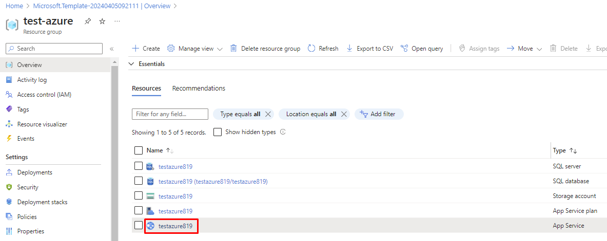
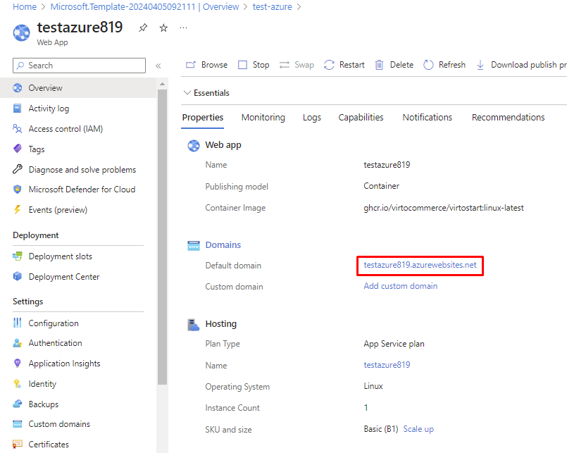
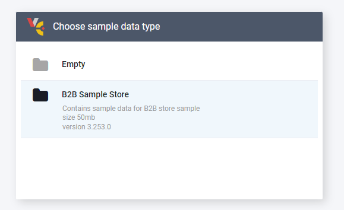

# Deploy VC Platform to Azure Cloud

You can deploy Virto Commerce Platform to Azure Cloud by simply clicking the button:

The following resources will be created during deployment:
 
* **Azure application service plan with Azure application service**: Virto Commerce Platform.
* **Azure Storage account**: Primary blob storage for CMS and Assets.
* **Azure SQL server and an Azure database**: Database.

!!! tip
    * Deploy problem may be related to using Free plan, change to Basic or Standard. 
    
        {: width="25"} [Deploying VC to Azure. Getting a Deployment Failure](https://www.virtocommerce.org/t/deploy-virto-commerce-to-azure-and-getting-a-deployment-failure/72)
    
    * Your login name must not be equal to an SQL Identifier or a typical system name (such as admin, administrator, sa, root, dbmanager, loginmanager, etc.) or a built-in database user or role (such as dbo, guest, public, etc.)
    * Your password must be at least 8 characters long.
    * Your password must contain characters from three of the following categories – English uppercase letters, English lowercase letters, numbers (0-9), and non-alphanumeric characters (!, $, #, %, etc.).
    * You can install modules and sample data later from the Virto Commerce Admin UI.

1.  The portal displays a window where you can easily enter parameter values. The parameters are pre-filled with default values from the template.

    

1. Click **Subscription** and fill in the required parameters.  
1. Click **Create**. 

    

1. Wait for the deployment to complete and click **Go to resource group**.

    

1. Open **Website URL** in your browser:

    
    

1. The application will create and initialize the database on the first request. After that you will see a sign in page. Use the following credentials:
    
    * User Name: **admin**
    * Password: **store**
    
    

1. After the database initialization is complete, Virto Commerce offers you to install sample data. Select this if required. The sample data can be a good starting point to launch a demo storefront and play around with the platform:

    

1. During the first login, the platform requires changing the default admin password:

    

You have completed installation steps for Virto Commerce platform, now the application is ready.

## Extra Deployment

### Deploy via PowerShell
Read [Azure Resource Manager documentation](https://docs.microsoft.com/en-us/azure/azure-resource-manager/templates/deploy-powershell) to
deploy Virto Commerce Platform from Custom Template [azureDeployWebAppForContainer.json](https://github.com/VirtoCommerce/vc-platform/blob/master/azuredeploy.json) to Azure via PowerShell.

### Deploy via Azure CLI
Read  [Azure Resource Manager documentation](https://docs.microsoft.com/en-us/azure/azure-resource-manager/templates/deploy-cli) to
deploy Virto Commerce Platform from Custom Template [azureDeployWebAppForContainer.json](https://github.com/VirtoCommerce/vc-platform/blob/master/azuredeploy.json) to Azure via CLI.