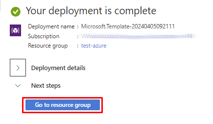

# Deploy VC Platform to Azure Cloud

You can [deploy Virto Commerce Platform to Azure Cloud](https://portal.azure.com/#create/Microsoft.Template/uri/https%3A%2F%2Fraw.githubusercontent.com%2FVirtoCommerce%2Fvc-platform%2Fmaster%2Fazuredeploy.json).

The following resources will be created during deployment:
 
* **Website** - Virto Commerce Platform.
* **Azure Storage** - Primary blob storage for CMS and Assets.
* **SQL Azure** - Database.

!!! tip
    * Deploy problem may be related to using Free plan, change to Basic or Standard. 
    
        {: width="25"} [Deploying VC to Azure. Getting a deployment failure](https://www.virtocommerce.org/t/deploy-virto-commerce-to-azure-and-getting-a-deployment-failure/72)
    
    * Your login name must not contain a SQL Identifier or a typical system name (such as admin, administrator, sa, root, dbmanager, loginmanager, etc.) or a built-in database user or role (such as dbo, guest, public, etc.)
    * Your password must be at least 8 characters long.
    * Your password must contain characters from three of the following categories – English uppercase letters, English lowercase letters, numbers (0-9), and non-alphanumeric characters (!, $, #, %, etc.).
    * You can install modules and sample data later from the Virto Commerce Admin UI.

1.  The portal displays a window where you can easily enter parameter values. The parameters are pre-filled with default values from the template.

    

1. Click **Subscription** and fill in the required parameters.  
1. Click **Create**. 

    

1. Wait for the deployment to complete and click **Go to resource group**.

    

1. Copy **WebSite URL**, **Content Storage Connection String** from the web app page on Azure portal.

    

    

1. Open **WebSite URL** in your browser.
1. The application will create and initialize the database on the first request. After that you will see a sign in page. Use the following credentials:
    
    * User Name: **admin**
    * Password: **store**
    
    

1. Install Commerce modules.
    
    

1. Restart the Platform. It may take some time for the application to start serving requests after restart.
1. Upon restart, Virto Commerce will offer to install sample data. Select this if required. The sample data can be a good starting point to launch a demo storefront and play around with the platform.
1. During the first login, the platform requires changing the default admin password:

    

## Extra Deployment

### Deploy via PowerShell
Read [Azure Resource Manager documentation](https://docs.microsoft.com/en-us/azure/azure-resource-manager/templates/deploy-powershell) to
deploy Virto Commerce Platform from Custom Template [azuredeploy.json](https://github.com/VirtoCommerce/vc-platform/blob/master/azuredeploy.json) to Azure via PowerShell.

### Deploy via Azure CLI
Read  [Azure Resource Manager documentation](https://docs.microsoft.com/en-us/azure/azure-resource-manager/templates/deploy-cli) to
deploy Virto Commerce Platform from Custom Template [azuredeploy.json](https://github.com/VirtoCommerce/vc-platform/blob/master/azuredeploy.json)  to Azure via CLI.