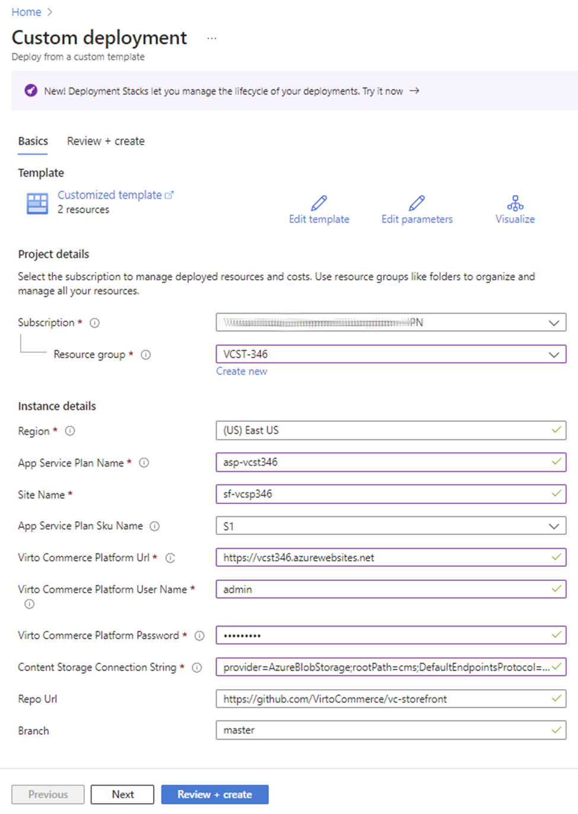
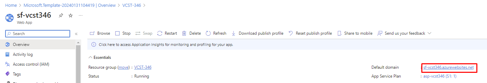
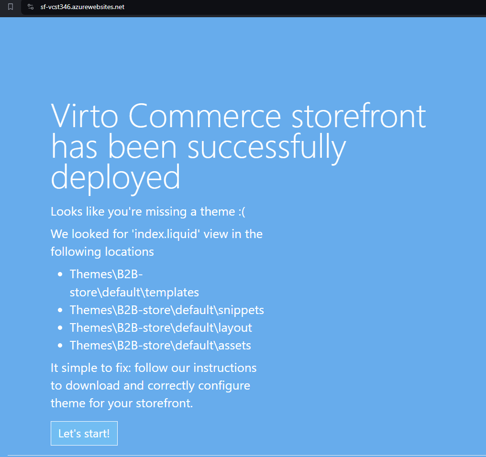

# Deploy VC Frontend to Azure Cloud

You can [deploy Virto Commerce Frontend to Azure Cloud](https://portal.azure.com/#create/Microsoft.Template/uri/https%3A%2F%2Fraw.githubusercontent.com%2FVirtoCommerce%2Fvc-storefront%2Fmaster%2Fazuredeploy.json). 

The following resources will be created during deployment:

* **Website** - Virto Commerce Frontend.

## Prerequisites

* Virto Commerce Platform should be installed. 
* Sample data should be installed, or a Store configured.

!!! tip
    If you have not copied Content Storage Connection String from Platform deployment, you can get it as follows:

    1. Open [Azure Portal](https://portal.azure.com/)
    1. Select **Storage Account** that you created when deploying the Virto Commerce Platform.
    1. Select **Access Keys** and copy **Connection string**. For example: `DefaultEndpointsProtocol=https;AccountName=vc...`
    1. Add prefix **provider=AzureBlobStorage;rootPath=cms;**
    1. The Content Storage Connection String is: `provider=AzureBlobStorage;rootPath=cms;DefaultEndpointsProtocol=https;AccountName=vc...`

1.  The portal displays a window where you can easily enter parameter values. The parameters are pre-filled with default values from the template.

    

1. Click **Subscription** and fill in the required parameters. To fill in `Content Storage Connection String` use the connection string that you've copied during the Platform installation, preceded by `provider=AzureBlobStorage;rootPath=cms;`.
1. Click **Review + create**, then click **Create**. 
1. Wait for the deployment to complete.
1. Copy url:

    

1. Open url in your browser.  

    

## Extra Deployment

### Deploy via PowerShell
Read [Azure Resource Manager documentation](https://docs.microsoft.com/en-us/azure/azure-resource-manager/templates/deploy-powershell) to
deploy Virto Commerce Platform from Custom Template [azuredeploy.json](https://github.com/VirtoCommerce/vc-platform/blob/master/azuredeploy.json) to Azure via PowerShell.

### Deploy via Azure CLI
Read  [Azure Resource Manager documentation](https://docs.microsoft.com/en-us/azure/azure-resource-manager/templates/deploy-cli) to
deploy Virto Commerce Platform from Custom Template [azuredeploy.json](https://github.com/VirtoCommerce/vc-platform/blob/master/azuredeploy.json)  to Azure via CLI.