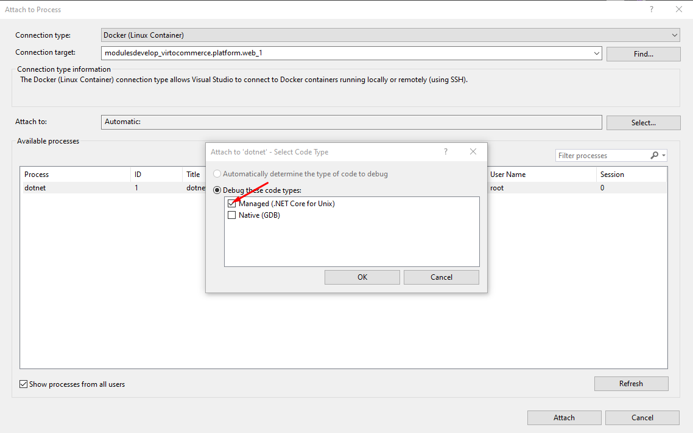

# Modules Development via Docker

The primary objective is to simplify the setup process for developing Virto Commerce (VC) modules by using Docker technology. This initiative aims to speed up the onboarding process for new engineers joining our team. With Docker and Visual Studio installed, developers can focus on coding without having to worry about configuring external tools or services such as the VC platform, SQL Server, Elastic Search or Redis. Development takes place in Visual Studio as usual, with changes seamlessly synchronised between the host and the Docker container.

{: width="25"} [Deploying Modules from Source Code](debugging.md)

## Description

The Virto Commerce team has developed a [docker-compose.yml](https://github.com/VirtoCommerce/vc-platform/blob/dev/DockerCompose/ModulesDevelop/docker-compose.yml) file to facilitate the execution of the VC Platform 2Manager web app inside Docker containers.

The VC Platform Manager web app has been containerized into multiple services, including the web service (Platform Manager) and external services for MS SQL Server, Elastic Search, and Redis. These services are orchestrated as a multi-container application using Docker Compose.


!!! note
    The solution does not include the Frontend Application components.

The web service container is based on the **virtocommerce/platform** latest Linux image.

Developers write and build code for new modules in Visual Studio on their host machines. To ensure that any code edits made on the host machine are automatically reflected in the container, the `./Modules` and `./App_Data/Modules` folders on the host machine are mapped to the `/opt/virtocommerce/platform/Modules` and `/opt/virtocommerce/platform/App_Data/Modules` folders in the container, respectively. 

This synchronization is achieved through bind mounting, where the contents of the host directory overwrite those in the container directory, creating an exact snapshot of the host directory in the container. This approach enhances the development experience, making it more intuitive and seamless. Volume mapping in the **docker-compose file** facilitates this synchronization.

For convenience in configuring the **Docker** and **Docker Compose files**, all customizable parameters are stored in a separate **.env** file. This file allows users to set values for various parameters, including:

* **PLATFORM_VERSION**: Tag for the required **virtocommerce/platform** image (default value `dev-linux-latest`).
* **MODULES_VOLUME**: Path to the `./Modules` folder on the host machine.
* **APP_DATA_MODULES**: Path to the `./App_Data/Modules` folder on the host machine.
* **DB_PASS**: SQL Server service password.
* **REDIS_PASS**: Redis service password (default value `passwd@123`).
* **SEARCH_PROVIDER**: Search provider used in VC Platform (default value ElasticSearch).

## Prerequisites

* Basic understanding of Docker and Docker Compose, along with key terms used in the ecosystem.
* [Docker Desktop for Windows](https://docs.docker.com/docker-for-windows/install/) installed on your machine.
* GitHub [personal access token](https://docs.github.com/en/github/authenticating-to-github/creating-a-personal-access-token) created.
* [Authentication to GitHub Packages](https://docs.github.com/en/packages/using-github-packages-with-your-projects-ecosystem/configuring-docker-for-use-with-github-packages#authenticating-to-github-packages).

## Install Docker for Windows

1. Review [What to know before you install](https://docs.docker.com/docker-for-windows/install/#what-to-know-before-you-install).
1. Install [Docker Desktop for Windows](https://docs.docker.com/docker-for-windows/install/) on your machine.
1. During installation, select Linux as the operating system used inside your containers and install updates for WSL 2 (Windows Subsystem for Linux).

## Use

1. Copy the [ModulesDevelop](https://github.com/VirtoCommerce/vc-platform/blob/dev/DockerCompose/ModulesDevelop/) folder to your local machine.
1. Create an external network for the Docker engine by running the following command in PowerShell with elevated administrator privileges:

    ```cmd
    docker network create nat
    ```

1. Parameterize values in the **.env** file.

    ```cmd
    APP_DATA_MODULES=c:\path\to\folder\modules
    ```

    You can also parameterize the platform version and search provider in the **.env** file:

    ```cmd
    PLATFORM_VERSION=dev-linux-latest
    ...
    SEARCH_PROVIDER=ElasticSearch
    ```

1. Build and launch `docker-compose` by running:

    ```cmd
    docker-compose -f c:\path\to\modulesdevelop\docker-compose.yml up --build -d
    ```

1. Run Virto Commerce Platform Manager at http://localhost:8090/ and configure modules as required.
1. [Create a new module](../Tutorials/creating-custom-module.md) as described in the article.
1. Write code for the new module.
1. Build the new module.
1. Copy the built module to the `Modules` folder.
1. Debug the new module.

## Run Virto Commerce Platform Manager

After the containers are started, open VC Platform Manager. This will launch the application and install default modules. After the modules have been installed, restart the container with the platform to configure sample data.


## Copy built module to modules folder

1. Navigate to the `Modules` folder on the local host.
1. Create a folder for the newly created module.
1. Copy the `your_module_project.Web` folder to the created folder.

## Debug module

1. Build the solution locally (press F6 in Visual Studio).
1. Within Visual Studio, select the **Attach to Process** action in the Debug window:

    

1. Choose **Connection type** **Docker (Linux Container)** (1).
1. Press the **Find** button to locate the remote connection (2).
1. Select the **virtocommerce.platform.web** container (3).
1. Press **Ok** (4).

    

1. Once the container is selected, attach the running process. For debugging a .NET Core application, select the `dotnet` process:

    

If the new module has been rebuilt:

1. Overwrite the folder for the newly created module with `your_module_project.Web`.
1. Restart the platform by clicking Settings -> Restart on Platform Manager UI:

    

## Clean up environment after debugging

When the debugging process is complete, stop `docker-compose` by running:

```cmd
docker-compose down
```

Don't forget to delete the newly created module from the `Modules` and `Modules\AppData` folders.

If you need to recreate the platform database for the next debug session, remove the `db-volume` by running:

```cmd
docker volume rm db-volume
```

{: width="25"} [Diagnose Docker problems](https://docs.docker.com/docker-for-windows/troubleshoot)

{: width="25"} [Visual Studio Docker development](https://docs.microsoft.com/en-us/visualstudio/containers/troubleshooting-docker-errors?view=vs-2022)