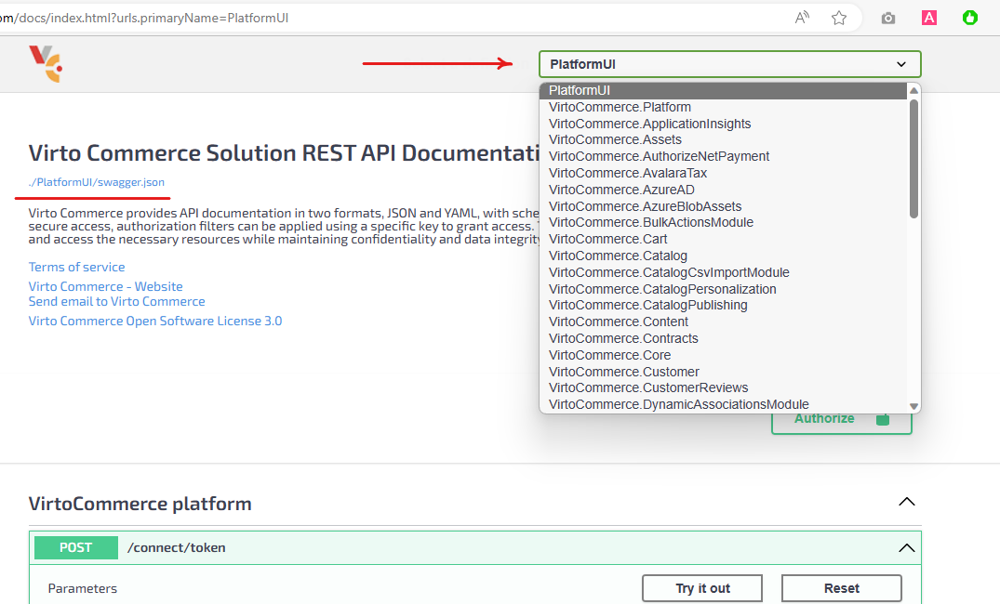
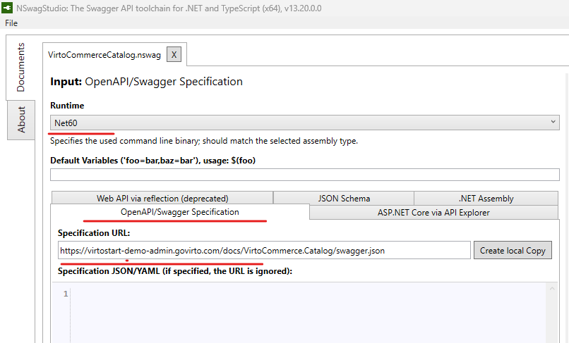
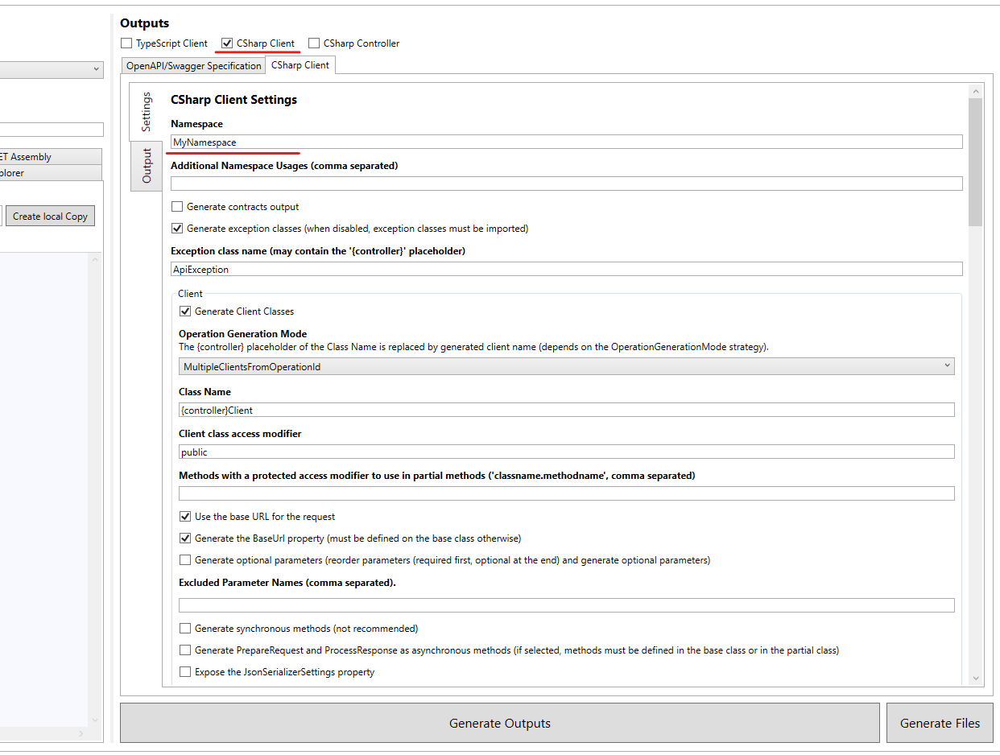
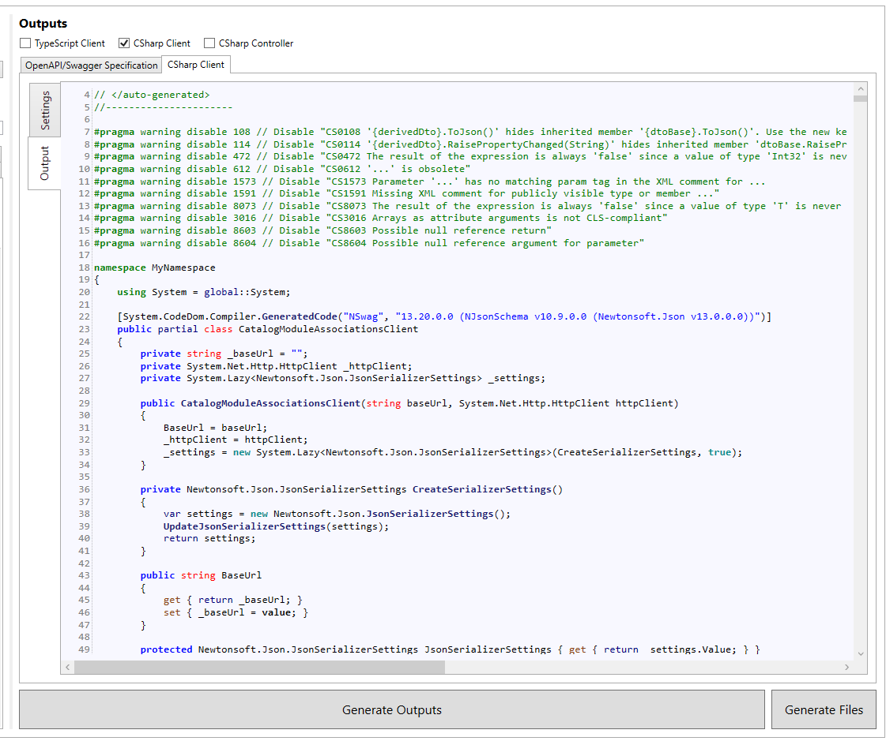
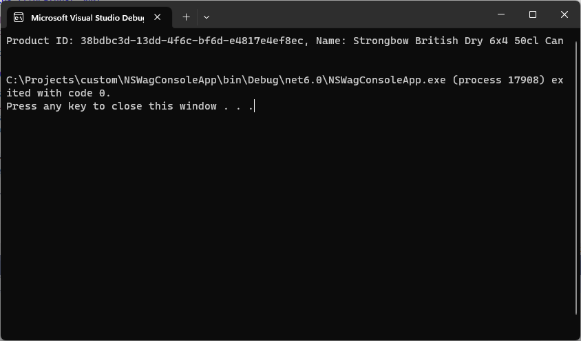

# Generating C# Client from VC Swagger with NSwag

To simplify your API integration process and enhance your development workflow, direct your attention to NSwag—an influential tool designed to generate C# client code from your Virto Commerce Swagger JSON file.

To generate C# client code from your Virto Commerce Swagger JSON file:

1. [Download NSwag Studio](https://github.com/RicoSuter/NSwag/releases) from the official GitHub repository. NSwag Studio is a user-friendly GUI tool that streamlines the code generation process.
1. Load Swagger JSON:
    1. Launch Virto Commerce Platform:
    1. Go to `https://<your_domain>/docs` to view the Swagger UI.
    1. Select the required module from the drop-down menu.
    1. Click `https://<your_domain>/docs/VirtoCommerce.Catalog/swagger.json` to view the Swagger specification for `/VirtoCommerce.Catalog module`.

        

1. Open NSwag Studio:
    1. Launch **NSwag Studio**. 
    1. Open **Documents** section and select **Net60**.
    1. Enter the **swagger.json** file URL in the **Swagger Specification URL** text box.
    1. Click the **Create local Copy** button to generate a JSON representation of your Swagger specification.

        

1. Configure NSwag Studio. Once the Swagger JSON file is loaded, you'll find yourself in the NSwag Studio interface. Pay attention to the following settings:
    * **Output**: NSwag Studio supports various code generators for different programming languages. Choose "CSharp Client" for generating a C# client.
    * **CSharp Client Settings**: Configure the client options such as the namespace, class name, and output file path.

        

1. Generate client Code:
    1. Click **Generate Outputs** to initiate the code generation process. NSwag Studio will generate the C# client code based on the provided settings and the Swagger JSON file.
    1. Copy the generated C# code into a file in the client project that will consume the API.

        

1. Start consuming the Virto Commerce API.

    ??? Example
        Here's an example of how to call the generated `CatalogModuleProductsClient` from C# using token authorization:

        ```cs
        // Replace with your actual Virto Commerce base URL
        string baseUrl = https://<your_domain>";
        string accessToken = "TODO:AccessToken";

        using (HttpClient httpClient = new HttpClient())
        {
            httpClient.DefaultRequestHeaders.Authorization = new AuthenticationHeaderValue("Bearer", accessToken);

            var client = new CatalogModuleProductsClient(baseUrl, httpClient);

            try
            {
                    // Call a method on the generated client
                    var product = await client.GetProductByIdAsync("38bdbc3d-13dd-4f6c-bf6d-e4817e4ef8ec", "Full");

                    Console.WriteLine($"Product ID: {product.Id}, Name: {product.Name}");
            }
            catch (ApiException ex)
            {
                    Console.WriteLine($"API Exception: {ex.Message}");
            }
        }
        ```
        The result is as follows:

        

1. Request Password Token 

    ??? Example
        Here's an example of how to call request password token using Snippet IdentityModel.

        ```cs
            ...
            string username = "TODO:YourUserName";
            string password = "TODO:YourPassword";

            var response = await httpClient.RequestPasswordTokenAsync(new PasswordTokenRequest
            {
                    Address = baseUrl + "/connect/token",
                    Scope = "offline_access",
                    UserName = username,
                    Password = password
            });

            if (response.IsError) throw new Exception(response.Error);
            string accessToken = response.AccessToken;
            ...
        ```

1. NSwag Command-Line Tool
NSwag provides a command-line tool called `NSwag.exe`. NSwag's command-line tool allows you to generate C# client code from a Swagger JSON file directly from the console. This approach is handy when you want to automate client code generation as part of your build or deployment process.

