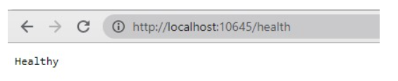

# Health Checks in Virto Commerce Platform

Virto Commerce Platform supports health checks through ASP.NET Core middlewares and exposes them at the `/health` endpoint. This article covers:

* [The /health endpoint and built-in checks.](#health-endpoint)
* [Adding module health checks.](#module-health-checks)
* [Docker integration.](#docker-integration)
* [Liveness and readiness probes.](#liveness-and-readiness-probes)

## /health endpoint

The Platform exposes a single health endpoint at `/health`. It runs every registered check and returns a JSON document with the overall status and a per-check breakdown. The same endpoint is available as a Developer Tool on the System Operations page.

The overall status follows the ASP.NET Core health model:

| Status | Meaning | Default HTTP code |
| --- | --- | --- |
| Healthy | All checks passed. | 200 |
| Degraded | A non-critical check reported a problem. | 200 |
| Unhealthy | A critical check failed. | 503 |

The Platform registers these checks out of the box:

| Check | Tag | Status on failure |
| --- | --- | --- |
| Installed modules | Modules | Unhealthy |
| Memory cache | Cache | Degraded |
| Redis connection | Cache | Unhealthy |
| Database | Database | Unhealthy |

The Redis check applies when a Redis backplane is configured, and the database check targets the configured provider. So a failed database connection or an unreachable Redis backplane marks the Platform **Unhealthy**, while a memory cache problem only marks it **Degraded**.

## Module health checks

To add health checks to your modules:

1. Create a class that inherits from the `IHealthCheck` interface and implement it. For example:

    ```csharp title="CatalogHealthCheck.cs"
    public class CatalogHealthCheck : IHealthCheck
    {
        public Task<HealthCheckResult> CheckHealthAsync(
            HealthCheckContext context,
            CancellationToken cancellationToken = default(CancellationToken))
        {
            var healthCheckResultHealthy = true;

            if (healthCheckResultHealthy)
            {
                return Task.FromResult(
                    HealthCheckResult.Healthy("A healthy result."));
            }

            return Task.FromResult(
                new HealthCheckResult(context.Registration.FailureStatus,
                "An unhealthy result."));
        }
    }
    ```

1. Register the created health checks in the service collection. For example, in your module's initialization:

    ```csharp title="Module.cs"
    public class Module : IModule
    {
        public void Initialize(IServiceCollection serviceCollection)
        {
            serviceCollection
                .AddHealthChecks()
                .AddCheck<CatalogHealthCheck>("catalog_health_check");

            // Other module initialization code here
        }
    }
    ```

Now you can check your Platform by getting a response from `/health` endpoint:

{: style="display: block; margin: 0 auto;" }

## Docker integration

For Docker environments, you can use the built-in `HEALTHCHECK` directive to monitor the status of your application. For example:

```bash
HEALTHCHECK CMD curl --fail http://localhost:5000/health || exit
```

{: width="25"} [Microsoft ASP.NET Core Health Checks Documentation](https://docs.microsoft.com/en-us/aspnet/core/host-and-deploy/health-checks?view=aspnetcore-5.0)

## Liveness and readiness probes

The Platform exposes one health endpoint, not separate liveness and readiness paths. To configure container orchestrator probes, point both at `/health`:

```yaml title="Kubernetes probes"
livenessProbe:
  httpGet:
    path: /health
    port: 8080   # match your container's HTTP port
readinessProbe:
  httpGet:
    path: /health
    port: 8080
```

Because the endpoint returns **503** only for an **Unhealthy** result, a **Degraded** memory cache does not fail the probe, while a failed database or Redis check does.

<br>
<br>
********

<div style="display: flex; justify-content: space-between;">
    <a href="../generating-pdfs">← Generating PDFs </a>
    <a href="../authorization-using-jwt">Authorization using JSON Web Token  →</a>
</div>