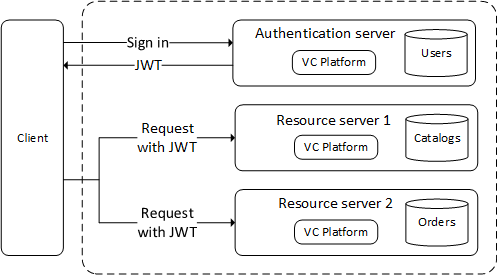

# Share Bearer Tokens Across Multiple Instances 

In some deployment scenarios, when running multiple platform instances, one of them usually play **authentication server** role and has access to user account stores.
Other platform instances play the role of **resource server**, which only needs to restrict access to those users who have valid security tokens provided by an **authentication server**.



Once the token is issued and signed by the authentication server, no database communication is required to verify the token.
Any service accepting the token will simply validate the digital signature of the token.

For this scenario, authentication middleware that handles JWT tokens is available in the `Microsoft.AspNetCore.Authentication.JwtBearer` package.
**JWT** stands for **JSON Web Token** and is a common security token format (defined by RFC 7519) for communicating security claims.

The Virto Commerce platform has some settings that can be used to configure the **resource server** to consume such tokens

```json title="appsettings.json"
...
 "Auth": {
         //The address of the authentication server issuing the token.
        //The JWT bearer authentication middleware uses this URI to retrieve the public key that can be used to validate the token's signature.
        //The middleware also verifies that the iss parameter in the token matches this URI.
        "Authority": "https://authentication-server-url",
        
        //Represents the recipient of the incoming token or the resource to which the token grants access.
        //If the value specified in this parameter does not match the parameter in the token,
        //The token will be rejected.
        //The value of 'resource_server' can be left unchanged.
        "Audience": "resource_server",

        "PublicCertPath": "./Certificates/virtocommerce.crt",
        "PrivateKeyPath": "./Certificates/virtocommerce.pfx",
        "PrivateKeyPassword": "virto"
    }
 ...
```
