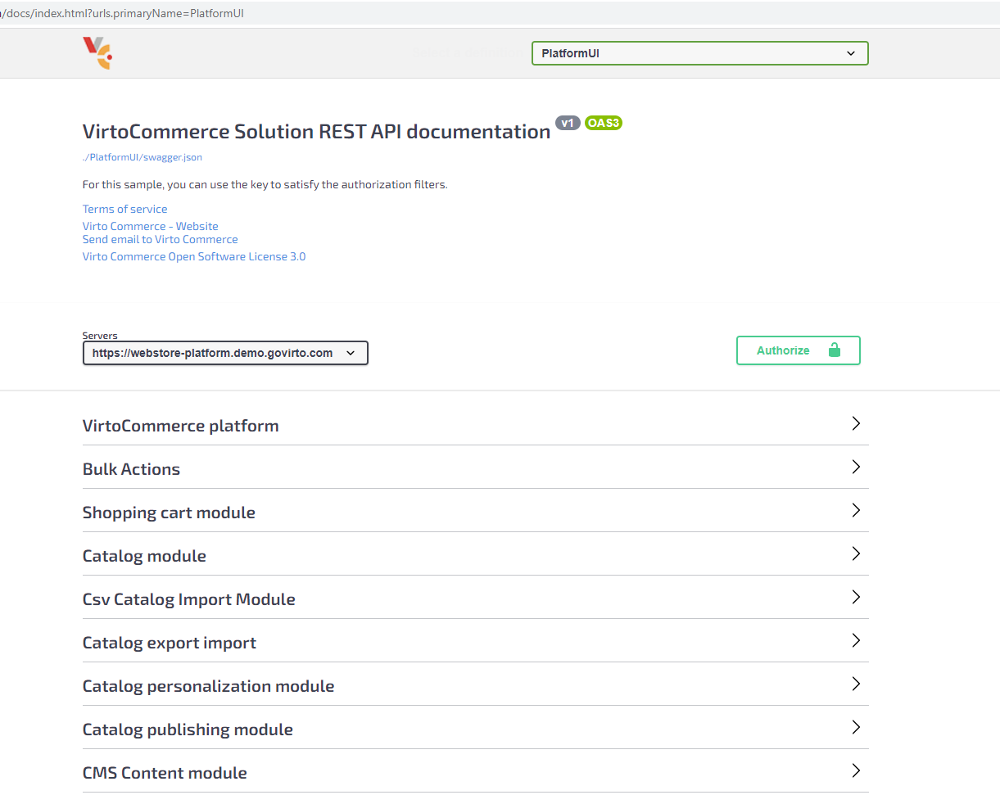

# Swagger/OpenAPI Integration in Virto Commerce

The Swagger UI allows both your development team and end users to seamlessly visualize and interact with the Virto Commerce REST API resources without any implementation complexity.

Automatically generated from Virto Commerce modules, Swagger UI's visual documentation streamlines backend implementation and client-side consumption processes.

## Swagger UI integration

Access Swagger UI via the Admin portal using the `/docs` path.

Example URL: `https://{admin-portal-domain-url}/docs`

## Platform endpoint
Gain access to complete Swagger/OpenAPI endpoints for all modules within the platform via the `/docs/PlatformUI/swagger.json` path.

## Module endpoint
Module-specific Swagger/OpenAPI endpoints are accessible at URLs structured as `/docs/{module-id}/swagger.json`.

Example URL: `https://{admin-portal-domain-url}/docs/VirtoCommerce.Orders/swagger.json`

## Disable Swagger UI
The Swagger UI is active by default. It can be disabled via [application settings](../../Configuration-Reference/appsettingsjson.md#virtocommerce) within the VirtoCommerce:Swagger node.

 
 
********

    <a href="../../overview">← Tutorials and how-tos </a>
    <a href="../generating-c-sharp-client">Generating C# client  →</a>

