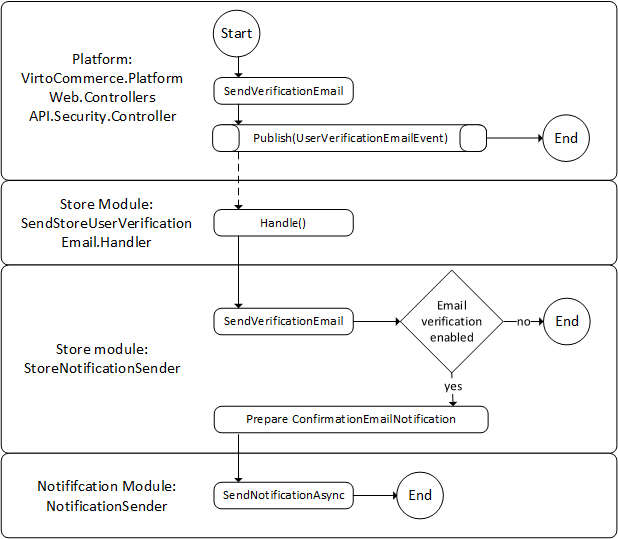
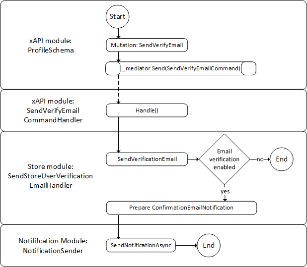
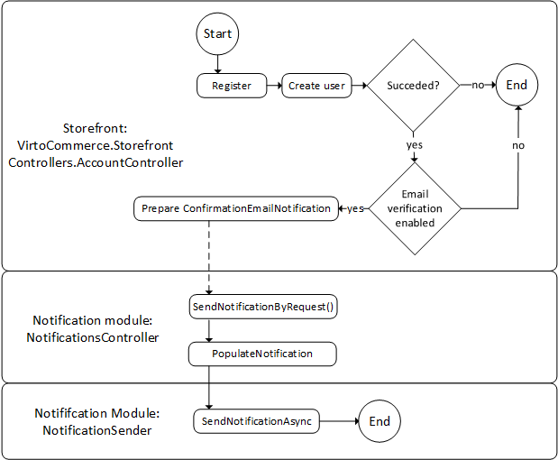

# User Email Verification

To protect user accounts and prevent fraud, users can be asked to verify and confirm their identity via email. This feature, known as user email verification, can be activated or deactivated. The default setting is off.

Users can verify their email address by clicking a verification link sent to their email address. Verification emails can be sent in the following scenarios:

* Administrator clicks **Verify email** in the Platform UI (`users/{userId}/sendVerificationEmail` endpoint requested).
* Administrator calls the `users/{userId}/sendVerificationEmail` endpoint.
* New user is created in xAPI.
* New user registers in the Frontend Application UI.

## Email verification in Platform API

{: style="display: block; margin: 0 auto;" }

1. A **SendVerificationEmail** endpoint is activated. It publishes `UserVerificationEmailEvent` via `IEventPublisher.Publish()`.
1. `UserVerificationEmailEvent` event is received in VirtoCommerce.StoreModule.
1. The received `ApplicationUser` is passed to `IStoreNotificationSender.SendUserEmailVerificationAsync()` (as a background job).
1. If email verification is not enabled for the particular store, stop processing and exit.
1. `ConfirmationEmailNotification` notification template is retrieved and filled.
1. Notification is passed to `INotificationSender.SendNotificationAsync()` for dispatching.

## Email verification in xAPI

{: style="display: block; margin: 0 auto;" }

1. A **sendVerifyEmail** mutation is activated. It creates and publishes `SendVerifyEmailCommand` via `IMediator.Send()`.
1. `SendVerifyEmailCommand` command is received in `SendVerifyEmailCommandHandler`.
1. The associated `ApplicationUser` is retrieved and passed to `IStoreNotificationSender.SendUserEmailVerificationAsync()`.
1. The processing is requested in `SendUserEmailVerificationAsync()` as described in the scenario above.

### Alternative scenario

1. A **createUser** mutation is activated. It creates and publishes `CreateUserCommand` via `IMediator.Send()`.
1. `CreateUserCommand` command is received in `SendVerifyEmailCommandHandler`.
1. The newly created user is retrieved and passed to `IStoreNotificationSender.SendUserEmailVerificationAsync()`.
1. The processing is requested in `SendUserEmailVerificationAsync()` as described in the scenario above.

## Email verification in Frontend Application Kit

The Frontend Application kit is an example of Platform API clients.

{: style="display: block; margin: 0 auto;" }

1. A **Register** endpoint activated in `AccountController`. A new user is created (via Virto Platform API).
1. If email verification is not enabled for the particular store, stop processing and exit.
1. `EmailConfirmationNotification` notification is created and filled.
1. The notification is dispatched via `SendNotificationByRequest` endpoint (Notifications module).

 
 
********

    <a href="../sharing-bearer-tokens">← Sharing bearer tokens </a>
    <a href="../enable-embedded-mode-for-vc-shell">Enabling embedded mode for VC-Shell instances  →</a>

