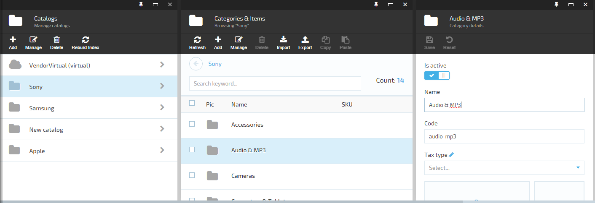
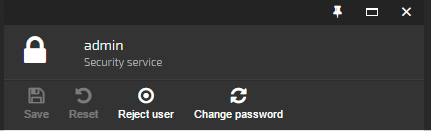

# Build and Customize Platform Manager UI

Use this guide to create Platform Manager UI for the Virto Commerce **Customer Reviews** module created [here](creating-custom-module.md).

After completing this lesson, a Platform Manager UI for the Virto Commerce "Customer Reviews" module will be created, including:

* Blade with the customer reviews list for products.
* Widget on the product page to view the number of reviews and open the new reviews blade for the product.

To build and customize Platform manager UI:

1. [Debug scripts.](build-platform-manager-ui.md#debug-scripts)
1. [Build module UI.](build-platform-manager-ui.md#build-customer-reviews-module-web-ui)
    1. [Create localization for the module.](build-platform-manager-ui.md#create-localization)
    1. [Define API controller for the module.](build-platform-manager-ui.md#define-api-controller)
    1. [Define blade for the module list.](build-platform-manager-ui.md#define-blade)
    1. [Define widget for the module.](build-platform-manager-ui.md#define-widget)

## Prerequisites

* Installed Virto Commerce Platform Manager.
* Visual Studio 2022 or higher.
* Basic JavaScript (AngularJS) knowledge.
* [Created custom module.](creating-custom-module.md)

## Platform manager UI elements

The most common extension points for Platform Manager UI are:

* **Blade**: The main UI element of the Platform Manager. Every blade has basic parts such as Maximize, Close buttons on the top and the title, toolbar, main content placeholders following down. 

    {: style="display: block; margin: 0 auto;" }

    {: width="25"} [Blades and Navigation](../../Platform-Manager/Extensibility-Points/blades-and-navigation.md)

* **Toolbar**:  A dedicated area inside blade for adding commands. Hereinafter, the toolbar commands shall be referenced to as toolbar items.

    {: style="display: block; margin: 0 auto;" }

    {: width="25"} [Blade Toolbar](../../Platform-Manager/Extensibility-Points/blade-toolbar.md)
 
* **Metaform**: A placeholder (container) control that renders UI content based on provided metadata.

    {: style="display: block; margin: 0 auto;" }

    {: width="25"} [Metaform](../../Platform-Manager/Extensibility-Points/metaform.md)

* **Widget**: A transient or auxiliary tile that:
    * Provides some useful information displayed in place.
    * Usually enables opening additional blade with extra information and functionality.
    * Is reusable and can be added to many blades (widget containers) in various places.

    {: style="display: block; margin: 0 auto;" }

    {: width="25"} [Widget](../../Platform-Manager/Extensibility-Points/widgets.md)


## Debug scripts

To enable JS debugging in the Platform:

1. Set app `VirtoCommerce:EnableBundlesOptimizations` value to **false** in the Platform's **Web.config**:

    ```xml
    <add key="VirtoCommerce:EnableBundlesOptimizations" value="false" />
    ```

1. Use the developer tools inside your browser, to debug the JS code. 

{: width="25"} [Debugging in Chrome](https://javascript.info/debugging-chrome) 

## Build customer reviews module web UI

To build the module WEB UI:

1. Place Platform Manager UI elements into **CustomerReviewsModule&#46;Web**\\**Scripts** folder. Typical structure of this folder:

    ```
    Scripts
    │
    ├── blades
    │   ├── (AngularJS controllers and templates for the module blades)
    │
    ├── resources
    │   ├── (AngularJS definitions of the resources (API endpoints) exposed and used by this module)
    │
    ├── widgets
    │   ├── (AngularJS controllers and templates for the module widgets)
    │
    └── module.js
        ├── (Main entry point for the module UI, containing AngularJS module definition, registrations for menus, widgets, etc.)

    ```

1. Localize UI elements. The localization is based on resources (translation files) placed in **CustomerReviewsModule&#46;Web**\\**Localizations** folder. 

{: width="25"} [Localization Implementation](../../Platform-Manager/localization.md)

### Create localization

1. Define the following names for blade and widget:

    * Blade title.
    * Blade labels (column names, "no-review" title).
    * Widget title.

1. Create the translation file **\Localizations\en.CustomerReviewsModule.json** to localize the defined names. 

    ```json
    {
        "customerReviewsModule": {
            "blades": {
                "review-list": {
                    "title": "Customer Reviews",
                    "labels": {
                        "content": "Content",
                        "modifiedDate": "Last updated",
                        "no-review": "No Customer Reviews found"
                    }
                }
            },
            "widgets": {
                "item-detail": {
                    "title": "Customer reviews"
                }
            }
        }
    }
    ```

These translations will be used in the blade and in the widget to label titles and field names in Platform Manager UI.

### Define API controller

To get data from backend, define `search` API controller method in the **\CustomerReviewsModule.Web\Scripts\resources**\\**customer-reviews-module-api.js** file:

```json
angular.module('customerReviewsModule')
    .factory('customerReviewsModule.webApi', ['$resource', function ($resource) {
        return $resource('api/customer-reviews-module', {}, {
            search: { method: 'POST', url: 'api/customer-reviews-module/search' }
        });
 }]);
```

{: width="25"} [AngularJS Resource Article](https://docs.angularjs.org/api/ngResource/service/$resource)

### Define blade

1. Create a new **reviews-list.js** blade JS file in the **\Scripts\blades** folder and define **customerReviewsModule.reviewsListController** by adding code to the file:

    ```json
    angular.module('customerReviewsModule')
        .controller('customerReviewsModule.reviewsListController', ['$scope', 'customerReviewsModule.webApi', 'platformWebApp.bladeUtils', 'uiGridConstants', 'platformWebApp.uiGridHelper',
            function ($scope, reviewsApi, bladeUtils, uiGridConstants, uiGridHelper) {
                $scope.uiGridConstants = uiGridConstants;

                var blade = $scope.blade;
                var bladeNavigationService = bladeUtils.bladeNavigationService;

                blade.getSearchCriteria = function () {
                    return angular.extend(filter, {
                        searchPhrase: filter.keyword ? filter.keyword : undefined,
                        sort: uiGridHelper.getSortExpression($scope),
                        skip: ($scope.pageSettings.currentPage - 1) * $scope.pageSettings.itemsPerPageCount,
                        take: $scope.pageSettings.itemsPerPageCount
                    });
                };

                blade.refresh = function () {
                    blade.isLoading = true;
                    reviewsApi.search(blade.getSearchCriteria(), function (data) {
                        blade.isLoading = false;
                        $scope.pageSettings.totalItems = data.totalCount;
                        blade.currentEntities = data.results;
                    });
                };


                blade.headIcon = 'fa-comments';

                blade.toolbarCommands = [
                    {
                        name: "platform.commands.refresh", icon: 'fa fa-refresh',
                        executeMethod: blade.refresh,
                        canExecuteMethod: function () {
                            return true;
                        }
                    }
                ];

                // simple and advanced filtering
                var filter = $scope.filter = blade.filter || {};

                filter.criteriaChanged = function () {
                    if ($scope.pageSettings.currentPage > 1) {
                        $scope.pageSettings.currentPage = 1;
                    } else {
                        blade.refresh();
                    }
                };

                // ui-grid
                $scope.setGridOptions = function (gridOptions) {
                    uiGridHelper.initialize($scope, gridOptions, function (gridApi) {
                        uiGridHelper.bindRefreshOnSortChanged($scope);
                    });
                    bladeUtils.initializePagination($scope.$parent);
                };

            }]);
    ```

1. To show a list of reviews in a blade, create a new **reviews-list.tpl.html** blade template file in the same folder:

    ```html
    <div class="blade-static">
        <div class="form-group">
            <div class="form-input __search">
                <input placeholder="{{'platform.placeholders.search-keyword' | translate}}" ng-model="filter.keyword" ng-keyup="$event.which === 13 && filter.criteriaChanged()" />
                <button class="btn __other" style="position: relative;right: 45px;">
                    <i class="btn-ico fa fa-times-circle" title="Clear" ng-click="filter.keyword=null;filter.criteriaChanged()"></i>
                </button>
            </div>
            <p class="form-count">{{ 'platform.list.count' | translate }}: <span class="count">{{pageSettings.totalItems | number:0}}</span></p>
        </div>
    </div>
    <div class="blade-static __bottom" ng-if="pageSettings.itemsPerPageCount < pageSettings.totalItems" ng-include="'pagerTemplate.html'"></div>
    <div class="blade-content">
        <div class="blade-inner">
            <div class="inner-block">
                <div class="table-wrapper" ng-init="setGridOptions({
                        useExternalSorting: true,
                        rowTemplate: 'list.row.html',
                        columnDefs: [
                                    { name: 'content', displayName: 'customerReviewsModule.blades.review-list.labels.content' },
                                    { name: 'modifiedDate', displayName: 'customerReviewsModule.blades.review-list.labels.modifiedDate', sort: { direction: uiGridConstants.DESC }}
                            ]})">
                    <div ui-grid="gridOptions" ui-grid-auto-resize ui-grid-save-state ui-grid-resize-columns ui-grid-move-columns ui-grid-pinning ui-grid-height></div>
                </div>
                <p class="note" ng-if="!blade.currentEntities.length">{{ 'customerReviewsModule.blades.review-list.labels.no-review' | translate }}</p>
            </div>
        </div>
    </div>
    <script type="text/ng-template" id="list.row.html">
        <div ng-click="grid.appScope.blade.selectNode(row.entity)" ng-repeat="(colRenderIndex, col) in colContainer.renderedColumns track by col.uid" ui-grid-one-bind-id-grid="rowRenderIndex + '-' + col.uid + '-cell'" class="ui-grid-cell" ng-class="{'ui-grid-row-header-cell': col.isRowHeader, '__hovered': grid.appScope.contextMenuEntity === row.entity, '__selected': row.entity.id===grid.appScope.selectedNodeId }" role="{{col.isRowHeader ? 'rowheader' : 'gridcell' }}" ui-grid-cell></div>
    </script>
    ```

1. Update the blade shown on activating the `workspace.customerReviewsModuleState` state in the AngularJS module by editing **\Scripts\module.js**:

    ```json
    angular.module(moduleName, [])
        .config(['$stateProvider', '$urlRouterProvider',
            function ($stateProvider, $urlRouterProvider) {
                $stateProvider
                    .state('workspace.customerReviewsModuleState', {
                        url: '/customerReviewsModule',
                        templateUrl: '$(Platform)/Scripts/common/templates/home.tpl.html',
                        controller: [
                            '$scope', 'platformWebApp.bladeNavigationService', function ($scope, bladeNavigationService) {
                                var newBlade = {
                                    id: 'reviewsList',
                                    title: 'customerReviewsModule.blades.review-list.title',
                                    controller: 'customerReviewsModule.reviewsListController',
                                    template: 'Modules/$(CustomerReviewsModule)/Scripts/blades/reviews-list.tpl.html',
                                    isClosingDisabled: true
                                };
                                bladeNavigationService.showBlade(newBlade);
                            }
                        ]
                    });
            }
        ])
    ```

    When the state is "activated", the blade's controller is bound to its template and the new blade is shown.

1. Delete **\CustomerReviewsModule.Web\Scripts\blades\hello-world.html** and **\CustomerReviewsModule.Web\Scripts\blades\hello-world.js** files created [here](creating-custom-module.md).

1. Save all changes, restart the Platform application and open blade in main menu. 

You will see the existing Customer reviews list:

{: style="display: block; margin: 0 auto;" }

### Define widget

1. Add new **widgets** subfolder inside the **Scripts** folder.

1. Create a new **customerReviewWidget.js** widget JS file in **widgets** folder and define **customerReviewsModule.customerReviewWidgetController** by adding code to the file:

    ```json
    angular.module('customerReviewsModule')
        .controller('customerReviewsModule.customerReviewWidgetController', ['$scope', 'customerReviewsModule.webApi', 'platformWebApp.bladeNavigationService', function ($scope, reviewsApi, bladeNavigationService) {
            var blade = $scope.blade;
            var filter = { take: 0 };

            function refresh() {
                $scope.loading = true;
                reviewsApi.search(filter, function (data) {
                    $scope.loading = false;
                    $scope.totalCount = data.totalCount;
                });
            }

            $scope.openBlade = function () {
                if ($scope.loading || !$scope.totalCount)
                    return;

                var newBlade = {
                    id: "reviewsList",
                    filter: filter,
                    title: 'Customer reviews for "' + blade.title + '"',
                    controller: 'customerReviewsModule.reviewsListController',
                    template: 'Modules/$(CustomerReviewsModule)/Scripts/blades/reviews-list.tpl.html'
                };
                bladeNavigationService.showBlade(newBlade, blade);
            };

            $scope.$watch("blade.itemId", function (id) {
                filter.productIds = [id];

                if (id) refresh();
            });
        }]);
    ```

1. Create a new **customerReviewWidget.tpl.html** widget template file in the same folder:

    ```html
    <div class="gridster-cnt" ng-click="openBlade()">
        <div class="cnt-inner">
            <div class="list-count" ng-if="loading">...</div>
            <div class="list-count" ng-if="!loading">{{ totalCount }}</div>
            <div class="list-t" ng-if="!loading">{{ 'customerReviewsModule.widgets.itemdetail.title' | translate }}</div>
        </div>
    </div>
    ```

1. Inject the new widget into the Product detail UI by registering it in **module.js**:

    ```json
    .run(['platformWebApp.mainMenuService', 'platformWebApp.widgetService', '$state',
        function (mainMenuService, widgetService, $state) {
            //Register module in main menu
            var menuItem = {
                path: 'browse/customerReviews',
                icon: 'fa fa-comments',
                title: 'Customer Reviews',
                priority: 100,
                action: function () { $state.go('workspace.customerReviewsModuleState'); },
                permission: 'customerReview:read'
            };
            mainMenuService.addMenuItem(menuItem);

            //Register reviews widget inside product blade
            var itemReviewsWidget = {
                controller: 'customerReviewsModule.customerReviewWidgetController',
                template: 'Modules/$(CustomerReviewsModule)/Scripts/widgets/customerReviewWidget.tpl.html'
            };
            widgetService.registerWidget(itemReviewsWidget, 'itemDetail');
        }
    ]);
    ```

1. Save all changes, restart application and open Product detail blade. 

The new widget appears in the widget container and shows actual number of existing reviews for the product. Click on the widget to display the list of Customer reviews for the product.


<br>
<br>
********

<div style="display: flex; justify-content: space-between;">
    <a href="../extending-database-model">← Extending database model </a>
    <a href="../extending-domain-models">Extending domain models  →</a>
</div>