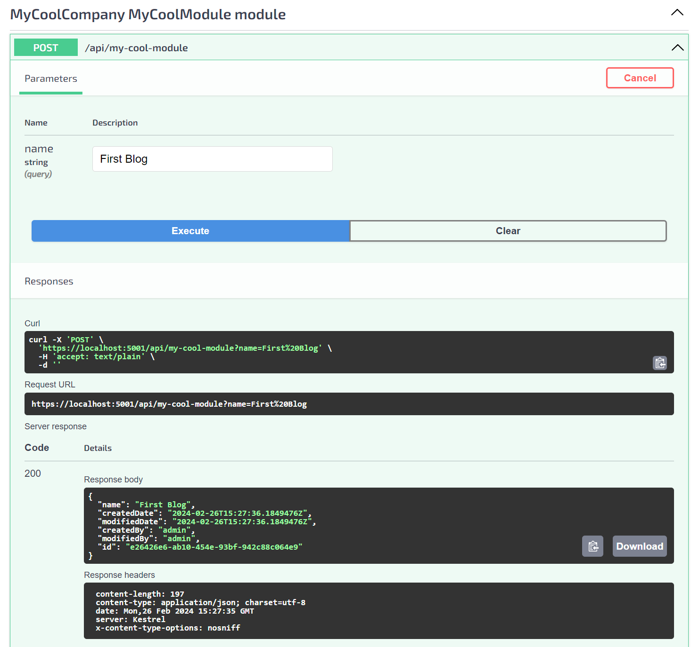
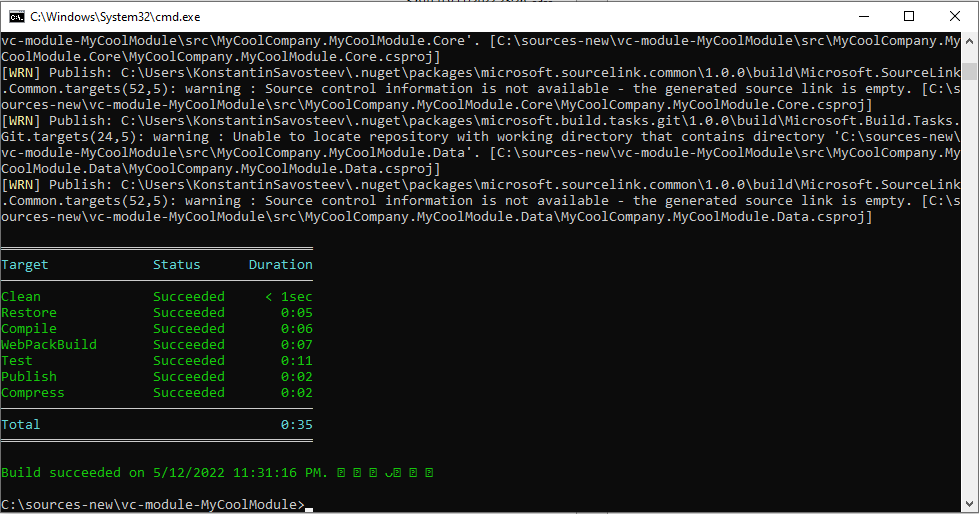

# Create New Module from Template

In this guide, we will learn how to create your own custom module according to your business or technical needs using the Virto Commerce ecosystem.

## Create solution from template
To run your own Virto Commerce module, you can [create it from scratch](create-new-module-from-scratch.md). However, it is recommended that you do it based on a predefined template. To do this: 

1. Create a source directory or, if you already have one, navigate to it.
1. Open Windows CMD or PowerShell.
1. Run the following command to install the Virto Commerce module template:

    ```console
    dotnet new install VirtoCommerce.Module.Template
    ```

1. Run the following command to create a new module based on that template with the specified name, author, and company:

    * For a module with DB Agnostic and xAPI support:

        ```console
        dotnet new vc-module-dba-xapi --ModuleName CustomerReviews --Author "Jon Doe" --CompanyName VirtoCommerce
        ```

    * For a module with DB Agnostic support only:
        ```console    
        dotnet new vc-module-dba --ModuleName CustomerReviews --Author "Jon Doe" --CompanyName VirtoCommerce
        ```

    * For a module with xAPI support only:
        ```console
        dotnet new vc-module-xapi --ModuleName CustomerReviews --Author "Jon Doe" --CompanyName VirtoCommerce
        ```

{: width="25"} [Custom Modules Templates for Dotnet New](module-templates-for-dotnet-new.md)

When you are done, you will have your `vc-module-my-cool-module` solution with the following structure, which you can see when you open your newly created module with Visual Studio:

{: style="display: block; margin: 0 auto;" }

## Work with database

Your next step is to connect your module to a database. Specifically, you need to define a model, entity, and repository classes that will constitute the persistent layer.

1. In the **Core Project Models** directory, add a file named `Blog.cs` with the following code:

    ```csharp
    using System;
    using VirtoCommerce.Platform.Core.Common;

    namespace MyCoolCompany.MyCoolModule.Core.Models;

    public class Blog : AuditableEntity, ICloneable
    {
        public string Name { get; set; }

        public object Clone() => MemberwiseClone();
    }
    ```

    !!! note
        Implementing **ICloneable** is required because Core Project Services (CRUDService, SearchService) are designed to return cloned objects to prevent cache data corruption.


1. In the **Data Project Models** directory, add another file named `BlogEntity.cs` with the following code:

    ```csharp
    using MyCoolCompany.MyCoolModule.Core.Models;
    using VirtoCommerce.Platform.Core.Common;
    using VirtoCommerce.Platform.Core.Domain;

    namespace MyCoolCompany.MyCoolModule.Data.Models;

    public class BlogEntity : AuditableEntity, IDataEntity<BlogEntity, Blog>
    {
        public string Name { get; set; }

        public Blog ToModel(Blog model)
        {
            model.Id = Id;
            model.Name = Name;

            return model;
        }

        public BlogEntity FromModel(Blog model, PrimaryKeyResolvingMap pkMap)
        {
            pkMap.AddPair(model, this);

            Id = model.Id;
            Name = model.Name;

            return this;
        }

        public void Patch(BlogEntity target)
        {
            target.Name = Name;
        }
    }
    ```

    !!! note
        Put **[Required]** and **[StringLength]** attributes to the Entity class. For string length, avoid magic numbers and use constants defined in DbContextBase class.

1. In the **Data Project Repositories** directory, add a file named `BlogRepository.cs` with the following code:

    ```csharp
    using System.Collections.Generic;
    using System.Linq;
    using System.Threading.Tasks;
    using Microsoft.EntityFrameworkCore;
    using MyCoolCompany.MyCoolModule.Data.Models;
    using VirtoCommerce.Platform.Core.Domain;
    using VirtoCommerce.Platform.Data.Infrastructure;

    namespace MyCoolCompany.MyCoolModule.Data.Repositories;

    public class BlogRepository : DbContextRepositoryBase<MyCoolModuleDbContext>
    {
        public BlogRepository(MyCoolModuleDbContext dbContext, IUnitOfWork unitOfWork = null)
            : base(dbContext, unitOfWork)
        {
        }

        public IQueryable<BlogEntity> Blogs => DbContext.Set<BlogEntity>();

        public virtual async Task<IList<BlogEntity>> GetBlogsByIdsAsync(IList<string> ids)
        {
            var result = await Blogs.Where(x => ids.Contains(x.Id)).ToListAsync();

            return result;
        }
    }
    ```

1. In the same **Data Project Repositories** directory, modify the `MyCoolModuleDbContext.cs` file as follows:

    ```csharp
    using EntityFrameworkCore.Triggers;
    using Microsoft.EntityFrameworkCore;
    using MyCoolCompany.MyCoolModule.Data.Models;

    namespace MyCoolCompany.MyCoolModule.Data.Repositories;

    public class MyCoolModuleDbContext : DbContextWithTriggers
    {
        public MyCoolModuleDbContext(DbContextOptions<MyCoolModuleDbContext> options)
        : base(options)
        {
        }

        protected MyCoolModuleDbContext(DbContextOptions options)
            : base(options)
        {
        }

        protected override void OnModelCreating(ModelBuilder modelBuilder)
        {
            modelBuilder.Entity<BlogEntity>().ToTable("Blogs").HasKey(x => x.Id);
            modelBuilder.Entity<BlogEntity>().Property(x => x.Id).HasMaxLength(DbContext.IdLength).ValueGeneratedOnAdd();
            modelBuilder.Entity<BlogEntity>().Property(x => x.Name).HasMaxLength(DbContext.Length128);
        }
    }
    ```

    !!! note
        Define foreign keys, indexes, OnDelete rules in the `DbContext` class. Use `ToAuditableEntityTable()` and `ToEntityTable()` for entities inherited from **VirtoCommerce.Platform.Core.Common.AuditableEntity** and **VirtoCommerce.Platform.Core.Common.Entity**.

1. Create the initial migration file in Visual Studio:
    1. Open Windows CMD or PowerShell in the **Data Project** directory (vc-module-my-cool-module\src\MyCoolCompany.MyCoolModule.Data)
    1. Run the following commands:
        
        ```console
        dotnet tool install --global dotnet-ef
        dotnet ef migrations add InitialMigration
        ```

This brings the **InitialMigration.cs** file to the **Data Project Migrations** directory.

## Add new API

To define services and an API layer to access the model:

1. In the **Core Project Services** directory, add the `IBlogService.cs` file with the following code:

    ```csharp
    using MyCoolCompany.MyCoolModule.Core.Models;
    using VirtoCommerce.Platform.Core.GenericCrud;

    namespace MyCoolCompany.MyCoolModule.Core.Services;

    public interface IBlogService : ICrudService<Blog>
    {
    }
    ```

1. In the **Core Project Services** directory, add another file named `IBlogSearchService.cs` with the following code:

    ```csharp
    using MyCoolCompany.MyCoolModule.Core.Models;
    using VirtoCommerce.Platform.Core.GenericCrud;

    namespace MyCoolCompany.MyCoolModule.Core.Services;

    public interface IBlogSearchService : ISearchService<BlogSearchCriteria, BlogSearchResult, Blog>
    {
    }
    ```

1. In the **Core Project Events** directory, add the `BlogChangedEvent.cs` file with the following code:

    ```csharp
    using System.Collections.Generic;
    using MyCoolCompany.MyCoolModule.Core.Models;
    using VirtoCommerce.Platform.Core.Events;

    namespace MyCoolCompany.MyCoolModule.Core.Events;

    public class BlogChangedEvent : GenericChangedEntryEvent<Blog>
    {
        public BlogChangedEvent(IEnumerable<GenericChangedEntry<Blog>> changedEntries)
            : base(changedEntries)
        {
        }
    }
    ```

1. In the **Core Project Events** directory, add another file named `BlogChangingEvent.cs` with the following code:

    ```csharp
    using System.Collections.Generic;
    using MyCoolCompany.MyCoolModule.Core.Models;
    using VirtoCommerce.Platform.Core.Events;

    namespace MyCoolCompany.MyCoolModule.Core.Events;

    public class BlogChangingEvent : GenericChangedEntryEvent<Blog>
    {
        public BlogChangingEvent(IEnumerable<GenericChangedEntry<Blog>> changedEntries)
            : base(changedEntries)
        {
        }
    }
    ```

1. In the **Core Project Models** directory, add the `BlogSearchCriteria.cs` file with the following code:

    ```csharp
    using VirtoCommerce.Platform.Core.Common;

    namespace MyCoolCompany.MyCoolModule.Core.Models;

    public class BlogSearchCriteria : SearchCriteriaBase
    {
    }
    ```

1. In the **Core Project Models** directory, add another file named `BlogSearchResult.cs`, with the following code:

    ```csharp
    using VirtoCommerce.Platform.Core.Common;

    namespace MyCoolCompany.MyCoolModule.Core.Models;

    public class BlogSearchResult : GenericSearchResult<Blog>
    {
    }
    ```

1. In the **Data Project Services** directory, add the `BlogService.cs` file with the following code:

    ```csharp
    using System;
    using System.Collections.Generic;
    using System.Threading.Tasks;
    using MyCoolCompany.MyCoolModule.Core.Events;
    using MyCoolCompany.MyCoolModule.Core.Models;
    using MyCoolCompany.MyCoolModule.Core.Services;
    using MyCoolCompany.MyCoolModule.Data.Models;
    using MyCoolCompany.MyCoolModule.Data.Repositories;
    using VirtoCommerce.Platform.Core.Caching;
    using VirtoCommerce.Platform.Core.Common;
    using VirtoCommerce.Platform.Core.Events;
    using VirtoCommerce.Platform.Data.GenericCrud;

    namespace MyCoolCompany.MyCoolModule.Data.Services;

    public class BlogService : CrudService<Blog, BlogEntity, BlogChangingEvent, BlogChangedEvent>, IBlogService
    {
        public BlogService(
            Func<BlogRepository> repositoryFactory,
            IPlatformMemoryCache platformMemoryCache,
            IEventPublisher eventPublisher) : base(repositoryFactory, platformMemoryCache, eventPublisher)
        {
        }

        protected override Task<IList<BlogEntity>> LoadEntities(IRepository repository, IList<string> ids, string responseGroup)
        {
            return ((BlogRepository)repository).GetBlogsByIdsAsync(ids);
        }
    }
    ```

1. In the **Data Project Services** directory, add another file named `BlogSearchService.cs` with the following code:

    ```csharp
    using System;
    using System.Collections.Generic;
    using System.Linq;
    using Microsoft.Extensions.Options;
    using MyCoolCompany.MyCoolModule.Core.Models;
    using MyCoolCompany.MyCoolModule.Core.Services;
    using MyCoolCompany.MyCoolModule.Data.Models;
    using MyCoolCompany.MyCoolModule.Data.Repositories;
    using VirtoCommerce.Platform.Core.Caching;
    using VirtoCommerce.Platform.Core.Common;
    using VirtoCommerce.Platform.Core.GenericCrud;
    using VirtoCommerce.Platform.Data.GenericCrud;

    namespace MyCoolCompany.MyCoolModule.Data.Services;

    public class BlogSearchService : SearchService<BlogSearchCriteria, BlogSearchResult, Blog, BlogEntity>, IBlogSearchService
    {
        public BlogSearchService(
            Func<BlogRepository> repositoryFactory,
            IPlatformMemoryCache platformMemoryCache,
            IBlogService crudService,
            IOptions<CrudOptions> crudOptions)
            : base(repositoryFactory, platformMemoryCache, crudService, crudOptions)

        {
        }

        protected override IQueryable<BlogEntity> BuildQuery(IRepository repository, BlogSearchCriteria criteria)
        {
            var query = ((BlogRepository)repository).Blogs;
            return query;
        }

        protected override IList<SortInfo> BuildSortExpression(BlogSearchCriteria criteria)
        {
            var sortInfos = criteria.SortInfos;

            if (sortInfos.IsNullOrEmpty())
            {
                sortInfos =
                [
                    new SortInfo { SortColumn = nameof(BlogEntity.Id) },
                ];
            }

            return sortInfos;
        }
    }
    ```

1. In the **Web project Controllers/Api** directory, change `MyCoolModuleController.cs` as follows:

    ```csharp
    using System.Threading.Tasks;
    using Microsoft.AspNetCore.Mvc;
    using MyCoolCompany.MyCoolModule.Core.Models;
    using MyCoolCompany.MyCoolModule.Core.Services;

    namespace MyCoolCompany.MyCoolModule.Web.Controllers.Api
    {
        [Route("api/my-cool-module")]
        public class MyCoolModuleController : Controller
        {
            private readonly IBlogService _blogService;
            private readonly IBlogSearchService _blogSearchService;

            public MyCoolModuleController(
                IBlogService blogService,
                IBlogSearchService blogSearchService)
            {
                _blogService = blogService;
                _blogSearchService = blogSearchService;
            }

            [HttpPost]
            [Route("")]
            public async Task<ActionResult<Blog>> AddBlog(string name)
            {
                var blog = new Blog { Name = name };

                await _blogService.SaveChangesAsync([blog]);

                return Ok(blog);
            }

            [HttpGet]
            [Route("")]
            public async Task<ActionResult<BlogSearchResult>> GetAll()
            {
                var result = await _blogSearchService.SearchAsync(new BlogSearchCriteria());

                return Ok(result);
            }
        }
    }
    ```

1. Register all created services by changing the **Initialize** method in `Module.cs` as follows:

    ```csharp
        public void Initialize(IServiceCollection serviceCollection)
        {
            // Initialize database
            var connectionString = Configuration.GetConnectionString(ModuleInfo.Id) ??
                                Configuration.GetConnectionString("VirtoCommerce");

            serviceCollection.AddDbContext<MyCoolModuleDbContext>(options => options.UseSqlServer(connectionString));

            serviceCollection.AddTransient<BlogRepository>();
            serviceCollection.AddTransient<Func<BlogRepository>>(provider => () => provider.CreateScope().ServiceProvider.GetRequiredService<BlogRepository>());

            serviceCollection.AddTransient<IBlogService, BlogService>();
            serviceCollection.AddTransient<IBlogSearchService, BlogSearchService>();
        }
    ```

## Test and debug API

After creating your module, install it from your source and debug it as follows:

1. Link the **Module Web** directory to the **Platform/modules** directory:

    ```console
    mklink /d C:\source\vc-platform\src\VirtoCommerce.Platform.Web\modules\my-cool-module\ C:\source\vc-module-my-cool-module\src\MyCoolCompany.MyCoolModule.Web
    ```

    !!! note
        In the above example, `C:\source\` is a path to the directory with your code.

1. Restart the Platform.

1. Open Swagger API at http://localhost:5000/docs/index.html, find **MyCoolModule extension module**, and run the POST method to verify that everything is working properly:

    

    This creates a new blog record.

1. To debug your module, attach the Platform process to the Visual Studio module solution:

    * If you run the Platform from source (built and launched via **VirtoCommerce.Platform.Web.exe**), attach to the **VirtoCommerce.Platform.Web.exe** process.

        {: style="display: block; margin: 0 auto;" }

    * If you run the Platform using prebuilt binaries (as described in this guide), the executable process will be **dotnet.exe**. In that case, attach to the appropriate **dotnet.exe** process instead:

        {: style="display: block; margin: 0 auto;" }


## Extend VC manager with new UI 

Our module template provides scripts to help you extend the Platform Manager UI. You can find these scripts in the **Web Scripts** directory:

* `module.js` contains the UI module registration code. 
* `resources/my-cool-module-api.js` contains the Web API service.
* `blades/hello-world.js` contains the basic blade template.

To extend the Platform Manager UI:

1. Modify **blades/hello-world.js** as follows:

    ```js
    angular.module('MyCoolModule')
        .controller('MyCoolModule.helloWorldController', ['$scope', 'MyCoolModule.webApi', function ($scope, api) {
            var blade = $scope.blade;
            blade.title = 'MyCoolModule';

            blade.refresh = function () {
                api.get(function (data) {
                    blade.title = 'MyCoolModule.blades.hello-world.title';
                    blade.data = data.results;
                    blade.isLoading = false;
                });
            };

            blade.refresh();
        }]);
    ```

1. Modify **blades/hello-world.html** as follows:

    ```html
    <div class="blade-content">
    <div class="blade-inner">
        <div class="inner-block">
        <div class="table-wrapper">
            <table class="table __normal">
            <tbody ng-model="blade.data">
                <tr class="table-item" ng-repeat="data in blade.data track by data.name">
                <td class="table-col">
                    <div class="table-t">
                    {{ data.name }}
                    </div>
                </td>
                </tr>
            </tbody>
            </table>
        </div>
        </div>
    </div>
    </div>
    ```

1. Build script artifacts:
	1. Navigate to the module **Web project** directory.
	1. Open Windows CMD or PowerShell and run the following commands:

        ```console
        npm install
        npm run webpack:build
        ```

1. Verify that the Platform UI has been extended with your module scripts:
    1. Open the Platform UI.
    1. Go to the `MyCoolModule` menu. You will see all created **Blogs** records.


## Add authentication options
Our module template also provides you with out-of-the-box default authentication permissions, which are located in the `ModuleConstants.cs` file:
 
```csharp
	public static class Permissions
	{
		public const string Access = "MyCoolModule:access";
		public const string Create = "MyCoolModule:create";
		public const string Read = "MyCoolModule:read";
		public const string Update = "MyCoolModule:update";
		public const string Delete = "MyCoolModule:delete";
	}
```

You can find the registration code inside the `Module.cs` **PostInitialize** method:

```csharp
// Register permissions
var permissionsRegistrar = serviceProvider.GetRequiredService<IPermissionsRegistrar>();
permissionsRegistrar.RegisterPermissions(ModuleInfo.Id, "MyCoolModule", ModuleConstants.Security.Permissions.AllPermissions);
```


To restrict access to an endpoint with a permission, add the **Authorize** attribute to it:

```csharp
	[HttpGet]
	[Route("")]
	[Authorize(ModuleConstants.Security.Permissions.Read)]
	public async Task<ActionResult<BlogSearchResult>> GetAll()
```

## Pack your module

To build your custom module for distribution, use our Virto Commerce CLI tool:

1. Navigate to the module root directory.
1. Open Windows CMD or PowerShell.
1. Run the following commands:

    ```console
        dotnet tool install VirtoCommerce.GlobalTool -g
        vc-build compress
    ```

The result will be as follows:

{: style="display: block; margin: 0 auto;" }

!!! note
    The new module package will be created in the **Artifacts** directory. 

## Distribution and installation

The module package can be uploaded and installed to the Virto Commerce Platform. To do this:

1. Open the Virto Commerce Admin Portal and sign into it.
1. In the main menu, click **Modules**. 
1. Click **Advanced** in the next blade.
1. Install or update the module from a file.
1. Restart the Platform.

If the module is installed properly, you will see the new module in the list of the installed modules, in the Admin UI, and in the Swagger API:

{: style="display: block; margin: 0 auto;" }

{: width="25"} [Custom modules templates to create pre-configured entities](module-templates-for-dotnet-new.md)


<br>
<br>
********

<div style="display: flex; justify-content: space-between;">
    <a href="../../overview">← Tutorials and how-tos </a>
    <a href="../module-templates-for-dotnet-new">Custom modules templates for Dotnet New  →</a>
</div>