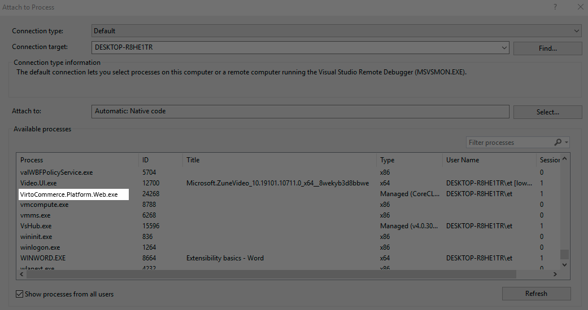
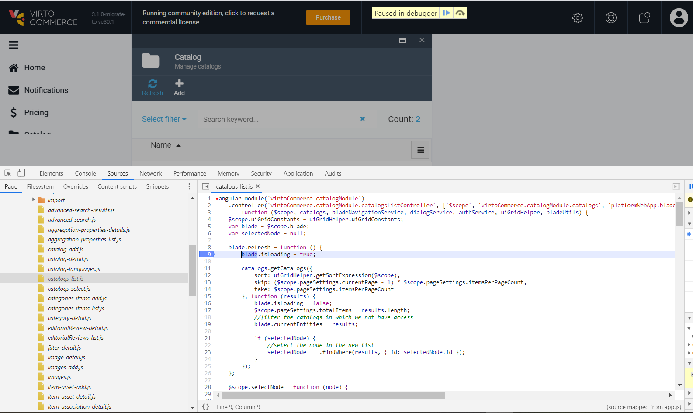

# Deploy Module from Source Code

This guide provides step-by-step instructions on how to deploy a Virto Commerce module from its source code. Follow the steps to set up the module locally, build it, configure it, and test it properly.

## Install

To get started with the module locally, ensure the following steps are completed:

1. Ensure that Virto Commerce Platform is installed.
1. Fork the latest version of the module source code from the repository:
   ```text
   https://github.com/VirtoCommerce/{module-name}.git
   ```
1. Clone the repository to your local machine using `git`:
   ```console
   git clone https://github.com/VirtoCommerce/{module-name}.git
   ```

## Build module

This section explains how to build the module for both backend and frontend components.

### Build backend

You can build the backend either using the command line or through Visual Studio.

=== "Build backend from CLI"

    1. Open your console and navigate to the backend project folder:

        ```console
        cd src/VirtoCommerce.{module-name}.Web
        ```
    1. Build the project using the following command:

        ```console
        dotnet build -c Development
        ```

=== "Build backend from Visual Studio"

    1. Open the **VirtoCommerce.{module-name}.sln** file in Visual Studio.
    1. Build the solution using the **Build Solution** option.

### Build Frontend

When building the module for the first time in Visual Studio, npm references will be installed, and Webpack will be executed automatically. This is managed by the **VirtoCommerce.BuildWebpack** NuGet package, which adds Webpack build targets to the project.

If you modify the frontend, you will need to manually rebuild the frontend to create the necessary style and script bundles.

To build the frontend locally:

1. Open the console and navigate to the frontend project folder:
    ```console
    cd src/VirtoCommerce.{module-name}.Web
    ```
1. Install all required dependencies:
    ```console
    npm ci
    ```
1. Build the frontend application:
    ```console
    npm run webpack:build
    ```
1. To watch for changes during development:
    ```console
    npm run webpack:watch
    ```

## Perform initial configuration

After building the module, configure it by linking the module directory to the platform. This allows the platform to read the module's manifest and load it:

```console
mklink /d VirtoCommerce.Platform.Web\Modules\VirtoCommerce.{module-name} src\VirtoCommerce.{module-name}.Web
```

## Run module

Restart the Virto Commerce Platform to load the newly built module into the platform's application process.

## Debug backend

To debug backend:

1. Make sure the platform is installed and running.
1. Open the module solution in Visual Studio.
1. Attach the debugger to the `VirtoCommerce.Platform.Web.exe` process.



## Debug frontend

Frontend debugging can be done in Chrome Developer Tools:

1. Open Chrome and access the Developer Console.
1. Navigate to the **Sources** tab.
1. In the file navigator, go to **{module-name}/./Script/** to view the source files.



## Test

You can run tests for the module locally. The test suites are located in the **tests** folder, where you can execute them as needed.
