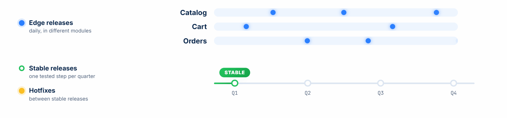
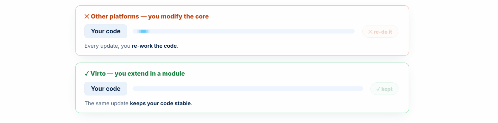
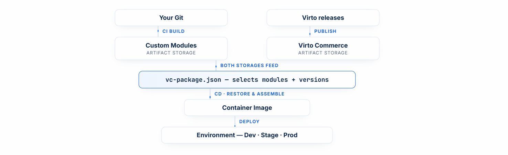

# Virto Commerce Release Strategy

Virto Commerce follows a structured release strategy designed to provide flexibility, stability, and innovation for a wide range of user needs.

Virto Commerce is not a single monolith with one annual version. It is the Platform plus more than 100 independent modules, each evolving and shipping continuously. The release strategy is the set of rules that keeps all those moving parts predictable and safe to combine, so you adopt new capabilities faster and with far less risk than a once-a-year upgrade.

To cater to various scenarios, this strategy includes:

* [Releases.](#releases)
* [Private modules.](#private-modules)
* [Bundles.](#bundles)
* [Packaged business capabilities and PBCs Max](#packaged-business-capabilities-pbcs-and-pbcs-max)

{: width="25"} [Release strategy presentation](https://virtocommerce.github.io/vc-release-notes/presentations/release-strategy-for-business-users)

## Releases

At Virto Commerce, we provide frequent releases for various modules and the Platform, packed with new features, enhancements, and fixes. Releases are a foundation for all [bundles](#bundles) and [PBCs](#packaged-business-capabilities-pbcs-and-pbcs-max).

Generally, we have three release channels: 

* [Stable.](release-strategy-overview.md#stable-releases)
* [Edge.](release-strategy-overview.md#edge-releases)
* [Preview.](release-strategy-overview.md#preview-releases)

Depending on your needs and development cycle, you can choose a release strategy that suits you best.

### Stable releases

Releases in the **Stable** channel have passed our full regression, E2E and load testing and are recommended for all users to avoid issues and maximize functionality.

By default, Virto Commerce CLI runs on stable releases.

Every quarter, we publish a new stable release in our [Stable Release Module Manifest](https://github.com/VirtoCommerce/vc-modules/blob/master/modules_v3.json) on GitHub. You can use it with Virto Commerce CLI to apply updates.

When we fix a bug, we release a hotfix for the two latest stable releases. 

When a stable release contains breaking changes, it ships with migration guides so you can upgrade predictably.

We recommend using it for maintenance updates and new solution development.

{: width="25"} [Install and update stable release](stable-releases.md)

{: width="25"} [Upgrade to Stable 15 and its breaking changes](/platform/developer-guide/latest/Tutorials-and-How-tos/How-tos/upgrading-to-stable-15/)

### Edge releases

The **Edge** channel gives you the opportunity to be among the first to try the latest updates, performance enhancements, and new features with minimal risk.

We publish edge releases for various modules on a daily basis. You can find more information about our releases in the [Virto Commerce GitHub repository](https://github.com/VirtoCommerce) and in the [Module Manifest](https://github.com/VirtoCommerce/vc-modules/blob/master/modules_v3.json) file.

We recommend using these releases if you want to stay up to date and get access to some features faster.

{: width="25"} [Install and update edge release](edge-releases.md)

### Preview releases

The releases in the **Preview** channel show what we are currently working on. These releases may still have some bugs, as we want to get our new features out to you as quickly as possible.

We usually create a preview release for either PR or Contribution so that we can review and adjust the implementation process early on.

### Choose channel

The **Stable** and **Edge** channels cover most needs. Use this comparison to decide which fits a given environment:

{: style="display: block; margin: 0 auto;" }

| Aspect | Stable | Edge |
|---|---|---|
| Cadence | About every three months. | Published daily. |
| Testing | Full regression, E2E, and load testing. | Automated testing only. |
| Strengths | Production-ready, with hotfixes for the two latest releases, documented breaking changes, and a quarterly checkpoint for roadmap alignment. | Latest features and fixes immediately, faster access to innovation, and room for development and staging experimentation. |
| Considerations | Features arrive later, after hardening, at a quarterly pace. | Lighter testing, possible breaking changes, and frequent updates. |
| Best for | Production, new builds, and maintenance. | Pre-production work, such as pilots, MVPs, and proofs of concept. |

Run **Stable** in production for predictability, and reach for **Edge** selectively for development and staging, or when a single feature cannot wait for the next quarter. **Preview** is for early looks at work in progress. Updating with every stable release keeps you current with the least effort, but monthly or yearly rhythms are also supported, based on your team's capacity.

## Preserve customizations across updates

Custom code extends the Platform rather than editing it, so updates recompile and re-test your solution without rewriting your customizations. It is similar to how an added room in a house survives a plumbing upgrade: the extension stays intact while the core is improved. This is the platform's seamless delivery principle: follow the Open-Closed Principle, open for extension and closed for modification, and never modify code you do not own.

{: style="display: block; margin: 0 auto;" }

{: width="25"} [Extensibility overview](/platform/developer-guide/latest/Extensibility/overview/)

## Update complexity

Most updates are small, but the custom-code work depends on what changed. The levels below form an update ladder, from a manifest edit to a full Platform upgrade:

| Level | Typical trigger | What it involves |
|---|---|---|
| Edit manifest only | Bump a module or Platform version, or add a Virto Commerce module. | Update the **vc-package.json** manifest. No code changes. |
| Small (S) | A new feature for your customization. | Add a C# class or extension point, then recompile and re-test. |
| Medium (M) | Documented breaking changes in a stable release. | Resolve the obsolete APIs and apply the documented fixes, then recompile and re-test. |
| Large (L) | A Platform update path, for example a .NET LTS upgrade. | Follow the upgrade recommendations for the Microsoft and .NET changes, then recompile and re-test. |

## How updates reach your project

Updates flow into your solution through a standard CI/CD pipeline that merges two sources:

* **Your Git repository**: your custom modules and extensions.
* **Virto Commerce releases**: the Platform and modules, resolved from the [module manifest](https://github.com/VirtoCommerce/vc-modules/blob/master/modules_v3.json).

Both sources are pulled into artifact storage. The **vc-package.json** manifest pins the exact versions you build against, so every build is reproducible. Virto Commerce CLI builds a single container image from that manifest, and the image is then promoted through your environments: development, staging, and production.

{: style="display: block; margin: 0 auto;" }

## Private modules

Virto Commerce also offers private modules that are not included in the public repository. These modules are available to customers with specific requirements such as AI, Enterprise, High Performance, and Marketplace functionality. [Contact us](https://virtocommerce.com/request-demo) for access to private modules.

## Bundles

The release types can be combined into the following bundles to meet different needs:  

| Bundle                                     | Included releases             | Description                                                                                      |
|--------------------------------------------|-------------------------------|------------------------------------------------------------------------------------------------------|
| Alfa                                       | Preview releases              | Includes experimental features and updates for testing and feedback; provides early access to innovations in development. |
| Edge                                       | Edge releases                 | Contains more stable modules than the Alfa Bundle but may include adjustments and breaking changes; suited for early adopters. |
| [Stable](https://github.com/VirtoCommerce/vc-modules/tree/master/bundles/latest)     | Stable releases  | Comprises thoroughly tested and finalized modules; production-ready and recommended for live environments. |

## Packaged Business Capabilities (PBCs) and PBCs Max

Packaged Business Capabilities (PBCs) are a core component of Virto Commerce's modular and flexible approach, known as the Virto Atomic Architecture:

* **PBC** is a module or a group of modules (in some cases) that solves an individual business problem, such as Catalog, or logging in. 
* **PBC Max** is a combination of modules, grouped by functionality to address specific business needs, such as setting up and customizing product catalogs. The PBCs Max are designed to encapsulate specific business functionalities, making them an ideal choice for decision-makers across various business entities.

    !!! note
        Virto Commerce offers [6 preset PBCs Max](pbcs.md). However, you can create any number of custom PBCs Max to address specific business tasks.

{: width="25"} [Available PBCs Max and their installation](pbcs.md)

{: width="25"} [Install specific Platform or module version](installing-specific-version.md)

{: width="25"} [Useful tips](tips.md)

 
 
********

    <a href="../../Tutorials-and-How-tos/overview">← Tutorials and how-tos </a>
    <a href="../stable-releases">Stable releases  →</a>

