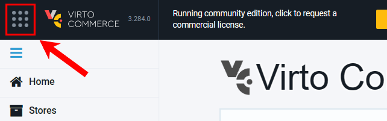
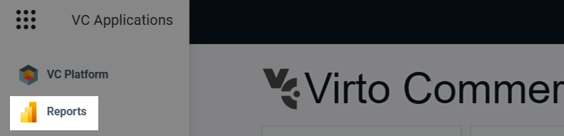
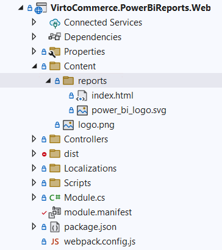
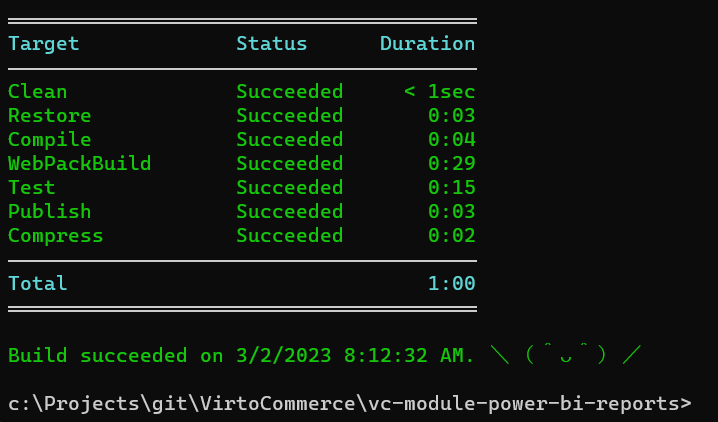
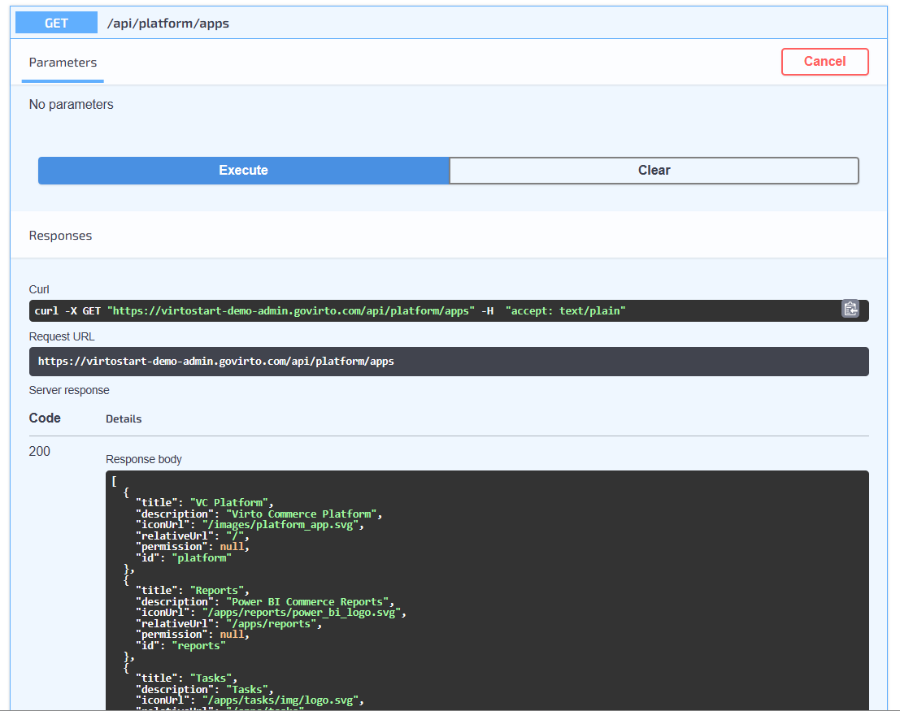

# How to register new App 

Using the Reports application as an example, let's look at the application installation process.

!!! note "Prerequisites"
    * Before adding a new web app, make sure the following prerequisites have been installed:
        * [Virto Commerce Platform 3.264+](https://github.com/VirtoCommerce/vc-platform)
        * [Virto Commerce CLI (VC-BUILD) 3.12+](https://github.com/VirtoCommerce/vc-build)
        * [Virto Shell VueJS Framework](https://github.com/VirtoCommerce/vc-shell)

1. Add a web app in the [module.manifest](../Fundamentals/Modularity/06-module-manifest-file.md):

    1. Add the app section in the **module.manifest**.

        ```xml
        ...
        <apps>
            <app id="reports">
                <title>Reports</title>
                <description>Power BI Commerce Reports</description>
                <iconUrl>/apps/reports/power_bi_logo.svg</iconUrl>
                <permission>PowerBiReports:access</permission>
            </app>
        </apps>
        ...
        ```

        <details><summary>Attributes description</summary>

        | `id`           	| A unique identifier for the app, which distinguishes it from other apps in the system.       	|
        |----------------	|----------------------------------------------------------------------------------------------	|
        | `title`        	| The name or title of the app that is displayed to the users.                                	|
        | `description`  	| A short description of the app that gives users an overview of what the app does and its purpose.|
        | `iconUrl`      	| The URL or path to the app's icon or logo used to identify the app in the system.          	|
        | `permission`   	| The permissions or access rights required to use the app, which are used to control<br>who can access the app and its features.     	|
        | `contentPath`  	| The default path to the app's content, which is used to specify where the app's files<br>are stored and accessed. In this example, the ContentPath is set to [VcModuleWeb]/Content/[Id],<br>which means that the app's content will be stored in the Content folder of the VcModuleWeb module,<br>with the app's Id appended to the end of the path. 	|

        </details>
        
    1. Go to the Apps Menu.

        

    1. Find the added app.
    
        


1. Create Content/[app_id] folder in the web project. Virto Commerce reads the manifest and adds binding to this folder. You can put any web content here. It can be a Virto Shell or any other HTML application.

    ```xml
    vc-module-power-bi-reports\src\VirtoCommerce.PowerBiReports.Web\Content\reports
    ```

    

1. Build, compress, and deploy. Use the Virto Commerce CLI (vc-build) to create a module package.

    

1. Invoke Rest API. Virto Commerce provides an API to returns list of available apps.

    ```ps
    curl -X GET "https://mycustomdomain.com/api/platform/apps" -H  "accept: text/plain"
    ```

    

New app is ready to go.
