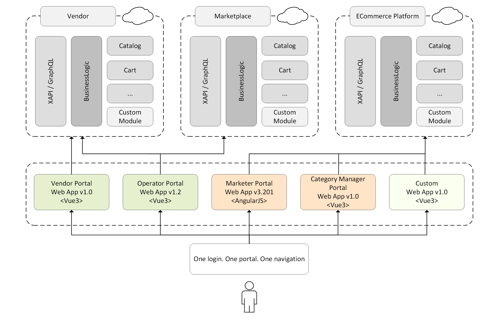

# Overview 

Virto Commerce offers a variety of apps to meet different needs of its users: from a project management app to assign tasks to a report app to generate reports. By combining multiple apps, users can create a more efficient and effective workflow that improves productivity and collaboration.

Virto Commerce's multi-app experience:

* Allows businesses to create their own app ecosystem and improve overall efficiency and productivity. 
* Ensures consistent user interface. 
* Provides an improved user experience due to seamless navigation between apps and one login.
* Enables multiple teams to work simultaneously on different aspects of the project. 
* Simplifies scalability.

## Architecture
Virto Commerce's multi-app architecture allows companies to create different UIs on any web technology, such as VueJs, Angular, React, and more, while maintaining a single UX. 

The Virto Commerce platform enables various isolated web apps for separate development by multiple teams. Developers can create, deploy, and manage apps as Virto Commerce modules, reducing the time and effort required to create and deploy apps. With the VC-Shell SDK and UI Kit Storybook, it also ensures a consistent user interface across all apps.

