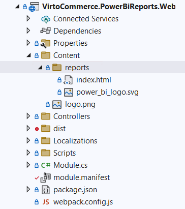
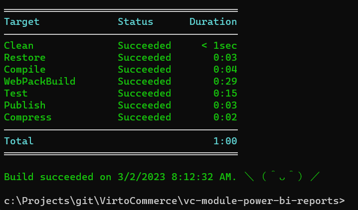
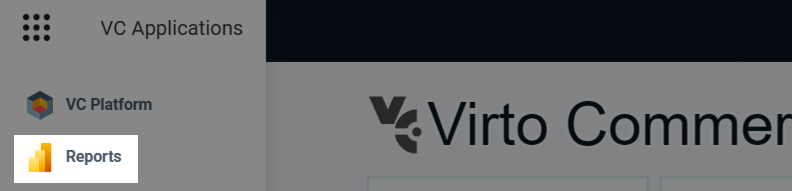
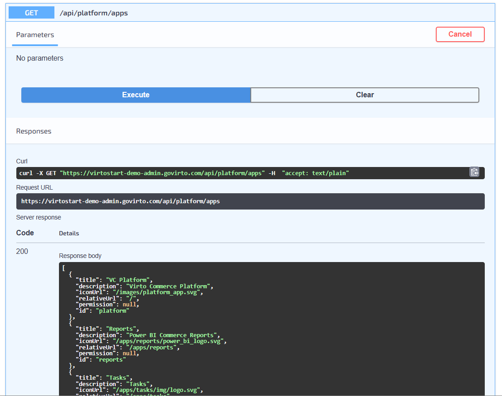

# Register a Third-Party App

A third-party app is an entry in the Platform's **Apps** menu that hands the user off to an external service instead of opening a custom-built application. The Platform binds **Content/[app_id]** to the `/apps/[app_id]` URL, so a tiny static **index.html** in that folder can redirect the browser to a server-side endpoint or an external URL.

The [Power BI Reports module](https://github.com/VirtoCommerce/vc-module-power-bi-reports) uses this pattern: its **Content/reports/index.html** issues a meta-refresh to **/api/power-bi-reports/redirect**, where a controller reads the configured Power BI URL and issues an HTTP redirect to it.

If your goal is to ship a custom back-office app rather than launch an external service, see [Register your own app](register-your-own-app.md) instead.

## Prerequisites

Before adding a third-party app, make sure the following prerequisites have been installed:

* [Virto Commerce Platform 3.264+](https://github.com/VirtoCommerce/vc-platform)
* [Virto Commerce CLI (VC-BUILD) 3.12+](https://github.com/VirtoCommerce/vc-build)

## Registration steps

To register a third-party app:

1. [Declare the app in module.manifest](#declare-the-app-in-modulemanifest).
1. [Provide the redirect index.html](#provide-the-redirect-indexhtml).
1. [Build, package, and deploy](#build-package-and-deploy).
1. [Verify the app appears in the Apps menu](#verify-the-app-appears-in-the-apps-menu).

### Declare the app in module.manifest

Add an `<app>` entry inside `<apps>` in **module.manifest**. For example:

```xml title="module.manifest"
<apps>
    <app id="reports">
        <title>Reports</title>
        <description>Power BI Commerce Reports</description>
        <iconUrl>/apps/reports/power_bi_logo.svg</iconUrl>
        <permission>PowerBiReports:access</permission>
    </app>
</apps>
```

For a description of every supported attribute, see [Apps section in Module.manifest](../Fundamentals/Modularity/06-module-manifest-file.md#apps-section).

### Provide the redirect index.html

Create a **Content/[app_id]** folder in the Web project and place an **index.html** in it.

Use a meta-refresh to forward the browser to your target URL. For example, to redirect to a controller endpoint that completes the integration server-side:

```html title="src/VirtoCommerce.PowerBiReports.Web/Content/reports/index.html"
<!DOCTYPE html>
<html>
<head>
    <meta charset="UTF-8">
    <meta http-equiv="refresh" content="0; URL=/api/power-bi-reports/redirect">
    <title>Redirecting to Power BI Reports</title>
</head>
<body>
    <h1>Redirecting to Power BI Reports...</h1>
    <p>If you are not redirected automatically, please click <a href="/api/power-bi-reports/redirect">here</a>.</p>
</body>
</html>
```



The controller behind `/api/power-bi-reports/redirect` issues the final HTTP redirect:

```csharp title="PowerBiReportsController.cs"
[Route("api/power-bi-reports")]
public class PowerBiReportsController : Controller
{
    private readonly ISettingsManager _settingsManager;

    public PowerBiReportsController(ISettingsManager settingsManager)
    {
        _settingsManager = settingsManager;
    }

    [HttpGet]
    [Route("redirect")]
    [Authorize(ModuleConstants.Security.Permissions.Read)]
    public ActionResult Redirect()
    {
        var redirectToPowerBIUrl = _settingsManager.GetValue<string>(ModuleConstants.Settings.General.PowerBiReportsUrl);

        if (string.IsNullOrEmpty(redirectToPowerBIUrl))
        {
            return NotFound("PowerBiReportsUrl is not configured in Platform Settings");
        }

        return Redirect(redirectToPowerBIUrl);
    }
}
```

### Build, package, and deploy

Use the Virto Commerce CLI (vc-build) to package the module:

```bash
vc-build Compile
vc-build Compress
```

The packaging step includes everything under **Content/[app_id]/**, so the redirect file ships inside the module zip. Deploy the resulting package as you would any other module.



### Verify the app appears in the Apps menu

1. Open Platform.
1. Click {: width="25"} in the top left corner.
1. Click the registered app and confirm the browser redirects to the target URL.

    

You can also confirm the app via REST API:

```bash
curl -X GET "https://mycustomdomain.com/api/platform/apps" -H "accept: application/json"
```


