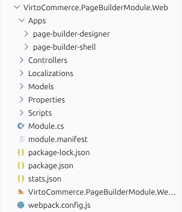
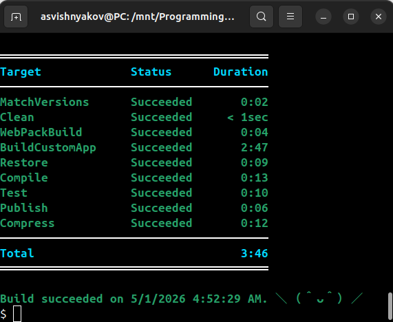
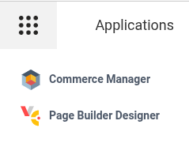
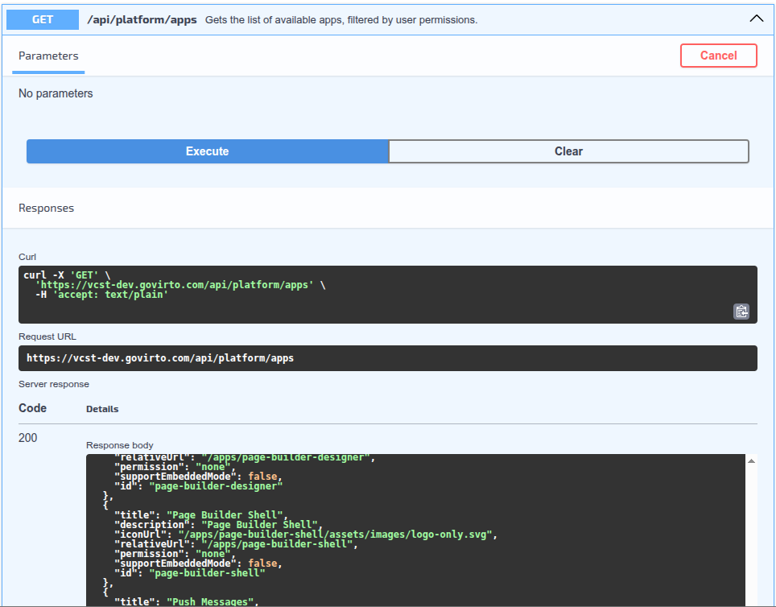

# Register Your Own App

This guide shows how to register a custom app you build yourself, packaged inside a Platform module. The Virto Commerce CLI (vc-build) builds the source, copies the output into the module, and the Platform serves it from the **Apps** menu under the `/apps/[app_id]` URL.

The recommended framework is [VC-Shell](https://github.com/VirtoCommerce/vc-shell), and the steps below use it as the example.

If your goal is to add an Apps menu entry that hands the user off to an external service rather than ship a custom-built app, see [Register a third-party app](register-third-party-app.md) instead.

## Prerequisites

Before adding a new app, make sure the following prerequisites have been installed:

* [Virto Commerce Platform 3.264+](https://github.com/VirtoCommerce/vc-platform)
* [Virto Commerce CLI (VC-BUILD) 3.12+](https://github.com/VirtoCommerce/vc-build)

Optional, depending on the frontend toolchain you choose:

* [VC-Shell framework](https://github.com/VirtoCommerce/vc-shell)

## Registration steps

To register your own app:

1. [Declare the app in module.manifest](#declare-the-app-in-modulemanifest).
1. [Place source code in the Web project](#place-source-code-in-the-web-project).
1. [Build, package, and deploy](#build-package-and-deploy).
1. [Verify the app appears in the Apps menu](#verify-the-app-appears-in-the-apps-menu).

### Declare the app in module.manifest

Add an `<app>` entry inside `<apps>` in **module.manifest**. For example:

```xml title="module.manifest"
<apps>
    <app id="page-builder-shell">
        <title>Page Builder Shell</title>
        <description>Page Builder Shell</description>
        <iconUrl>/apps/page-builder-shell/assets/images/logo-only.svg</iconUrl>
        <permission>none</permission>
        <supportEmbeddedMode>false</supportEmbeddedMode>
    </app>
    <app id="page-builder-designer">
        <title>Page Builder Designer</title>
        <description>Page Builder Designer</description>
        <iconUrl>/apps/page-builder-designer/assets/images/logo-only.svg</iconUrl>
        <permission>none</permission>
        <supportEmbeddedMode>false</supportEmbeddedMode>
    </app>
</apps>
```

This example, taken from the [Page Builder module](https://github.com/VirtoCommerce/vc-module-pagebuilder), declares two apps in a single module. Each app gets its own `<app>` entry, source folder, and runtime URL. It also shows that the registration mechanism is not tied to VC-Shell: `page-builder-shell` is a VC-Shell app and `page-builder-designer` is an Angular app, but both are registered the same way.

For a description of every supported attribute, see [Apps section in Module.manifest](../Fundamentals/Modularity/06-module-manifest-file.md#apps-section).

### Place source code in the Web project

The vc-build `BuildCustomApp` target resolves the source folder in this order:

1. **Apps/[app_id]** under the Web project, for example, **src/VirtoCommerce.PageBuilderModule.Web/Apps/page-builder-shell/** and **src/VirtoCommerce.PageBuilderModule.Web/Apps/page-builder-designer/**. This is the canonical layout and the only one supported when the manifest declares more than one app.
1. **App** under the Web project, for example, **src/VirtoCommerce.News.Web/App/**. This legacy fallback applies only when the manifest declares a single app.

The package manager is auto-detected from the project's lockfile, so yarn, pnpm, npm, and bun are all supported with no configuration. Projects with non-conventional setups can override the defaults; run `vc-build --help` to see the available parameters.

To bootstrap a VC-Shell app, run the scaffolder from the Web project's directory and pass the app id as the project name:

```bash
npx @vc-shell/create-vc-app page-builder-shell
```

The scaffolder creates **Apps/page-builder-shell/** automatically, matching the canonical layout. Run it once per app id when the manifest declares multiple apps. For details on the scaffolder, see [Creating Custom VC-Shell Applications](vc-shell/Guides/creating-custom-applications.md).



### Build, package, and deploy

Run vc-build at the module root:

```bash
vc-build Compile
vc-build Compress
```

`Compile` invokes the `BuildCustomApp` target, which:

1. Detects the project's package manager from the lockfile and runs install and build in the resolved source folder.
1. Copies the build output into **Content/[app_id]** in the Web project.

`Compress` then packages the module into a zip in which the app sits at **Content/[app_id]/**. Deploy the resulting package as you would any other module.



### Verify the app appears in the Apps menu

1. Open Platform.
1. Click {: width="25"} in the top left corner.
1. Find the registered app.

    

You can also confirm the app via REST API:

```bash
curl -X GET "https://mycustomdomain.com/api/platform/apps" -H "accept: application/json"
```



## Optional: enable embedded mode

To make a VC-Shell app open inside the AngularJS-based back office instead of as a standalone tab, see [Enabling Embedded Mode for VC-Shell Instances](../Tutorials-and-How-tos/How-tos/enable-embedded-mode-for-vc-shell.md).
