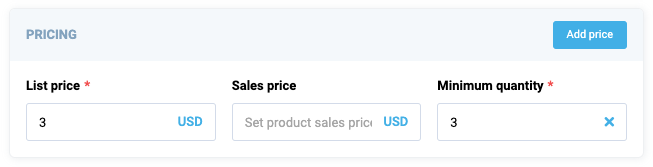

# Card

Card is a flexible and collapsible container component. The examples below illustrate how you can use the `vc-card` component to enhance your user interface.

## Usage

Include the `vc-card` component in your Vue application, providing theming and enhanced functionality to your card inputs.
Card is created with a `header` property and default slot as its content.


=== "Basic Vue"

    Create a basic static card with a labeled header as follows:

    ```html
    <template>
        <vc-card header="Card label"></vc-card>
    </template>
    ```

=== "Dynamic Views"

    To start using all the available card properties, specify the `vc-card` component when creating the schema. For example:

    ```typescript
    {
        id: "cardId",
        component: "vc-card",
        label: "Card label",
        fields: [
            // other schema components
        ],
    }
    ```

As the card has the ability of deep nesting, you can add other cards or controls to it and create complex UI interfaces.

## Card API

API empowers you to create dynamic and interactive card components to customize its appearance and behavior.

### Basic Vue

Integrate the `vc-card` component into your Vue applications using a simple template.

#### Props

To customize the appearance and behavior of cards, use the following props:

| Name      | Type                                         | Description                                            |
|-----------|----------------------------------------------|--------------------------------------------------------|
| `header`  | `string`                                     | The header of the component.                           |
| `icon`    | `string`                                     | The icon associated with the component.                |
| `isCollapsable`| `boolean`                               | Specification whether the component is collapsible.    |
| `isCollapsed`  | `boolean`                               | Specification whether the component is initially collapsed. |
| `fill`         | `boolean`                               | Specification whether the content of the card should fill available space. |
| `variant`      | `"default"`, `"success"`, `"danger"`    | The variant of the component.                |

#### Slots

To enhance the content of the `vc-card` component, use the slot system:

| Name      | Description                                                     |
| --------- | --------------------------------------------------------------- |
| `default` | Card content slot.                                              |
| `actions` | Slot for any customizable component to show in the right corner of the card header                           |

#### Emits

To interact with the `vc-card` component, use the emitted events. The `click` event, triggered when the button is clicked, allows you to implement dynamic behaviors and responses within your application:

| Name              | Parameters                    | ReturnType | Description                                                   |
| ----------------- | ----------------------------- | ---------- | --------------------------------------------------------------|
| `header:click`    | `void`                        | `void`     | Emitted when the header is clicked.                           |
| `state:collapsed` | `isCollapsedState: boolean`   | `void`     | Emitted when the card is collapsed or expanded.               |

### Dynamic Views

To dynamically integrate the `vc-card` component into your views, use the schema interface:

```typescript
interface CardSchema {
    id: string;
    component: "vc-card";
    label: string;
    fields: ControlSchema[];
    action?: ButtonSchema & {
        method: string;
    };
    collapsible?: boolean;
    visibility?: {
        method: string;
    };
    horizontalSeparator?: boolean;
}
```

To incorporate the card into your dynamic applications, define the following properties:

| Property              | Type                                 | Description                                                                                                                                   |
| ----------------------|------------------------------------- | --------------------------------------------------------------------------------------------------------------------------------------------- |
| `id`                  | `string`                             | The unique Id for `vc-card` component.                                                                                                        |
| `component`           | `vc-card`                            | Component used in schema.                                                                                                                     |
| `label`               | `string`                             | Card label that is displayed in the header. Also available interpolation `{}` syntax based on current element context. You can specify the localization key for the `label`. Under the hood, [vue-i18n](https://kazupon.github.io/vue-i18n/) is used.                        |
| `fields`              | `ControlSchema[]`                    | Array of schemas for components that will be displayed inside the card.                                                                       |
| `action`              | `ButtonSchema & {method: string}`    | Action button that is displayed in the top right corner of the card. Could be used to trigger some actions.                                   |
| `collapsible`         | `boolean`                            | Specification whether the card should be collapsed.                                                                                           |
| `visibility`          | `{method: string}`                   | Visibility state for the component, could be used to hide the card based on some conditions. Method or variable should be defined in the blade `scope` and should return a boolean value. |
| `horizontalSeparator` | `boolean`                            | Adds a horizontal separator line after the component. |


### Example

The card example with action button and fieldset component containing several inputs from `vc-app` project:

=== "Screenshot"

    

=== "Code"

    ```typescript title="vc-app-extend/src/modules/offers/pages/details.ts" linenums="1"
    {
        id: "pricingCard",
            component: "vc-card",
            label: "Pricing",
            action: {
                id: "addPrice",
                component: "vc-button",
                content: "Add price",
                small: true,
                method: "addPrice",
            },
            fields: [
                {
                id: "pricesFieldset",
                component: "vc-fieldset",
                property: "prices",
                columns: 3,
                remove: {
                    method: "removePrice",
                },
                fields: [
                    {
                        id: "listPrice",
                        component: "vc-input-currency",
                        label: "List price",
                        property: "listPrice",
                        placeholder: "Set list price",
                        optionProperty: "currency",
                        optionValue: "value",
                        optionLabel: "title",
                        rules: {
                            required: true,
                            min_value: 0,
                        },
                    },
                    {
                        id: "salePrice",
                        component: "vc-input-currency",
                        label: "Sales price",
                        property: "salePrice",
                        placeholder: "Set product sales price",
                        optionProperty: "currency",
                        optionValue: "value",
                        optionLabel: "title",
                    },
                    {
                        id: "minQuantity",
                        component: "vc-input",
                        label: "Minimum quantity",
                        property: "minQuantity",
                        placeholder: "Enter product minimal quantity in order",
                        clearable: true,
                        rules: {
                            required: true,
                            min_value: 0,
                        },
                        variant: "number",
                    },
                ],
                },
            ],
    }
    ```
