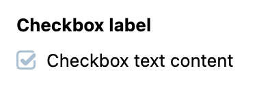

# Checkbox

Checkbox is an extension to a standard checkbox element with theming.

## Usage

Include the `vc-checkbox` component in your Vue application, providing theming and enhanced functionality to your checkbox inputs.



=== "Basic Vue"

    Create a basic checkbox as follows:

    ```html
    <template>
        <vc-checkbox :modelValue="checkboxProperty" label="Checkbox label">{{ Checkbox text content }}</vc-checkbox>
    </template>
    ```

=== "Dynamic Views"

    To start using all the available checkbox properties, specify the `vc-checkbox` component when creating the schema. For example:

    ```typescript
    {
        id: "checkboxId",
        component: "vc-checkbox",
        label: "Checkbox label",
        property: "checkboxProperty",
        content: "Checkbox text content",
    }
    ```

## Checkbox API

API empowers you to create dynamic and interactive checkbox components to customize its appearance and behavior.

## Basic Vue

You can easily incorporate the `vc-checkbox` component into your Vue applications using simple templates.

### Props

To customize the appearance and behavior of checkboxes, use the following props:

| Property and Type                  | Description                                           |
| ---------------------------------- |  ---------------------------------------------------- |
| `modelValue` ==`MaybeRef<boolean>`==| The value of the component.                           |
| `disabled`  ==boolean==          | Disabled state for the component.                     |
| `required`  ==boolean==          | Indicates if the component is required.               |
| `name` ==string==                | The name attribute of the component.                  |
| `errorMessage` ==string==        | The error message to display when validation fails.   |
| `trueValue` ==boolean==          | Set value for checked state. Default: `true`          |
| `falseValue` ==boolean==         | Set value for unchecked state. Default: `false`       |
| `label` ==string==               | The label of the component.                           |
| `tooltip` ==string==             | The tooltip text to display when hovering over the component. |

### Slots

To enhance the content of the `vc-checkbox` component, use the slot system:

| Name      | Description                                      |
| --------- | -------------------------------------------------|
| `default` | Checkbox text content slot.                      |
| `error`   | Slot for error message                           |

### Emits

To interact with the `vc-checkbox` component, use the emitted events. The `update:modelValue` event is triggered when the value of the component changes:

| Name                | Parameters          | ReturnType | Description                                                     |
| ------------------- | -----------------   | ---------- | --------------------------------------------------------------- |
| `update:modelValue` | value: `boolean`    | `void`     | Emitted when the value of the component changes.                |

## Dynamic Views

To dynamically integrate the `vc-checkbox` component into your views, use the schema interface:

```typescript
interface CheckboxSchema {
    id: string;
    component: "vc-checkbox";
    trueValue?: boolean;
    falseValue?: boolean;
    label?: string;
    rules?: IValidationRules;
    tooltip?: string;
    property: string;
    content?: string;
    update?: {
        method: string
    };
    disabled?: {
        method: string;
    };
    visibility?: {
        method: string;
    };
    horizontalSeparator?: boolean;
}
```

To incorporate the checkbox into your dynamic applications, define the following properties:

| Property                  | Description                                                                                                                                               |
| ------------------------- |  -------------------------------------------------------------------------------------------------------------------------------------------------------- |
| `id` ==string==         | The unique Id for `vc-checkbox` component.                                                                                                                |
| `component` ==string==  | `vc-checkbox`                                                                                                                                             |
| `trueValue` ==boolean== | Set value for checked state.                                                                                                                              |
| `falseValue` ==boolean==| Set value for unchecked state.                                                                                                                            |
| `label` ==string==      | Checkbox label that is displayed above the checkbox. Also available interpolation `{}` syntax based on current element context. You can specify the localization key for the `label`. Under the hood, [vue-i18n](https://kazupon.github.io/vue-i18n/) is used.                      |
| `rules` ==IValidationRules== | Checkbox validation rules. Could be used to validate checkbox value. Uses [VeeValidate](https://vee-validate.logaretm.com/v4/) validation rules.     |
| `tooltip` ==string==    | Checkbox tooltip that is displayed when hovering over the checkbox label tooltip icon. You can specify the localization key for the `tooltip`. Under the hood, [vue-i18n](https://kazupon.github.io/vue-i18n/) is used.                                                                   |
| `property` ==string==   | Property name that is used for binding checkbox value to blade data. <br> Supports deep nested properties like `property[1].myProperty`. <br> Additionally, you have the flexibility to bind computed property that returns a value. Computed property should be defined in the blade `scope`.                                                               |
| `content` ==string==    | Text content that is displayed on the right side of the checkbox. You can specify the localization key for the `content`. Under the hood, [vue-i18n](https://kazupon.github.io/vue-i18n/) is used.                                                                                         |
| `update` =={method: string}== | Update method that is called when checkbox value is changed. It gets changed value, schema property name and field internal context as arguments. Method should be defined in the blade `scope`.                                        |
| `disabled` =={method: string}== | Disabled state for component, could be used to disable checkbox based on some conditions. Method or variable should be defined in the blade `scope` and should return a boolean value. |
| `visibility` =={method: string}== | Visibility state for component, could be used to hide checkbox based on some conditions. Method or variable should be defined in the blade `scope` and should return a boolean value. |
| `horizontalSeparator` ==boolean==       | Adds a horizontal separator line after the component. |
