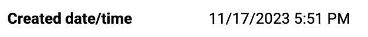

# Data field

Data field is used to display a field label and some static data. It can be used to display text, date, date-ago and links. It also has ability to copy displayed value.

## Usage

Include the `vc-field` component in your Vue application, providing theming and enhanced functionality to your data field inputs.



=== "Basic Vue"

    Create a basic data field as follows:

    ```html
    <template>
        <vc-field :modelValue="fieldProperty" label="Field label" copyable></vc-field>
    </template>
    ```

=== "Dynamic Views"

    To start using all the available data field properties, specify the `vc-field` component when creating the schema. For example:

    ```typescript
    {
        id: "fieldId",
        component: "vc-field",
        label: "Field label",
        property: "fieldProperty",
        type: "text",
        copyable: true
    }
    ```

## Field API

API empowers you to create dynamic and interactive data field components to customize its appearance and behavior.

### Basic Vue

You can easily incorporate the `vc-field` component into your Vue applications using simple templates. 

#### Props

To customize the appearance and behavior of your data field, use the following props:

| Property and Type                 | Description                                   |
| --------------------------------- | -------------------------------------------   |
| `label?` {==string==}             | Field label.                                  |
| `tooltip?` {==string==}           | Field tooltip information.                    |
| `type?` {=="text"==}, {=="normal"==}, {=="date"==}, {=="date-ago"==}, {=="link"==}| Field type. Default: `text` |
| `modelValue?` {==any==}           | Field content. |
| `copyable?` {==boolean==}         | Add button for field content copying. |


### Dynamic Views

To dynamically integrate the `vc-field` component into your views, use the schema interface:

```typescript
interface FieldSchema {
    id: string;
    component: "vc-field";
    label?: string;
    tooltip?: string;
    property: string;
    variant: "text" | "date" | "date-ago" | "link";
    copyable?: boolean;
    visibility?: {
        method: string;
    };
}
```

To incorporate the data field into your dynamic applications, define the following properties:

| Property and Type                     | Description                                       |
| ------------------------------------- | -----------------------------------------------   |
| `id` {==string==}                     | The unique Id for the `vc-field` component.       |
| `component` {==vc-field==}            | Component used in schema. |
| `label` {==string==}                  | Label for the field. Also available interpolation `{}` syntax based on current element context. |
| `tooltip` {==string==}                | Tooltip text for the field label. |
| `property` {==string==}               | Property name that is used for binding field value to blade data.  <br> Supports deep nested properties like `property[1].myProperty`. <br> Additionally, you have the flexibility to bind any function or computed property that returns a value and retrieve changed value as an argument for the function.|
| `variant` {==string==}                | Field variant. Default: `text` |
| `copyable` {==boolean==}              | Specification whether the field is copyable or not. |
| `visibility` {=={method: string}==}   | Visibility state for component, could be used to hide field based on some conditions. Method or variable should be defined in the blade `scope` and should return a boolean value. |


