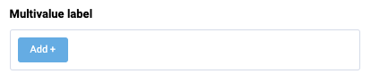

# Multivalue

Multivalue is a control that allows you to select multiple values from a list of values. Also supports the ability to add new values.

## Usage

Include the `vc-multivalue` component in your Vue application.



=== "Basic Vue"

    Create a basic multivalue as follows:

    ```html
    <template>
        <vc-multivalue v-model="multivalueProperty" :placeholder="Multivalue placeholder" :label="Multivalue label"></vc-multivalue>
    </template>
    ```

=== "Dynamic Views"

    To start using all the available multivalue properties, specify the `vc-multivalue` component when creating the schema. For example:

    ```typescript
    {
        id: "multialueId",
        component: "vc-multivalue",
        label: "Multivalue label",
        property: "multivalueProperty",
        placeholder: "Multivalue placeholder",
    }
    ```

## Multivalue API

API empowers you to create dynamic and interactive multivalue component to customize its appearance and behavior.

### Basic Vue

You can easily incorporate the `vc-multivalue` component into your Vue applications using simple templates.

#### Props

To customize the appearance and behavior of your multivalue, use the following props:

|Property and Type       | Description                                      |
| --------------------- | ------------------------------------------------ |
| `placeholder` ==string==        | Multivalue placeholder text.                          |
| `modelValue` ==T[]==        | Model of the component.                          |
| `required` ==boolean==         | Multivalue required state.                            |
| `disabled` ==boolean==         | Put component in disabled mode.                  |
| `type` ==text==, ==number==             | Multivalue type.                                |
| `label` ==string==             | Multivalue label text.                                |
| `tooltip` ==string==           | Multivalue tooltip information.                       |
| `name` ==string==            | Used to specify the name of the control.         |
| `options` ==T[]==             | Multivalue options list                                |
| `optionValue` ==string==             | Property of option which holds the 'value'. Default value: `id`.                                |
| `optionLabel` ==string==  | Property of option which holds the 'label'. Default value: `title`. |
| `multivalue` ==boolean==  | Ability to add values with Add button. |
| `error` ==boolean==                 | Shows, if the field has validation errors. |
| `errorMessage` ==string==           | Validation error message (gets displayed only if 'error' is set to 'true'). |
| `multilanguage` ==boolean==         | Multilanguage support. |
| `currentLanguage` ==string==        | Current language. |

#### Slots

To enhance the content of the `vc-multivalue` component, use the slot system:

| Name         | Type                                      | Description                                                                                     |
| ---------------- | ----------------------------------------- | ----------------------------------------------------------------------------------------------- |
| `item`  | args: { item: T }        | Override item slot      |
| `error`          | void                                        | Slot for errors


#### Emits

To interact with the vc-multivalue component, use the emitted events. The `update:modelValue` event is triggered when the value of the component changes:

| Name               | Parameters                                  | ReturnType | Description                                                                                     |
| ------------------ | ------------------------------------------- | ---------- | ----------------------------------------------------------------------------------------------- |
| `update:modelValue` | value: `T[] \| undefined`    | Emitted when the value of the component changes.                                                |
| `close` | -    | Emitted when the multivalue is closed.                                                |
|`search` | value: `string`    | Emitted when the search value of the component changes.                                                |

### Dynamic Views

To dynamically integrate the `vc-multivalue` component into your views, use the schema interface:

```typescript
interface MultivalueSchema {
    id: string;
    component: "vc-multivalue";
    label?: string;
    tooltip?: string;
    property: string;
    placeholder?: string;
    required?: boolean;
    disabled?: boolean;
    variant?: "text" | "number";
    rules?: IValidationRules;
    options?: string;
    optionValue?: string;
    optionLabel?: string;
    multivalue?: boolean;
    error?: boolean;
    errorMessage?: string;
    multilanguage?: boolean;
    currentLanguage?: string;
    visibility?: {
        method: string;
    };
    customTemplate?: {
        component: string;
    };
    horizontalSeparator?: boolean;
}
```

To incorporate the multivalue into your dynamic applications, define the following properties:

| Property and Type                     | Description                                       |
| ------------------------------------- | -----------------------------------------------   |
| `id` ==string==                     | The unique Id for the `vc-multivalue` component.       |
| `component` ==vc-multivalue==       | The `vc-multivalue` component.       |
| `label?` ==string==                 | Multivalue label text. You can specify the localization key for the `label`. Under the hood, [vue-i18n](https://kazupon.github.io/vue-i18n/) is used.                               |
| `tooltip?` ==string==               | Multivalue tooltip information. You can specify the localization key for the `tooltip`. Under the hood, [vue-i18n](https://kazupon.github.io/vue-i18n/) is used.                      |
| `property` ==string==               | The property of the model that the component is bound to. <br> Additionally, you have the flexibility to bind computed property that returns a value. Computed property should be defined in the blade `scope`. |
| `placeholder?` ==string==           | Multivalue placeholder text. You can specify the localization key for the `placeholder`. Under the hood, [vue-i18n](https://kazupon.github.io/vue-i18n/) is used.                         |
| `required?` ==boolean==             | Multivalue required state.                            |
| `disabled?` ==boolean==             | Put component in disabled mode.                  |
| `variant?` ==text==, ==number==   | Multivalue type.                                |
| `rules` ==IValidationRules==        | Validation rules for the multivalue. Uses [VeeValidate](https://vee-validate.logaretm.com/v4/) validation rules. |
| `options?` ==string==                  | Method to get multivalue options array. Method should be defined in the `scope` blade.                                |
| `optionValue?` ==string==           | Property of option which holds the 'value'. Default value: `id`.                                |
| `optionLabel?` ==string==           | Property of option which holds the 'label'. Default value: `title`. |
| `multivalue?` ==boolean==           | Ability to add values with Add button. |
| `error?` ==boolean==                | Shows, if the field has validation errors. |
| `errorMessage?` ==string==          | Validation error message (gets displayed only if 'error' is set to 'true'). |
| `multilanguage?` ==boolean==        | Multilanguage support. |
| `currentLanguage?` ==string==       | Current language. |
| `visibility?` =={ method: string }== | Visibility settings. |
| `customTemplate?` =={ component: string }== | Custom template settings. |
| `horizontalSeparator` ==boolean==       | Adds a horizontal separator line after the component. |
