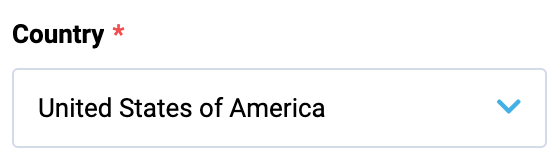

# Select

Select is used to choose an item from a collection of options. It supports the combination of a method for loading options directly from the server with automatic loading of items on scrolling.

## Storybook

Explore the `vc-select` component in the [VC Shell Storybook](https://vc-shell-storybook.govirto.com/?path=/docs/molecules-vcselect--docs).

Dynamic Views examples are also available in the [VC Shell Storybook](https://vc-shell-storybook.govirto.com/?path=/docs/dynamicviews-molecules-vcselect--docs) for a better understanding of the component usage.

## Usage

Include the `vc-input-currency` component in your Vue application, providing theming and enhanced functionality to your currency input.



=== "Basic Vue"

    Create a basic component as follows:

    ```html
    <template>
        <vc-select
            label="Country"
            :property="selectProperty"
            :placeholder="Select placeholder"
            :options="fetchMethod"
            optionValue="value"
            optionLabel="label"
        ></vc-select>
    </template>
    ```

=== "Dynamic Views"

    To start using all the available select properties, specify the `vc-select` component when creating the schema. For example:

    ```typescript
    {
        id: "selectId",
        component: "vc-select",
        label: "Country",
        property: "selectProperty",
        placeholder: "Select placeholder",
        optionsMethod: "fetchMethod",
        optionValue: "value",
        optionLabel: "label",
    }
    ```

    Where `optionProperty` is an object array containing select options, `optionValue` is the name of the property that contains the value of the option, `optionLabel` is the name of the property that contains the label of the option.

## Select API

API empowers you to create a dynamic and interactive component to customize its appearance and behavior.

### Basic Vue

You can easily incorporate the `vc-select` component into your Vue applications using simple templates.

#### Props

To customize the appearance and behavior of your component, use the following props:

| Property and Type                     | Description                                     |
| --------------------------------      | ----------------------------------------------- |
| `name` ==string==                   | Name of select.                                  |
| `modelValue` ==any==                | Model of the component; Must be Array if using 'multiple' prop. Use this property with a listener for 'update:modelValue' event OR use v-model directive. |
| `mapOptions` ==boolean==            |Try to map labels of model from 'options' Array. If you are using emit-value you will probably need to use map-options to display the label text in the select field rather than the value. Default value: `true`. |
| `error` ==boolean==                 | Shows, if the field has validation errors. |
| `errorMessage` ==string==           | Validation error message (gets displayed only if 'error' is set to 'true'). |
| `label` ==string==                  | Select label. |
| `hint` ==string==                   | Select description (hint) text below input component. |
| `prefix` ==string==                 | Prefix. |
| `suffix` ==string==                 | Suffix. |
| `loading` ==boolean==               | Signals the user a process is in progress by displaying a spinner. |
| `clearable` ==boolean==             | Appends clearable icon when a value is set; When clicked, model becomes null. |
| `disabled` ==boolean==              | Put component in disabled mode. |
| `multiple` ==boolean==              | Allow multiple selection. Model must be Array. |
| `options` ==((keyword?: string, skip?: number, ids?: string[]) => Promise<P>)==, ==T[]== | Available options that the user can select from. Default value: `[]` |
| `optionValue` ==OptionProp<Option>==  | Property of option which holds the 'value'. Default value: `id`. |
| `optionLabel` ==OptionProp<Option>==  | Property of option which holds the 'label'. Default value: `title`. |
| `emitValue` ==boolean==             | Update model with the value of the selected option instead of the whole option |
| `debounce` ==number==, ==string== | Debounce the search input update with an amount of milliseconds. Default value: `500`. |
| `placeholder` ==string==            | Input placeholder text. |
| `tooltip` ==string==                | Input tooltip information. |
| `required` ==boolean==              | Input required state. |
| `searchable` ==boolean==            | Input search activation. |
| `multilanguage` ==boolean==         | Multilanguage support. |
| `currentLanguage` ==string==        | Current language. |

#### Slots

To enhance the content of the `vc-select` component, use the slot system:

| Name           | Parameters                                  | Description                                                                                     |
| -------------- | ------------------------------------------- |----------------------------------------------------------------------------------------------- |
| `control`        | scope: { toggleHandler: () => void }               | Custom select control                                                                           |
| `prepend-inner`  | void                                        | Prepend inner field                                                                             |
| `append-inner`   | void                                        | Append to inner field                                                                           |
| `prepend`        | void                                        | Prepend outer field                                                                             |
| `append`         | void                                        | Append outer field                                                                              |
| `no-option`      | void                                        | What should the menu display after filtering options and none are left to be displayed         |
| `error`          | void                                        | Slot for errors                                                                                 |
| `hint`           | void                                        | Slot for hint text                                                                              |
| `selected-item`  | scope: { index: number; opt: Option; selected: boolean; removeAtIndex: (index: number) => void }        | Override default selection slot      |
| `option`         | scope: { index: number; opt: Option; selected: boolean; toggleOption: (opt: any) => void }        | Override default selection slot            |
| `no-options`     | void                                       | Slot for when there are no options available                                                      |

#### Emits

To effectively interact with the component, use the emitted events. The `update:modelValue` event is triggered with `inputValue` as a parameter and is emitted when the component needs to change the model. The `search` event is triggered when the user intends to filter a value and is emitted with `inputValue` as a parameter. The `close` event is emitted when the select options list is hidden.

| Event                 | Parameters            | Description   |
| ---                   | ---                   | ---           |
| `update:modelValue`   | `inputValue: MaybeArray<string \| Option> \| null` | Emitted when the component needs to change the model. Is is also used by v-model. |
| `search`              | `inputValue: string`  | Emitted when user wants to filter a value |
| `close`               | -                     | Emitted when the select options list is hidden |


### Dynamic Views

To dynamically integrate the `vc-select` component into your views, use the schema interface:

```typescript
interface SelectSchema {
    id: string;
    component: "vc-select";
    label?: string;
    property: string;
    rules?: IValidationRules;
    placeholder?: string;
    tooltip?: string;
    optionsMethod: string;
    optionValue?: string;
    optionLabel?: string;
    searchable?: boolean;
    clearable?: boolean;
    emitValue?: boolean;
    customTemplate?: {
        component: string;
    };
    disabled?: {
        method: string;
    };
    visibility?: {
        method: string;
    };
    update?: {
        method: string;
    };
    horizontalSeparator?: boolean;
}
```

To incorporate the component into your dynamic applications, define the following properties:


| Property and Type             | Description                           |
| --------                      | ---                                   |
| `id` ==string==             | The unique Id for the `vc-select` component. |
| `component` ==vc-select==   | Component used in schema. |
| `label` ==string==          | Label for the select. Also available interpolation `{}` syntax based on current element context. You can specify the localization key for the `label`. Under the hood, [vue-i18n](https://kazupon.github.io/vue-i18n/) is used. |
| `property` ==string==       | Property name that is used for binding select value to blade data.  <br> Supports deep nested properties like `property[1].myProperty`. <br> Additionally, you have the flexibility to bind computed property that returns a value. Computed property should be defined in the blade `scope`.|
| `rules` ==IValidationRules==| Validation rules for the select. Uses [VeeValidate](https://vee-validate.logaretm.com/v4/) validation rules. |
| `placeholder` ==string==    | Placeholder text for the select. You can specify the localization key for the `placeholder`. Under the hood, [vue-i18n](https://kazupon.github.io/vue-i18n/) is used. |
| `tooltip` ==string==        | Tooltip text for the select label. You can specify the localization key for the `tooltip`. Under the hood, [vue-i18n](https://kazupon.github.io/vue-i18n/) is used.|
| `optionsMethod` ==string==  | Method to call to get select options. Method should be defined in the `scope` blade. |
| `optionValue` ==string==    | Property that holds the value of the option. Default: `id` |
| `optionLabel` ==string==    | Property that holds the label of the option. Default: `title` |
| `searchable` ==boolean==    | Specification whether the select is searchable. |
| `clearable` ==boolean==     | Specification whether the select has a clear button. |
| `emitValue` ==boolean==     | Update model with the value of the selected option instead of the whole option. If true - emits only selected value, if false - emits whole selected object. |
| `customTemplate`              | `{component: string}` | Custom template for select options. Component should be registered globally. |
| `disabled` =={method: string}== | Disabled state for component, could be used to disable select based on some conditions. Method or variable should be defined in the `scope` blade and should return a boolean value. |
| `visibility` =={method: string}== | Visibility state for component, could be used to hide select based on some conditions. Method or variable should be defined in the `scope` blade and should return a boolean value. |
| `update` =={method: string}== | Method to call when the select value is updated. It gets changed value, schema property name and field internal context as arguments. Method should be defined in the `scope` blade. |
| `horizontalSeparator` ==boolean==       | Adds a horizontal separator line after the component. |
