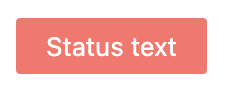
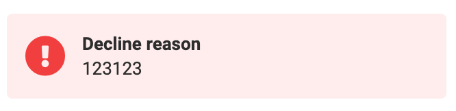

# Status

The status component is used to display a status badge with customizable view and icon as well as its size, title, and badge content text.

## Usage

Include the `vc-status` component in your Vue application, providing theming and enhanced functionality to your status inputs.



=== "Basic Vue"

    Create a basic status as follows:

    ```html
    <template>
        <vc-status variant="danger" :outline="false">Status text</vc-status>
    </template>
    ```

=== "Dynamic Views"

    To start using all the available status properties, specify the `vc-status` component when creating the schema. For example:

    ```typescript
    {
        id: "statusId",
        component: "vc-status",
        variant: "danger",
        content: {
            method: "statusText",
        },
    }
    ```

## Status API

API empowers you to create dynamic and interactive status components to customize its appearance and behavior.

## Basic Vue

You can easily incorporate the `vc-status` component into your Vue applications using simple templates.

### Props

To customize the appearance and behavior of statuses, use the following props:

| Property and Type                                                                             | Description                                                |
| ----------------------------------------------------------------------------------------------| ---------------------------------------------------------- |
| `variant` =="info"==, =="warning"==, =="danger"==, =="success"==, =="light-danger"==| Status variant.                                            |
| `outline` ==boolean==                                                                       | Whether the status is outlined or not.                     |
| `extend` ==boolean==                                                                        | Whether the status is extendable or not.                   |

### Slots

To enhance the content of the `vc-status` component, use the slot system:

| Name      | Description                                                     |
| --------- | --------------------------------------------------------------- |
| `default` | Status content slot.                                            |


## Dynamic Views

To dynamically integrate the `vc-status` component into your views, use the schema interface:

```typescript
interface StatusSchema {
    id: string;
    component: "vc-status";
    variant: "info" | "warning" | "danger" | "success" | "light-danger";
    icon?: string;
    iconVariant?: "warning" | "danger" | "success";
    iconSize?: "xs" | "s" | "m" | "l" | "xl" | "xxl" | "xxxl";
    title?: string;
    outline?: boolean;
    extend?: boolean;
    content?: {
        method: string;
    };
    visibility?: {
        method: string;
    };
    horizontalSeparator?: boolean;
}
```

To incorporate the status into your dynamic applications, define the following properties:

| Property                              | Description                                                           |
| ------------------------------------- | --------------------------------------------------------------------  |
| `id` ==string==                     | Identifier for the `vc-status` component.                             |
| `component` ==vc-status==           | Utilized component in the schema.                                     |
| `variant` ==string==                | Type of status variant.                                              |
| `icon` ==string==                   | Icon featured in the status badge, utilizing [AwesomeIcons](https://fontawesome.com/) package. |
| `iconVariant` ==string==            | Variant of the displayed icon.                                       |
| `iconSize` ==string==               | Size of the icon.                                                     |
| `title` ==string==                  | Title associated with the status. You can specify the localization key for the `title`. Under the hood, [vue-i18n](https://kazupon.github.io/vue-i18n/) is used.                                    |
| `outline` ==boolean==               | Specification of whether the status is outlined.                     |
| `extend` ==boolean==                | This setting allows to create status with header and content text. See the example below. |
| `content` =={method: string}==      | Method for retrieving the status content. Method should be defined in the blade `scope` and should return a string value. |
| `visibility` =={method: string}==   | State of visibility for the component, allowing you to hide the status based on certain conditions. The method or variable should be defined in the blade `scope` and should return a boolean value. |
| `horizontalSeparator` ==boolean==       | Adds a horizontal separator line after the component. |

### Example

Status example with `extend` setting set to `true`:

=== "Screenshot"

    

=== "Code"
    ```typescript
    {
        id: "declineStatus",
        component: "vc-status",
        outline: false,
        extend: true,
        variant: "light-danger",
        icon: "fas fa-exclamation-circle",
        iconSize: "xxl",
        title: "Decline reason",
        iconVariant: "danger",
        content: {
            method: "statusText",
        },
    }
    ```
