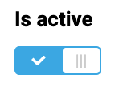

# Switch

Switch is a component that allows users to toggle between two states, such as on and off. It is a simple and effective way to enable or disable a feature or setting.

## Usage

Include the `vc-switch` component in your Vue application, providing theming and enhanced functionality to your switch inputs.



=== "Basic Vue"

    Create a basic switch as follows:

    ```html
    <template>
        <vc-switch :modelValue="switchProperty" label="Switch label"></vc-switch>
    </template>
    ```

=== "Dynamic Views"

    To start using all the available switch properties, specify the `vc-switch` component when creating the schema. For example:

    ```typescript
    {
        id: "switchId",
        component: "vc-switch",
        label: "Switch label",
        property: "switchProperty",
    }
    ```

## Switch API

API empowers you to create dynamic and interactive switch components to customize its appearance and behavior.

## Basic Vue

You can easily incorporate the `vc-switch` component into your Vue applications using simple templates.

### Props

To customize the appearance and behavior of switch, use the following props:

| Property and Type                  | Description                                           |
| ---------------------------------- |  ---------------------------------------------------- |
| `modelValue` {==boolean==}| The value of the component.                           |
| `disabled`  {==boolean==}          | Disabled state for the component.                     |
| `required`  {==boolean==}          | Indicates if the component is required.               |
| `label` {==string==}               | The label of the component.                           |
| `tooltip` {==string==}             | The tooltip text to display when hovering over the component. |

### Emits

To interact with the `vc-switch` component, use the emitted events.  The `update:modelValue` event is triggered when the value of the component changes:

| Name                | Parameters          | ReturnType | Description                                                     |
| ------------------- | -----------------   | ---------- | --------------------------------------------------------------- |
| `update:modelValue` | value: `boolean`    | `void`     | Emitted when the value of the component changes.                |

## Dynamic Views

To dynamically integrate the `vc-switch` component into your views, use the schema interface:

```typescript
interface SwitchSchema {
    id: string;
    component: "vc-switch";
    trueValue?: boolean;
    falseValue?: boolean;
    label?: string;
    tooltip?: string;
    property: string;
    update?: {
        method: string
    };
    disabled?: {
        method: string;
    };
    visibility?: {
        method: string;
    };
    horizontalSeparator?: boolean;
}
```

To incorporate the switch into your dynamic applications, define the following properties:

| Property                  | Description                                                                                                                                               |
| ------------------------- |  -------------------------------------------------------------------------------------------------------------------------------------------------------- |
| `id` {==string==}         | The unique Id for `vc-switch` component.                                                                                                                |
| `component` {==string==}  | `vc-switch`                                                                                                                                             |
| `trueValue` {==boolean==} | Set value for checked state.                                                                                                                              |
| `falseValue` {==boolean==}| Set value for unchecked state.                                                                                                                            |
| `label` {==string==}      | Switch label that is displayed above the switch. Also available interpolation `{}` syntax based on current element context. You can specify the localization key for the `label`. Under the hood, [vue-i18n](https://kazupon.github.io/vue-i18n/) is used.                      |
| `tooltip` {==string==}    | Switch tooltip that is displayed when hovering over the switch label tooltip icon. You can specify the localization key for the `tooltip`. Under the hood, [vue-i18n](https://kazupon.github.io/vue-i18n/) is used.                                                                   |
| `property` {==string==}   | Property name that is used for binding switch value to blade data. <br> Supports deep nested properties like `property[1].myProperty`. <br> Additionally, you have the flexibility to bind computed property that returns a value. Computed property should be defined in the blade `scope`.                                                                 |
| `update` {=={method: string}==} | Update method that is called when switch value is changed. It gets changed value, schema property name and field internal context as arguments. Method should be defined in the blade `scope`.                                         |
| `disabled` {=={method: string}==} | Disabled state for component, could be used to disable switch based on some conditions. Method or variable should be defined in the blade `scope` and should return a boolean value. |
| `visibility` {=={method: string}==} | Visibility state for component, could be used to hide switch based on some conditions. Method or variable should be defined in the blade `scope` and should return a boolean value. |
| `horizontalSeparator` {==boolean==}       | Adds a horizontal separator line after the component. |
