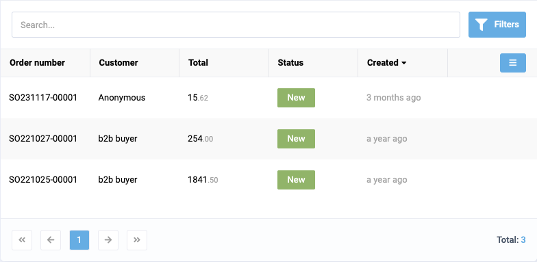

# Table

Table is a component that displays data in a tabular format. It is used to display large amounts of data in a structured format.

## Usage

Include the `vc-table` component in your Vue application:



=== "Basic Vue"

    Create a basic table as follows:

    ```html
    <template>
        <vc-table :columns="tableColumns" state-key="tableStorageKey" :items="tableItems"></vc-table>
    </template>
    ```

=== "Dynamic Views"

    To start using all the available table properties, specify the `vc-table` component when creating the schema. For example:

    ```typescript
    {
        id: "tableId",
        component: "vc-table",
        property: "tableItems",
        columns: [
            {
                id: "imageUrl",
                title: "Img",
                width: 60,
                class: "pr-0",
                type: "image",
            },
            // ...
        ]
    }
    ```

## Table API

API empowers you to create dynamic and interactive table components to customize its appearance and behavior.

## Basic Vue

You can easily incorporate the `vc-table` component into your Vue applications using simple templates.

### Props

To customize the appearance and behavior of table, use the following props:

| Property          | Type                  | Description                                           |
| ------------------|---------------------- |  ---------------------------------------------------- |
| `columns`         | `ITableColumns[]`     | Array of table columns. Required.                               |
| `items`           | `T[]`                 | Array of table items. Default: `[]`. Required.                                 |
| `itemActionBuilder` | `((item: T) => IActionBuilderResult[])` | Function to build item actions.          |
| `sort`            | `string`               | Sort key for the table.                               |
| `multiselect`     | `boolean`             | Enable multiselect for the table.                      |
| `expanded`        | `boolean`             | Prop to pass from `expanded` blade prop. Default: `true`                    |
| `totalLabel`      | `string`              | Label for the total count of items.                    |
| `totalCount`      | `number`              | Total count of items. Default: `0`                                  |
| `pages`           | `number`              | Number of pages in the table. Default: `0`                          |
| `currentPage`     | `number`              | Current page in the table. Default: `0`                             |
| `searchPlaceholder` | `string`            | Placeholder text for the search input.                 |
| `searchValue`     | `string`              | Value of the search input.                             |
| `loading`         | `MaybeRef<boolean>`   | Loading state of the table.                            |
| `empty`           | `StatusImage`         | Image, text and action to display when the table is empty.              |
| `notfound`        | `StatusImage`         | Image, text and action to display when no items are found.              |
| `header`          | `boolean`             | Enable table header. Default: `true`                                   |
| `footer`          | `boolean`             | Enable table footer. Default: `true`                                   |
| `activeFilterCount` | `number`            | Count of active filters. Default: `0`                               |
| `selectedItemId` | `string`               | ID of the selected item.                               |
| `pullToReload`    | `boolean`             | Enable pull-to-reload functionality.                   |
| `resizableColumns`| `boolean`             | Enable resizable columns. Default: `true`                              |
| `reorderableColumns` | `boolean`          | Enable reorderable columns. Default: `false`                            |
| `reorderableRows` | `boolean`             | Enable reorderable rows. Default: `false`                              |
| `stateKey`        | `string`              | Key to store the table state. Required.                          |
| `selectAll`       | `boolean`             | Enable select all functionality.                       |


### Emits

To interact with the `vc-table` component, use the emitted events.

| Name                | Parameters          | ReturnType | Description                                                     |
| ------------------- | -----------------   | ---------- | --------------------------------------------------------------- |
| `paginationClick`   | page: `number`      | `void`     | Emitted when the pagination is clicked.                         |
| `selectionChanged`  | values: `T[]`       | `void`     | Emitted when the selection is changed.                           |
| `search:change`     | value: `string \| number \| Date \| null \| undefined` | `void` | Emitted when the search value changes.                  |
| `headerClick`       | item: `ITableColumns` | `void`   | Emitted when a table header is clicked.                          |
| `itemClick`         | item: `T`           | `void`     | Emitted when a table item is clicked.                            |
| `scroll:ptr`        | -                   | `void`     | Emitted when the table is scrolled to the pull-to-reload position. |
| `row:reorder`       | args: `{ dragIndex: number; dropIndex: number; value: T[] }` | `void` | Emitted when a table row is reordered.                |
| `select:all`        | values: `boolean`   | `void`     | Emitted when the select all functionality is triggered.           |


### Slots

To enhance the content of the `vc-table` component, use the slot system:

| Name               | Type                                                                                     | Description           |
| ------------------ | ---------------------------------------------------------------------------------------- | --------------------- |
| `header`           | `(props: any) => any`                                                                    | Slot for header        |
| `filters`          | `(args: { closePanel: () => void }) => any`                                               | Slot for filters       |
| `mobile-item`      | `(args: { item: T }) => any`                                                              | Slot for mobile item template   |
| `header_${string}` | `(props: any) => any`                                                                    | Dynamic column header slot    |
| `item_${string}`   | `(args: { item: T; cell: ITableColumns }) => any`                                         | Dynamic column item slot      |
| `notfound`         | `(props: any) => any`                                                                    | Slot for not found     |
| `empty`            | `(props: any) => any`                                                                    | Slot for empty         |
| `footer`           | `(props: any) => any`                                                                    | Slot for footer        |

## Dynamic Views

To dynamically integrate the `vc-table` component into your views, use the schema interface:

```typescript
interface TableSchema {
    id: string;
    component: "vc-table";
    property: string;
    multiselect?: boolean;
    header?: boolean;
    footer?: boolean;
    columns?: ITableColumns[];
    reorderableRows?: boolean;
    mobileTemplate?: {
        component: string;
    };
    notFoundTemplate?: {
        component: string;
    };
    emptyTemplate?: {
        component: string;
    };
    visibility?: {
        method: string;
    };
}

interface ITableColumns {
    id: string;
    width?: number | string;
    field?: string;
    alwaysVisible?: boolean;
    type?: "money" | "date-ago" | "date" | "time" | "date-time" | "image" | "status" | "status-icon" | "number" | "link";
    sortable?: boolean;
    class?: string;
    format?: string;
    align?: "start" | "end" | "center" | "between" | "around" | "evenly";
    title: string;
    sortable?: boolean;
    type?: string;
    customTemplate?: GridTemplateOverride;
    visible?:
        | boolean
        | { method: string; };
}
```

To incorporate the table into your dynamic applications, define the following properties:

| Property          | Type              | Description                                                                                                                                               |
| ------------------|-------            |  -------------------------------------------------------------------------------------------------------------------------------------------------------- |
| `id`              | `string`          | The unique Id for `vc-table` component.                                                                                                                |
| `component`       | `string`          | `vc-table`                                                                                                                                             |
| `property`        | `string`          | Property name that is used for binding table value to blade data. <br> Supports deep nested properties like `property[1].myProperty`. <br> Additionally, you have the flexibility to bind computed property that returns a value. Computed property should be defined in the blade `scope`.                                                                 |
| `multiselect`     | `boolean`         | Enable multiselect for the table.                     |
| `header`          | `boolean`              | Enable table header. Default: `true`             |
| `footer`          | `boolean`              | Enable table footer. Default: `true`             |
| `columns`         | `ITableColumns[]`      | Array of table columns. Each column has properties like `id`, `title`, `sortable`, `alwaysVisible`, `type`, `customTemplate`, `visible`.                                   |
| `reorderableRows` | `boolean`     | Enable reorderable rows. Default: `false`                 |
| `mobileTemplate`  | `{component: string}`  | Mobile template for the table.                   |
| `notFoundTemplate` | `{component: string}` | Not found template for the table.                |
| `emptyTemplate`   | `{component: string}`  | Empty template for the table.                    |
| `visibility`      | `{component: string}`  | Visibility state for the table.                  |
