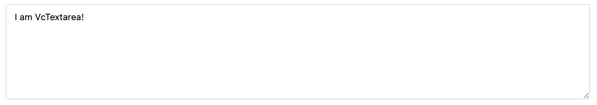

# Textarea

Textarea is a component that allows the user to enter text over multiple rows. It is a wrapper around the native `<textarea>` element.

## Usage

Include the `vc-textarea` component in your Vue application.



### Usage

=== "Basic Vue"

    Create a basic textarea as follows:

    ```html
    <template>
        <vc-textarea v-model="textareaProperty" :placeholder="Textarea placeholder" :label="Textarea label"></vc-textarea>
    </template>
    ```

=== "Dynamic Views"

    To start using all the available textarea properties, specify the `vc-textarea` component when creating the schema. For example:

    ```typescript
    {
        id: "textareaId",
        component: "vc-textarea",
        label: "Textarea label",
        property: "textareaProperty",
        placeholder: "Textarea placeholder",
    }
    ```

## Textarea API

API empowers you to create dynamic and interactive textarea component to customize its appearance and behavior.

### Basic Vue

You can easily incorporate the `vc-textarea` component into your Vue applications using simple templates.

#### Props

To customize the appearance and behavior of your textarea, use the following props:

|Property       | Type              | Description                                      |
| --------------|----------------   | ------------------------------------------------ |
| `placeholder` | `string`          | Textarea placeholder text.                       |
| `modelValue`  | `string`          | Model of the component.                          |
| `required`    | `boolean`         | Textarea required state.                         |
| `disabled`    | `boolean`         | Put component in disabled mode.                  |
| `label`       | `string`          | Textarea label text.                             |
| `tooltip`     | `string`          | Textarea tooltip information.                    |
| `name`        | `string`          | Used to specify the name of the control.         |
| `maxchars`    | `string`          | Specify a max length of model.                   |
| `errorMessage` | `string`         | Validation error message.                        |
| `multilanguage` | `boolean`       | Textarea multilanguage state.                    |
| `currentLanguage` | `string`      | Textarea current language.                       |

#### Slots

To enhance the content of the `vc-textarea` component, use the slot system:

| Name             | Type                                      | Description                                                                                     |
| ---------------- | ----------------------------------------- | ----------------------------------------------------------------------------------------------- |
| `error`          | `void`                      | Slot for errors                                                                                 |

#### Emits

To interact with the vc-textarea component, use the emitted events. The `update:modelValue` event is triggered when the value of the component changes:

| Name               | Parameters                                  | ReturnType | Description                                                                                     |
| ------------------ | ------------------------------------------- | ---------- | ----------------------------------------------------------------------------------------------- |
| `update:modelValue` | value: `string \| undefined`               | `void`     | Emitted when the value of the component changes.                                                |

### Dynamic Views

To dynamically integrate the `vc-textarea` component into your views, use the schema interface:

```typescript
interface TextareaSchema {
    id: string;
    component: "vc-textarea";
    label?: string;
    property: string;
    rules?: IValidationRules;
    placeholder?: string;
    tooltip?: string;
    clearable?: boolean;
    disabled?: {
        method: string;
    };
    multilanguage?: boolean;
    visibility?: {
        method: string;
    };
    update?: {
        method: string;
    };
    horizontalSeparator?: boolean;
}
```

To incorporate the textarea into your dynamic applications, define the following properties:

| Property              | Type                     | Description                                       |
| ----------------------|------------------------- | ------------------------------------------------- |
| `id`                  | `string`                 | The unique Id for the `vc-textarea` component.       |
| `component`           | `vc-textarea`            | Component used in schema.                         |
| `label`               | `string`                 | Label for the textarea. Also available interpolation `{}` syntax based on current element context. You can specify the localization key for the `label`. Under the hood, [vue-i18n](https://kazupon.github.io/vue-i18n/) is used. |
| `property`            | `string`                  | Property name that is used for binding textarea value to blade data.  <br> Supports deep nested properties like `property[1].myProperty`. <br> Additionally, you have the flexibility to bind computed property that returns a value. Computed property should be defined in the blade `scope`.|
| `rules`               | `IValidationRules`        | Validation rules for the textarea. Uses [VeeValidate](https://vee-validate.logaretm.com/v4/) validation rules. |
| `placeholder`         | `string`                  | Placeholder text for the textarea. You can specify the localization key for the `placeholder`. Under the hood, [vue-i18n](https://kazupon.github.io/vue-i18n/) is used. |
| `tooltip`             | `string`                  | Tooltip text for the textarea label. You can specify the localization key for the `tooltip`. Under the hood, [vue-i18n](https://kazupon.github.io/vue-i18n/) is used. |
| `clearable`           | `boolean`                 | Specification whether the textarea has a clear button. |
| `disabled`            | `{method: string}`        | Disabled state for component, could be used to disable textarea based on some conditions. Method or variable should be defined in the blade `scope` and should return a boolean value. |
| `visibility`          | `{method: string}`        | Visibility state for component, could be used to hide textarea based on some conditions. Method or variable should be defined in the blade `scope` and should return a boolean value. |
| `update`              | `{method: string}`        | Method to call when the textarea value is updated. It gets changed value, schema property name and field internal context as arguments. Method should be defined in the blade `scope`. |
| `horizontalSeparator` | `boolean`                 | Adds a horizontal separator line after the component. |
