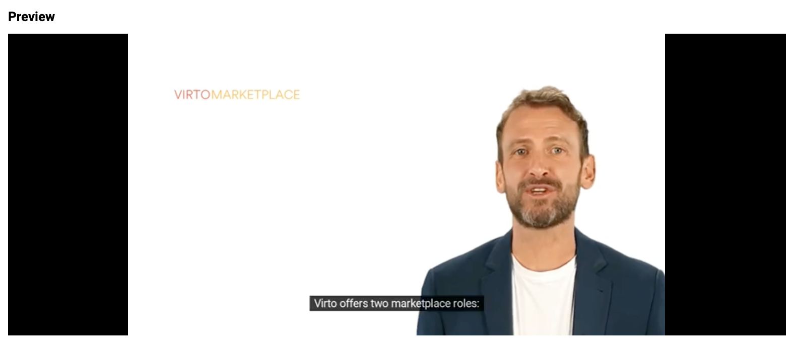

# Video

The video component displays a YouTube video in an iframe.

## Storybook

Explore the `vc-video` component in the [VC Shell Storybook](https://vc-shell-storybook.govirto.com/?path=/docs/atoms-vcvideo--docs).

Dynamic Views examples are also available in the [VC Shell Storybook](https://vc-shell-storybook.govirto.com/?path=/docs/dynamicviews-atoms-vcvideo--docs) for a better understanding of the component usage.

## Usage

Include the `vc-video` component in your Vue application, providing theming and enhanced functionality to your video inputs.



Video is created with `source` property.

=== "Basic Vue"

    Create a basic video as follows:

    ```html
    <template>
        <vc-video :source="https://video-url"></vc-video>
    </template>
    ```

=== "Dynamic Views"

    To start using all the available video properties, specify the `vc-video` component when creating the schema. For example:

    ```typescript
    {
        id: "videoId",
        component: "vc-video",
        property: "videoPropertyWithUrl",
        label: "Video label",
        size: "xl",
    }
    ```

## Video API

API empowers you to create dynamic and interactive video components to customize its appearance and behavior.

## Basic Vue

You can easily incorporate the `vc-video` component into your Vue applications using simple templates.

### Props

To customize the appearance and behavior of videos, use the following props:

| Property and Type             | Description                       |
| ----------------------------- | --------------------------------- |
| `label` ==string==          | Label for the video. Also available interpolation `{}` syntax based on current element context. |
| `tooltip` ==string==        | Tooltip text for the video label. |
| `source` ==string==         | The source URL of the video.      |
| `size` =="auto"==, =="xs"==, =="s"==, =="m"==, =="l"==, =="xl"==, =="xxl"== | Video size. Default: `auto` |

## Dynamic Views

To dynamically integrate the `vc-video` component into your views, use the schema interface:

```typescript
interface VideoSchema {
    id: string;
    component: "vc-video";
    property: string;
    label?: string;
    size?: "auto" | "xs" | "s" | "m" | "l" | "xl" | "xxl";
    tooltip?: string;
    visibility?: {
        method: string;
    };
    update?: {
        method: string;
    };
    horizontalSeparator?: boolean;
}
```

To incorporate the status into your dynamic applications, define the following properties:

| Property and Type                         | Description                                 |
| ----------------------------------------- | ------------------------------------------- |
| `id` ==string==                         | The unique Id for the `vc-video` component. |
| `component` ==vc-video==                | Component used in schema.                   |
| `property` ==string==                   | Property name that is used for binding video url value to blade data.  <br> Supports deep nested properties like `property[1].myProperty`. <br> Additionally, you have the flexibility to bind computed property that returns a value. Computed property should be defined in the blade `scope`.|
| `label` ==string==                      | Label for the video. Also available interpolation `{}` syntax based on current element context. You can specify the localization key for the `label`. Under the hood, [vue-i18n](https://kazupon.github.io/vue-i18n/) is used.|
| `size` ==string==                       | Video size. Default: `auto` |
| `tooltip` ==string==                    | Tooltip text for the video label. You can specify the localization key for the `tooltip`. Under the hood, [vue-i18n](https://kazupon.github.io/vue-i18n/) is used. |
| `visibility` =={method: string}==           | Visibility state for component, could be used to hide video based on some conditions. Method or variable should be defined in the blade `scope` and should return a boolean value. |
| `update` =={method: string}==               | Method to call when the video url value is updated. It gets changed value, schema property name and field internal context as arguments. Method should be defined in the blade `scope`. |
| `horizontalSeparator` ==boolean==       | Adds a horizontal separator line after the component. |

