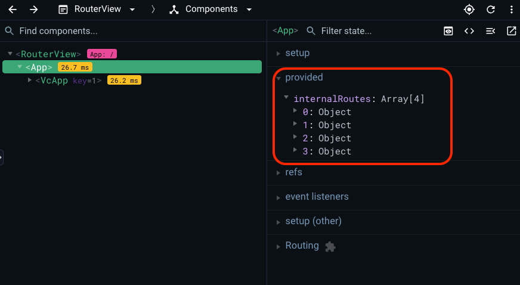

# Navigation

In the VC Shell application, navigation is a fundamental aspect of managing modules and interacting with different blades. This guide explores the various elements of navigation and how to efficiently work with them.

The application has its own routing, which is based on the `vue router` and provided by the ``useBladeNavigation`` composable.
``useBladeNavigation`` is a custom composite responsible for navigating between modules, opening and closing new blades, and their interaction with each other.

The `Vue router` is responsible for navigation within the application, handling clicks in the application menu, and also supporting opening pages via direct links and saving page state after page refresh.

The scaffolded application already has all the initial settings for working with navigation, but let's have a look at the details.

## Navigation elements

The main navigation elements in the application are **blades**. Each blade is a separate page with its own functionality and template. Blades are not connected to each other, but can be used together by means of special methods.

The **workspace** consists of blades. Each new blade is added to the right, hiding the first ones so that only two are available at a time. You can open and close new blades, and work with different data at the same time. The blade is a fully customizable entity that follows application design patterns.


The main blades elements are:

* **Header**. The blade header contains the title of the blade, various actions such as the Expand and Collapse Blade buttons, and an area where you can place data as you see fit, such as product type or blade status.

    

* **Toolbar**. The blade toolbar is a place where you can place any combination of actions with this blade. It could be actions like refresh, delete, etc.

    

* **Content**. The blade content is a place, where all the content of the blade is located. It can be tables, forms, and any other data that needs to be displayed in it.

    

* **Top bar**. The blade top bar is an application component that can contain various data and components. It is fully customizable, but by default it contains the language selection component, notification component, and user information. It is also responsible for displaying the blade name in the mobile version.

    

* **Navigation menu**. This element is a part of the application menu system.

    


## Quick Start for Navigation

To get started with the VC Shell application's navigation system, import the `useBladeNavigation` composable from the `@vc-shell/framework` package:

```typescript linenums="1"
import { useBladeNavigation } from "@vc-shell/framework";
```

`useBladeNavigation` is a custom composition API function designed for working with blade navigation. It works hand in hand with the `VcBladeNavigation` component from `@vc-shell/framework`. This component manages the workspace blade of the module and other blades, which may or may not have their paths defined.

### Blade Components Structure

* Each blade comprises a template with a `VcBlade` component serving as the root. The `VcBlade` component is central to creating a blade:

  ```html linenums="1"
  <VcBlade
      title="My first blade"
      :expanded="expanded"
      :closable="closable"
      width="50%"
      @close="$emit('close:blade')"
      @expand="$emit('expand:blade')"
      @collapse="$emit('collapse:blade')"
  >
      <!-- Blade content -->
  </VcBlade>
  ```

* Every blade comes with its default props interface:

  ```typescript linenums="1"
  export interface Props {
      expanded: boolean; // Required prop for VcBlade component
      closable: boolean; // Required prop for VcBlade component
      param?: string; // Additional blade parameter, e.g., for data retrieval
      options?: {}; // Any extra options to pass to the blade
  }
  ```

* Each blade also emits its events based on your requirements:

  ```typescript linenums="1"
  export interface Emits {
      (event: "parent:call", args: IParentCallArgs): void; // Optional
      (event: "close:blade"): void; // Required
      (event: "collapse:blade"): void; // Required
      (event: "expand:blade"): void; // Required
  }
  ```

* If you want your blade to have its path, you can use the `defineOptions` macro:

  ```typescript linenums="1"
  defineOptions({
      url: "/<blade-url>",
  });
  ```

* If you want your blade to have its own navigation menu item, you can use the `defineOptions` macro:

  ```typescript linenums="1"
  defineOptions({
      ...,
      menuItem: {
          title: "My blade",
          icon: "fas fa-file-alt",
          priority: 1,
          group: 'My group', // Optional
          inGroupPriority: 1, // Optional
      },
  });
  ```

* To create a blade toolbar, make use of the IBladeToolbar interface:

  ```typescript linenums="1"
  const bladeToolbar = ref<IBladeToolbar>([
      {
          id: "item", // Any unique identifier
          title: "My action", // Title of the toolbar button
          icon: "fas fa-save", // Icon for display
          clickHandler() {
              // Define actions to perform on click
          },
      });
  ```

## Creating Navigation Menu Items

To create a menu item, use the `defineOptions` macro in the blade component. This macro allows you to define the blade's URL and menu item. The menu item is an object with the following interface:

```typescript linenums="1"
interface MenuItemConfig {
  title: string;
  icon: string;
  group?: string;
  priority: number;
  inGroupPriority?: number;
}
```

| Property | Type | Description |
| --- | --- | --- |
| `title` | `string` | Menu item title. You can specify the localization key for the title. Under the hood, [vue-i18n](https://kazupon.github.io/vue-i18n/) is used.  |
| `icon` | `string` | Menu item icon. |
| `group` | `string` | Menu item group. Is used to group menu items with its provided name. If the path is not specified, the menu item is added to the root of the menu. You can specify the localization key for the group. Under the hood, [vue-i18n](https://kazupon.github.io/vue-i18n/) is used. |
| `priority` | `number` | Position priority. |
| `inGroupPriority` | `number` | Position priority in group. |

```typescript linenums="1"
defineOptions({
    url: "/<blade-url>",
    menuItem: {
        title: "My blade",
        icon: "fas fa-file-alt",
        priority: 1,
        group: 'My group',
        inGroupPriority: 1,
    },
});
```

## Routing

The application's routing can be handled using the `openBlade` method from the `useBladeNavigation` composable:

```typescript linenums="1"
import { useBladeNavigation } from '@vc-shell/framework';

const { openBlade } = useBladeNavigation();
```

To navigate to a module or open a new blade, use the async `openBlade` method. Pass the blade component you wish to navigate to as an argument.

Additionally, you can provide parameters, options, and two types of callbacks, namely `onOpen` and `onClose`, which execute when the blade is opened or closed, respectively:

```typescript linenums="1"
import { useBladeNavigation } from '@vc-shell/framework';
// Your imported blade component
import Blade from './blade-component.vue'

const { openBlade } = useBladeNavigation();

await openBlade({
    blade: markRaw(Blade),
    param: ...,
    options: {
        ...
    },
    onOpen() {
        // Define actions to perform on blade open
    },
    onClose() {
        // Define actions to perform on blade close
    }
})
```

## Add Module to Application

Once you've created your `blade` template, it needs to be initialized. In the module's `index.ts` file, register it within the application using the `createAppModule` method. With this setup, you're ready to go:

```typescript linenums="1"
// Your blade pages
import * as pages from "./pages";
import { createAppModule } from "@vc-shell/framework";

export default createAppModule(pages, locales);
```

??? Example

    ```html linenums="1"
    <template>
    <VcBlade
        title="My first blade"
        :expanded="expanded"
        :closable="closable"
        width="50%"
        @close="$emit('close:blade')"
        @expand="$emit('expand:blade')"
        @collapse="$emit('collapse:blade')"
    >
        <!-- Blade content -->
    </VcBlade>
    </template>
    ```
    ```typescript linenums="1"
    <script lang="ts" setup>
    export interface Props {
        expanded?: boolean;
        closable?: boolean;
        param?: string;
    }

    export interface Emits {
        (event: "collapse:blade"): void;
        (event: "expand:blade"): void;
        (event: "close:blade"): void;
    }

    /**
    * Define your path
    */
    defineOptions({
        url: '/my-first-blade',
        menuItem: {
            title: "My blade",
            icon: "fas fa-file-alt",
            priority: 1,
            group: 'My group',
            inGroupPriority: 1,
        },
    })

    withDefaults(defineProps<Props>(), {
        expanded: true,
        closable: true,
    });

    defineEmits<Emits>();
    </script>
    ```


## Navigation Actions

=== "Open Blade"

    To open a new workspace, you can use the `openBlade` function from the `useBladeNavigation` composable with second argument `isWorkspace === true` . It offers the advantage of setting initial data when opening the blade. When using imported blade components with `openBlade`, remember to use Vue's `markRaw` method to prevent conversion to a proxy, thereby optimizing performance.

    ```typescript linenums="1"
    import MyImportedNewBlade from './MyImportedNewBlade.vue'

    await openBlade({
        blade: markRaw(MyImportedNewBlade),
        options: {}, // Typed options specific to MyImportedNewBlade, if any
        param: 'my-any-string-param'
        onOpen() {
            // Define actions when the blade is opened
        },
        onClose() {
            // Define actions when the blade is closed
        }
    }, true)
    ```

    Alternatively, you can use `resolveBladeByName` method to get blade component by its name.

    ```typescript linenums="1"
    await openBlade({
        blade: resolveBladeByName(MyImportedNewBlade),
        options: {}, // Typed options specific to MyImportedNewBlade, if any
        param: 'my-any-string-param'
        onOpen() {
            // Define actions when the blade is opened
        },
        onClose() {
            // Define actions when the blade is closed
        }
    }, true)
    ```

    To open the blade in the same workspace, use the `openBlade` function from the `useBladeNavigation` composable with second argument `isWorkspace === false` or without it:

    ```typescript linenums="1"
     await openBlade({...})
     // or
     await openBlade({...}, false)
    ```

=== "Close Blade"

    To close a blade, emit a `close:blade` event from your blade component. The `VcBlade` component, which is used to construct blades, emits this event when the close button is clicked.

    ```html linenums="1"
    <VcBlade
        @close="$emit('close:blade')"
        ...
    >
        <!-- Blade contents -->
    </VcBlade>
    ```

    Alternatively, use the `closeBlade` function from the `useBladeNavigation` composable if you know the index of the blade you want to close:

    ```typescript linenums="1"
    closeBlade(indexNumber)
    ```

=== "Execute Methods in the Previous Blade"

    Each blade can emit a `parent:call` event to invoke a method in its parent blade. To execute a method in the parent blade, expose it using `defineExpose`:

    ```typescript linenums="1"
    // Parent blade
    function reload() {
    // Implement reloading logic
    }

    defineExpose({
        reload,
    })

    // Child blade
    interface Emits {
        (event: 'parent:call', args: IParentCallArgs): void;
    }

    const emit = defineEmits<Emits>();

    function anyFunction() {
        emit("parent:call", {
            method: "reload", // Exposed method in the parent blade
        });
    }
    ```


## Overview of All Registered Blades in the Application

You can see all `blades` registered in the application with and without paths. To do so, use a browser extension called `Vue Devtools`.

{: width="25"} [Vue Devtools](https://devtools.vuejs.org/)

1. To discover the blade's name, open `Vue Devtools` and locate `App` in the components tree. Clicking on it will reveal the component's state:

    

1. Identify the `provided` option within this state, which contains an array of `internalRoutes`. This array encompasses all registered blades from each module, whether they have their own URL or not:

    

1. As an example, let's expand two objects of the `internalRoutes` array and see an example of registered blades that belong to the `Offers` module:

    

