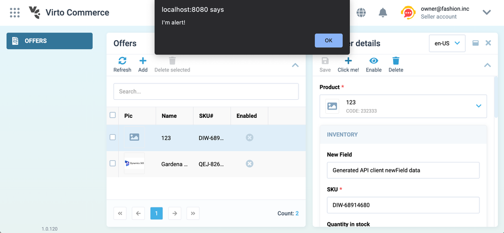

# Overview

Composables are functions with an internal state that changes over time and methods to modify this state. You cannot directly modify the state. The only way to alter the state is by invoking one of the composable's methods. However, because the state is reactive, thanks to Vue's Composition API, you can monitor and react to these changes when necessary to update the user interface or perform other operations.

This pattern includes both the state and business logic and exposes them through easy-to-use methods.

In most cases, the composables defined in the referenced application and bound to specific sections are reusable and can be shared across various applications. For instance, the `useOffer` composable defined in the Vendor Portal application can be extended with new methods or logic in another custom application.

With this guide, you will explore how you can substitute, enhance, or add new methods utilized in the referenced application.

In this guide, we'll employ the example of the `vc-app-extend` project, which augments the functionality of the `vc-app` project located in the `sample` folder.

## Extend composable

You can extend a composable by appending new methods, variables, or computed values. For our example, let's incorporate a new button into the toolbar and establish a new method in the extensible module.

### Create overrides

Initiate the process by creating overrides for the external module. For more information, please refer to the [Extending Views](../Essentials/dynamic-views/Extending-Views.md) guide. In this illustration, we'll introduce a new button to the toolbar:

```typescript title="vc-app-extend/src/modules/offers/schemaOverride/overrides.ts" linenums="1"
import { OverridesSchema } from "@vc-shell/framework";

export const overrides: OverridesSchema = {
  upsert: [
    ...
    // Appending a new action button to the blade toolbar
    {
      id: "Offer",
      path: "settings.toolbar",
      index: 1,
      value: {
        id: "newToolbarAction",
        title: "Click me!",
        icon: "fas fa-plus",
        method: "showAlert",
      },
    },
  ],
};
```

### Create extension composable

Inside the `src/modules/composables` directory, create a folder named `useOfferDetails` with an `index.ts` file, which will serve as the file for our composable. Initially, this composable will be empty:

```typescript title="vc-app-extend/src/modules/offers/composables/useOfferDetails/index.ts" linenums="1"
export const useOfferDetails = () => {
    return {}
}
```

### Import and extend composable

Since we need to extend a composable from an external application, we must import it into our composable file. Import the required modules from the `vc-app` application and destructure the composable method to access its return values:

```typescript title="vc-app-extend/src/modules/offers/composables/useOfferDetails/index.ts" linenums="1"
import { DynamicBladeForm } from "@vc-shell/framework"
import modules from "@vc-app/modules";

export const useOfferDetails = (args: {
    props: InstanceType<typeof DynamicBladeForm>["$props"];
    emit: InstanceType<typeof DynamicBladeForm>["$emit"];
    mounted: Ref<boolean>;
}) => {
    const { load, saveChanges, remove, loading, item, validationState, scope, bladeTitle } =
        modules.Offers.composables.useOfferDetails(args);

    return {
        load,
        saveChanges,
        remove,
        loading,
        item,
        validationState,
        scope,
        bladeTitle,
    }
}
```

At this point, we've established a proxy for the `useOfferDetails` composable located in the `Offers` module of the `vc-app` application.

### Add new method

Create a new method named `clickMe` that will be invoked by the newly added toolbar button:

```typescript title="vc-app-extend/src/modules/offers/composables/useOfferDetails/index.ts" linenums="1"
import { DynamicBladeForm } from "@vc-shell/framework"

export const useOfferDetails = (args: {
    props: InstanceType<typeof DynamicBladeForm>["$props"];
    emit: InstanceType<typeof DynamicBladeForm>["$emit"];
    mounted: Ref<boolean>;
}) => {
    const { load, saveChanges, remove, loading, item, validationState, scope, bladeTitle } =
        modules.Offers.composables.useOfferDetails(args);

    // Incorporating a new method to be invoked by the new toolbar button
    function clickMe() {
        alert("I'm alert!");
    }

    return {
        load,
        saveChanges,
        remove,
        loading,
        item,
        validationState,
        scope,
        bladeTitle,
    }
}
```

### Extend scope

As all new methods need to be exposed within the `scope`, create an `extendedScope` that extends the base `scope`. Since `scope` is reactive, it's convenient to use lodash's `merge` method to maintain reactivity while adding new objects to the `scope`, such as `toolbarOverrides` where we introduce our new method, `clickMe`. Utilize the `UnwrapRef` type from Vue to handle reactivity correctly:

```typescript title="vc-app-extend/src/modules/offers/composables/useOfferDetails/index.ts" linenums="1"
import { IBladeToolbar, DynamicBladeForm } from "@vc-shell/framework";
import modules from "@vc-app/modules";
import { Ref, UnwrapRef, ref, computed } from "vue";
import * as _ from "lodash-es";

export type ExtendedOfferDetailsScope = UnwrapRef<
    ReturnType<typeof modules.Offers.composables.useOfferDetails>["scope"]
    > & {
    toolbarOverrides: {
        showAlert: IBladeToolbar;
    };
};

export const useOfferDetails = (args: {
    props: InstanceType<typeof DynamicBladeForm>["$props"];
    emit: InstanceType<typeof DynamicBladeForm>["$emit"];
    mounted: Ref<boolean>;
}) => {
    const { load, saveChanges, remove, loading, item, validationState, scope, bladeTitle } =
        modules.Offers.composables.useOfferDetails(args);

    // Introducing a new method that will be invoked by the new toolbar button
    function clickMe() {
        alert("I'm alert!");
    }

    // Extending the useOfferDetails 'scope' and adding a new 'showAlert' method representing the 'method' key of the new toolbar button:
    const extendedScope = _.merge(
        ref({}),
        ref(scope.value),
        ref({
          toolbarOverrides: {
            showAlert: {
              clickHandler() {
                clickMe();
            },
            isVisible: true,
            },
          },
        })
      ) as Ref<ExtendedOfferDetailsScope>;

    return {
        load,
        saveChanges,
        remove,
        loading,
        item,
        validationState,
        scope: computed(() => extendedScope.value),
        bladeTitle,
    }
}
```

### Add composable to module

Incorporate the extended composable into the module's initialization. Create a file with module initialization in `vc-app-extend/src/modules/offers`, and utilize the `createDynamicAppModule` method for dynamic module initialization. Import your overrides with the new toolbar button and the extended composable. In `createDynamicAppModule`, replace one of the composables from the external module with your extended composable and include your overrides:

```typescript title="vc-app-extend/src/modules/offers/index.ts" linenums="1"
import { createDynamicAppModule } from "@vc-shell/framework";
import modules from "@vc-app/modules";
// Import overrides with the new toolbar button
import overrides from "./schemaOverride";
// Import the extended composable
import { useOfferDetails } from "./composables";

export default createDynamicAppModule({
    schema: modules.Offers.schema,
    composables: {
        useOffersList: modules.Offers

.composables.useOffersList,
        useOfferDetails, <- Override @vc-app useOfferDetails composable with the imported one
    },
    locales: modules.Offers.locales,
    moduleComponents: modules.Offers.components,
    overrides, // <- Imported 'overrides'
});
```

### Add module to application

To include the module in the application, in the `main.ts` file, import the module initializer from the previous step and install it using the Vue `use` method:

```typescript title="vc-app-extend/src/main.ts" linenums="1"
...
import { Offers } from "./modules";

async function startApp() {
    ...
    const app = createApp(RouterView);
    app.use(VirtoShellFramework);
    // Imported Offers module
    app.use(Offers, { router });
    app.use(router);
    ...
}
startApp()
```

### Verify result

After following these steps, you will have extended a composable by adding a new method and a toolbar button to your application.

