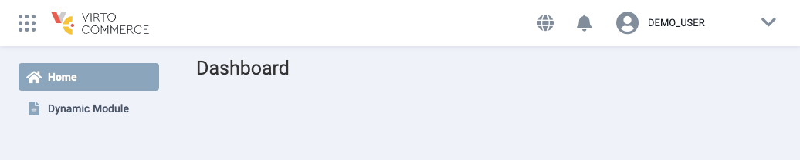

# Create first VC-Shell application

In this section we will show you how to scaffold a VC Shell application on your local machine. The created project will use Vue 3 and Vite as the build setup.

!!! note "Prerequisites"
    * You have an up-to-date installation of Node.js.
    * Your current working directory is set to the location where you want to create the application.

To create and install custom app:

1. Install and run the `create-vc-app` scaffolding tool using one of the following commands:

    === "With NPM"

        ```bash
        npm create @vc-shell/vc-app@latest
        ```

    === "With NPX"

        ```bash
        npx @vc-shell/create-vc-app@latest
        ```

    === "With Yarn"

        ```bash
        yarn create @vc-shell/vc-app
        ```

1. Configure the options based on your requirements. If you are unsure about an option, simply choose `No` by hitting <kbd>Enter</kbd>:

    ```bash
    ✔ Project name: … *your-app-name*
    ✔ Base path: … /apps/*your-app-name*/
    ? Select module variant: › - Use arrow-keys. Return to submit.
    ❯   Dynamic view modules boilerplate
        Classic view modules boilerplate
    Module name: › *your-module-name*
    ? Do you want to include additional module with sample data? › (y/N)

    Scaffolding app in /*your-app-name*...

    Done. You can now run application:

    cd vc-app
    yarn
    yarn serve
    ```

1. Once the application is created, go to the application folder and add Platform URL to the `.env.local` file under the `APP_PLATFORM_URL` variable:

    ```bash
    $ cd `*your-app-name*`
    $ echo "APP_PLATFORM_URL=https://your_platform_url_here" >> .env.local
    ```

2. Install the dependencies and start the development server:

Your first VC-Shell application is now ready to run!

An example application with classic and dynamic views, created using `@vc-shell/create-vc-app` package, can be found in the `sample/vc-app` folder in the @VirtoCommerce/vc-shell github repo.


{: width="25"} [Dynamic Views Extensibility](../Extensibility/overview.md)

!!! info "Note"

    The example components in the generated application are written using the Vue Composition API and `<script setup>`.


!!! tip
    For an optimal development experience, we recommend using [Visual Studio Code](https://code.visualstudio.com/) with the [Volar extension](https://marketplace.visualstudio.com/items?itemName=Vue.volar).

{: width="25"} [Vite tools](https://vitejs.dev/)

{: width="25"} [Vue Composition API](https://vuejs.org/guide/introduction.html#composition-api)

## Application folder structure

After the application is scaffolded, the folder structure will look as follows:

```css hl_lines="12 13 14 15 16 17 18 19 20"
├─ public                         // Static assets
│  ├─ assets                      // Static images used inside the application.
│  └─ img
│     └─ icons                    // Icons used for favicons, PWA, etc.
├─ src
│  ├─ api_client                  // Generated API clients folder
│  │  └─...
│  ├─ composables                 // Application composables
│  │  └─...
│  ├─ locales                     // Locale files used to provide translated content
│  │  └─ en.json
│  ├─ modules                     // The collection of custom modules
│  │  └─ ...                      // Modules folder
│  │     ├─ components            // The collection of components specific for this module
│  │     │   ├─ notifications     // Dropdown notifications templates
│  │     │   └─ ...
│  │     ├─ composables           // The collection of shared logic written using Composable API pattern.
│  │     ├─ locales               // Locale files used to provide translated content specific for this module
│  │     ├─ pages                 // Set of module pages used within Application router
│  │     └─ index.ts              // Module entry point
│  ├─ pages                       // Set of application pages used within Application router.
│  │  └─...
│  ├─ router                      // SPA routing configuration
│  │  └─...
│  ├─ styles                      // Extras application style files
│  │  └─ index.scss               // Tailwind initialization file
│  └─ types                       // Typescript .d.ts files
```

Let's take a look at the modules directory as it represents the key concept in the application's architecture.

### Modules directory structure

A **module** is a collection of composables, locales, components, and pages. Each module is responsible for its own functionality and can contain the number of **blades** you need to serve your specific requirements, which are stored in the "pages" folder. A **blade** is a standalone page with its own functionality and template. <br>Blades are not interconnected, but they can be used together using special methods.

| Folder               	| Description                                                                                                 	|
|--------------------	|--------------------------------------------------------------------------------------------------------------	|
| Components  	        | This directory contains components that are specific to this module. If you want to create a component for your module, the **components** folder is the ideal place to do so. Components placed within a module should only be used within that module. If a component needs to be used globally, it's better to place it in the **components** folder at the root of the application.the application root folder. |
| Composables        	| The collection of shared logic written using Composable API pattern.<br>It may include, for example, logic for loading data from the backend which is used by blade.                                                                                                                                                                 	|
| Locales      	        | The folder stores locale files used to provide translated content specific to the module. If you need to translate your blades into multiple languages, you can store all the translations in JSON format in this folder. These translations can then be processed using the vue-i18n library. <br> {: width="25"} [Syntax of localization files](https://kazupon.github.io/vue-i18n/) |
| Pages                 | A set of Blades used within application router.

### Create a new module

To create your own modules within the scaffolded application folder structure:

1. Create a new folder for your module inside the **src/modules** directory. Choose a descriptive name that reflects its functionality. You can create multiple modules within the **src/modules** directory, with each module responsible for a specific set of features or pages.

1. Inside your module folder, organize your module-specific code into different directories as needed.

1. Additionally, you can include an **index.ts** file as the entry point for your module. This file can provide the necessary exports and configurations for your module.


### Initialize a new module in the application

Initialize your module to make it usable within the application.

All modules are created as Vue plugins. To simplify the module installation process, you can initialize it using the `createAppModule method`. This method takes `pages`, `locales`, and, if necessary, `notificationTemplates` as arguments:

```typescript title="index.ts" linenums="1"
// Import your blade pages
import * as pages from "./pages";
// Include your locale files if applicable
import * as locales from "./locales";
// Import createAppModule to initialize your module in the application
import { createAppModule } from "@vc-shell/framework";

export default createAppModule(pages, locales);

// Required exports
export * from "./pages";
export * from "./composables";
export * from "./components";
```

With these steps, your module is now ready for use within your application!

{: width="25"} [Adding new module to the navigation menu](../Essentials/navigation.md)
