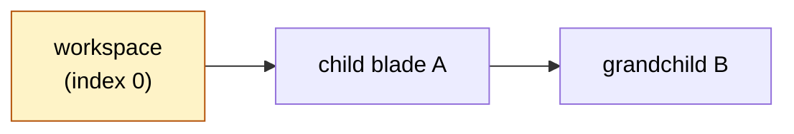

# Blade Navigation

A blade is a vertical panel pushed onto a stack. Opening a new blade slides it in from the right; closing it slides it back out.

The pattern (popularized by the Azure Portal) preserves context across drill-downs: opening a details panel does not unmount the list, so the user compares list and details side by side instead of losing search state on every click. Each blade has at most one active child, so navigation history is linear but branchable; the URL captures the whole stack, so the browser back button restores the workspace and every open child blade. The framework owns the header, toolbar slot, banners, and close button; blade authors write only the body.

Three primitives back the system: `useBladeStack` is the state machine; `useBladeMessaging` is the parent-child method dispatcher; `useBlade()` is the everyday composable that wraps both and works inside and outside blade context.

```vue
<script setup lang="ts">
import { useBlade, VcBlade } from "@vc-shell/framework";

defineBlade({ name: "OrdersList", url: "/orders", isWorkspace: true });

const { openBlade } = useBlade();
function onRowClick(order) {
  openBlade({ name: "OrderDetails", param: order.id });
}
</script>

<template>
  <VcBlade title="Orders">
    <!-- list contents -->
  </VcBlade>
</template>
```

## When not to use a blade

The stack metaphor is heavy. Reserve blades for workspace navigation; reach for lighter primitives for transient or out-of-workspace UI.

| Need | Use instead |
| --- | --- |
| Quick confirmation ("Are you sure?"). | `usePopup().showConfirmation(...)`. |
| App-level page outside the workspace (login, 404). | Vue Router route + `<router-view>`. |
| Persistent side panel (chat, AI agent). | Extension-point slot in the shell, not a blade. |

## The stack

The active branch of the navigation tree is a flat array. Index 0 is the workspace root; each subsequent entry is the active child of the entry before it. Opening a new blade after a non-leaf closes everything deeper, then pushes.



Stack source of truth: [`useBladeStack`](https://github.com/VirtoCommerce/vc-shell/blob/main/framework/core/blade-navigation/useBladeStack.ts). Operations:

| Operation | Effect |
| --- | --- |
| `openWorkspace(event)`. | Replace the stack with a single root blade. |
| `openBlade(event)`. | Push a child after the active parent; anything deeper closes (subject to guards). |
| `closeBlade(bladeId)`. | Close a blade and its children. Returns `true` if a guard prevented it. |
| `closeChildren(parentId)`. | Close everything after a parent; the parent stays. |
| `replaceCurrentBlade(event)`. | Destroy the active blade, create a new one at the same index. |
| `coverCurrentBlade(event)`. | Hide the active blade and open a covering blade on top. Closing it restores the hidden one. |

!!! warning "Close guards return `true` to prevent the close"
    Same convention as Vue Router's `beforeRouteLeave`. The legacy adapter inverts this; guards written via `useBlade()` follow the modern semantics.

## useBlade()

Most code never touches `useBladeStack` directly. The everyday API is `useBlade()`, a context-aware composable that works inside and outside blade components.

**Inside a blade:** identity refs (`id`, `name`, `param`, `options`), actions (`closeSelf`, `replaceWith`, `coverWith`), messaging (`callParent`, `exposeToChildren`), guards and errors (`onBeforeClose`, `setError`), banners (`addBanner`, `clearBanners`), lifecycle (`onActivated`, `onDeactivated`).

**Outside a blade** (dashboard widget, toolbar handler, plain composable): only `openBlade` works; the rest throw a descriptive runtime error.

Plugin-author primitives: [Blade Navigation Composables](../composables/blade-navigation/blade-nav-composables.md).

{: width="25"} Full useBlade reference.

## Passing data: param and options

A parent hands its child two payloads: `param` rides the URL for deep linking, `options` rides `history.state` for everything else. The child reads both through `useBlade()`.

```ts
// Parent
const { openBlade } = useBlade();
openBlade({
  name: "OrderDetails",
  param: orderId,
  options: { mode: "edit", preloadedName: order.name },
});
```

```ts
// Child
interface OrderOptions { mode: "edit" | "create"; preloadedName?: string }
const { param, options } = useBlade<OrderOptions>();

onMounted(async () => {
  if (param.value) await loadOrder(param.value);
  const mode = options.value?.mode ?? "create";
});
```

| Channel | Goes to | Use for |
| --- | --- | --- |
| `param`. | The URL. | A single string, typically an entity ID. Deep-linkable. |
| `options`. | `history.state`. | Larger or structured data. Not in the URL. |

## Parent-child messaging

Children invoke methods on their parent through a typed dispatcher, not shared refs or event buses. The parent exposes named methods; the child calls them by name and awaits the result.

```vue
<!-- Parent -->
<script setup lang="ts">
const { exposeToChildren } = useBlade();
async function reload() { /* refresh the list */ }
exposeToChildren({ reload });
</script>
```

```vue
<!-- Child -->
<script setup lang="ts">
const { callParent, closeSelf } = useBlade();
async function onSave() {
  await saveOrder();
  await callParent("reload");
  await closeSelf();
}
</script>
```

`callParent` is generic: `const count = await callParent<number>("getOffersCount")`.

!!! note "Two scopes of shared data"
    Use `callParent` / `exposeToChildren` for **cross-blade** communication. Use `defineBladeContext` / `injectBladeContext` for **descendant widgets inside the same blade**. The latter replaces the deprecated `provideBladeData`.

## Close guards

A blade can intercept its own close to confirm unsaved changes. Register a hook with `onBeforeClose`; return `true` to block, `false` to proceed.

```vue
<script setup lang="ts">
import { useBlade, usePopup } from "@vc-shell/framework";

const { onBeforeClose } = useBlade();
const { showConfirmation } = usePopup();

onBeforeClose(async () => {
  if (!isModified.value) return false;
  const confirmed = await showConfirmation("Discard unsaved changes?");
  return !confirmed; // true blocks the close
});
</script>
```

## Common patterns

A handful of stack shapes recur often enough to name.

| Pattern | How |
| --- | --- |
| **List → details.** | Workspace list with `VcDataTable`; row click calls `openBlade({ name: "Details", param: id })`. Child calls `callParent("reload")` on save. |
| **Wizard.** | Each step is its own blade. Step 2 opens via `openBlade` from step 1; "Back" calls `closeSelf` on step 2. |
| **Master / detail with preview.** | Use `coverWith` to open a preview on top of details. Closing the preview reveals the editor at its previous state. |
| **Replace mode (create → edit).** | After saving a "create" blade, call `replaceWith({ name: "ItemDetails", param: newId })`. The old blade is destroyed; URL updates. |

Full recipes: [`useBlade` reference, Recipes section](../composables/blade-navigation/useBlade.md#recipes).

## URL synchronization

Blades that declare `url` in their config are reflected in the address bar. The router guard distinguishes a real route from the blade catch-all; on a catch-all, the URL is parsed and the stack restored idempotently. Child blades without `url` do not change the URL, so deep links land on the deepest URL-bearing blade.

## Errors are caught automatically

Every blade is wrapped with an error boundary. Throw from any function inside the blade and the framework renders a banner with the message and a "More" button; the app keeps running. Use `setError(...)` from `useBlade()` only for a custom error you constructed yourself.

```ts
const { action: load } = useAsync(async () => {
  const client = await getApiClient();
  // If this throws, the blade renders an error banner. No try/catch.
  item.value = await client.getProductById(props.param);
});
```

!!! tip "Skip the try/catch in actions"
    Throwing inside a `useAsync` action is enough. Catch only to convert errors, for example, wrapping a 500.

## Common mistakes

These four mistakes account for most blade-navigation bugs.

!!! warning "Calling blade-specific methods outside blade context"
    `closeSelf`, `callParent`, `onBeforeClose`, `setError` throw at runtime when called from a dashboard widget, toolbar handler, or plain composable. Only `openBlade` works everywhere.

!!! warning "Forgetting `exposeToChildren` in the parent"
    `callParent("reload")` from the child silently fails. Always pair `exposeToChildren` in the parent with the corresponding `callParent` in the child.

!!! warning "Wrong return value in a guard"
    `onBeforeClose` returns `true` to **block** the close. Returning `true` unconditionally pins the blade open.

!!! warning "Reading `param` without `.value`"
    Identity properties are `ComputedRef`s. `if (param)` is always truthy; use `if (param.value)`.
