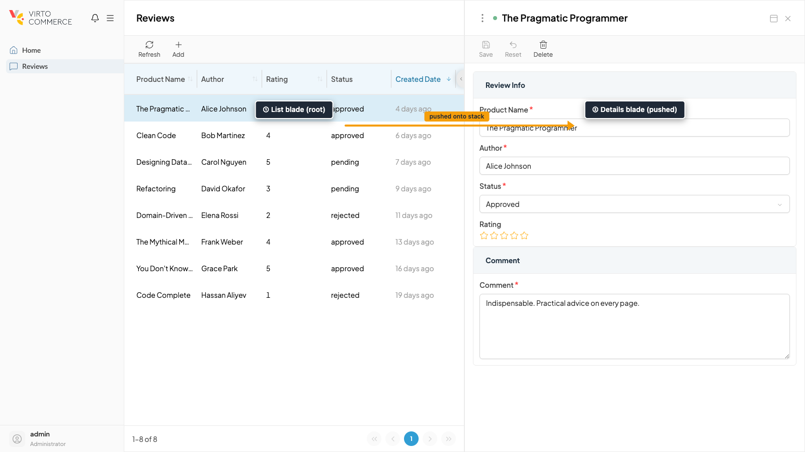
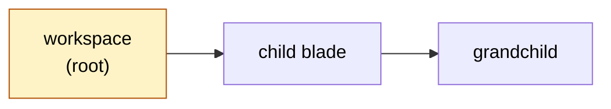

# Blade Navigation

A blade is a vertical panel pushed onto a stack. Opening a new blade slides it in from the right; closing it slides it back out. The pattern preserves context across drill-downs: opening a details panel does not unmount the list, so the user compares list and details side by side instead of losing search state on every click.

Each blade has at most one active child, so navigation is linear but branchable. The framework owns the header, toolbar slot, banners, and close button; blade authors write only the body.

```vue
<script setup lang="ts">
import { useBlade, VcBlade } from "@vc-shell/framework";

defineBlade({ name: "OrdersList", url: "/orders", isWorkspace: true });

const { openBlade } = useBlade();
function onRowClick(order) {
  openBlade({ name: "OrderDetails", param: order.id });
}
</script>

<template>
  <VcBlade title="Orders">
    <!-- list contents -->
  </VcBlade>
</template>
```

## The mental model

A list workspace plus its details child, both visible at once, is the canonical blade pair:

{: style="display: block; margin: 0 auto;" }

Think of the active branch as a flat list: a workspace root at the head, then its active child, then that child's active child, and so on. Opening a new blade after an intermediate one closes everything deeper and pushes the new blade in its place. Closing a blade closes its children with it.



You do not manipulate this stack directly. The everyday API is `useBlade()`, a composable that gives you `openBlade` and the rest of the actions your blade needs.

## useBlade()

`useBlade()` is the only navigation API most code touches. It behaves differently depending on whether you call it from inside a blade or from outside.

**Inside a blade:** you can read identity (`param`, `options`, `query`), trigger actions (`closeSelf`, `replaceWith`), exchange messages with the parent (`callParent`, `exposeToChildren`), guard the close (`onBeforeClose`), and surface state (`setError`, `addBanner`).

**Outside a blade** (a dashboard widget, a toolbar handler, a plain composable): only `openBlade` works. Reading identity refs or calling blade-scoped methods throws a descriptive runtime error so you find the mistake at the first run.

For the full method list and signatures, see the [useBlade reference](../composables/blade-navigation/useBlade.md).

## Passing data: param and options

A parent passes two payloads to a child: `param` for a stable string identifier and `options` for runtime-only data. The child reads both through `useBlade()`.

```ts
// Parent
const { openBlade } = useBlade();
openBlade({
  name: "OrderDetails",
  param: orderId,
  options: { mode: "edit", preloadedName: order.name },
});
```

```ts
// Child
interface OrderOptions { mode: "edit" | "create"; preloadedName?: string }
const { param, options } = useBlade<OrderOptions>();

onMounted(async () => {
  if (param.value) await loadOrder(param.value);
  const mode = options.value?.mode ?? "create";
});
```

| Channel | Use for | URL? |
| --- | --- | --- |
| `param`. | A single string, typically an entity ID. | Yes, when the blade declares `url`. |
| `options`. | Structured runtime data the URL should not carry. | No. Not restored after refresh. |

## Parent-child messaging

Children invoke methods on their parent through a typed dispatcher, not shared refs or event buses. The parent exposes named methods; the child calls them by name and awaits the result.

```vue
<!-- Parent -->
<script setup lang="ts">
const { exposeToChildren } = useBlade();
async function reload() { /* refresh the list */ }
exposeToChildren({ reload });
</script>
```

```vue
<!-- Child -->
<script setup lang="ts">
const { callParent, closeSelf } = useBlade();
async function onSave() {
  await saveOrder();
  await callParent("reload");
  await closeSelf();
}
</script>
```

`callParent` is generic when you need the return value typed: `const count = await callParent<number>("getOffersCount")`.

## Close guards

A blade can intercept its own close to confirm unsaved changes. For details blades — the overwhelmingly common case — you do not write this by hand. `useBladeForm` wires the guard against the form's dirty state for you and accepts a custom message:

```ts title="OrderDetails.vue"
import { useBladeForm } from "@vc-shell/framework";

const form = useBladeForm({
  data: order,
  closeConfirmMessage: computed(() => t("ORDERS.PAGES.ALERTS.CLOSE_CONFIRMATION")),
});
```

That is all. The framework prompts on close and on tab close, both reading `form.canSave` and the unsaved-changes state.

The lower-level `onBeforeClose` hook from `useBlade()` is the escape hatch for the rare blade that has unsaved state outside a form: a kanban board with pending moves, a wizard halfway through, an inline editor without `useBladeForm`. Register the hook and return `true` to block the close, `false` to proceed:

```ts title="KanbanBoard.vue"
import { useBlade, usePopup } from "@vc-shell/framework";

const { onBeforeClose } = useBlade();
const { showConfirmation } = usePopup();

onBeforeClose(async () => {
  if (!hasPendingMoves.value) return false;
  const confirmed = await showConfirmation("Discard pending moves?");
  return !confirmed; // true blocks the close
});
```

See [Forms](forms.md) for the recommended path.

## URL synchronization

A blade that declares `url` in its config gets reflected in the address bar; routing back to that URL re-opens the matching workspace. Non-routable child blades and `options` payloads are runtime state: they do not change the address bar and are not restored after a hard refresh. Do not rely on the browser Back and Forward buttons to replay every blade open and close operation.

## Errors are caught automatically

Every blade is wrapped with an error boundary. Throw from any function inside the blade and the framework renders a banner with the message; the app keeps running. There is usually no reason to wrap your action in `try/catch`.

```ts
const { action: load } = useAsync(async () => {
  const client = await getApiClient();
  item.value = await client.getProductById(props.param);
});
```

Catch only to convert one error into another, for example, replacing a generic 500 with a user-friendly message.

## Common patterns

A handful of stack shapes recur often enough to name.

| Pattern | How |
| --- | --- |
| **List → details.** | Workspace list with `VcDataTable`; row click calls `openBlade({ name: "Details", param: id })`. Child calls `callParent("reload")` on save. |
| **Replace mode (create → edit).** | After saving a "create" blade, call `replaceWith({ name: "ItemDetails", param: newId })` to switch the blade in place. |
| **Inline preview over an editor.** | Use `coverWith` to open a preview on top of details. Closing the preview reveals the editor at its previous state. |

Full recipes: [useBlade reference, Recipes section](../composables/blade-navigation/useBlade.md#recipes).

## Common mistakes

These four account for most blade-navigation bugs.

!!! warning "Calling blade-specific methods outside blade context"
    `closeSelf`, `callParent`, `onBeforeClose`, `setError` throw at runtime when called from a dashboard widget, toolbar handler, or plain composable. Only `openBlade` works everywhere.

!!! warning "Forgetting `exposeToChildren` in the parent"
    `callParent("reload")` from the child silently fails. Pair `exposeToChildren` in the parent with the corresponding `callParent` in the child.

!!! warning "Wrong return value in a guard"
    `onBeforeClose` returns `true` to **block** the close. Returning `true` unconditionally pins the blade open.

!!! warning "Reading `param` without `.value`"
    Identity properties are `ComputedRef`s. `if (param)` is always truthy; use `if (param.value)`.
