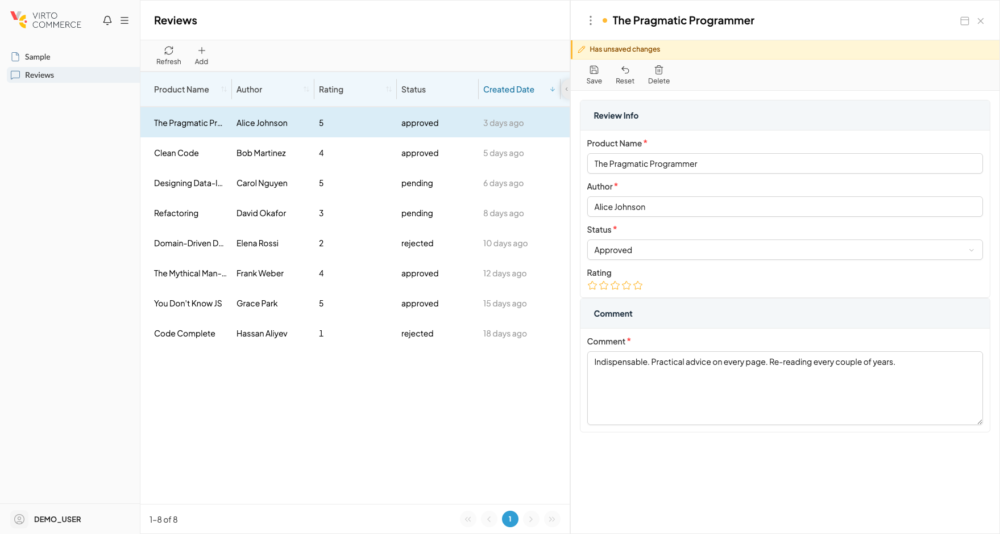

# Forms

A details blade in VC-Shell almost always wraps a form: the user opens a record, edits a few fields, and saves. Four concerns travel together with every such blade: per-field validation, "is the form dirty" tracking, a save button that gates on both, and a confirmation prompt when the user tries to close with unsaved changes. The framework's job is to make all four cohere with one composable instead of four hand-wired hooks.

The recommended cohesion point is `useBladeForm`. It owns the validation state from vee-validate, snapshots the data to compute "modified", drives the toolbar's save-button `disabled`, registers the unsaved-changes prompts on both blade close and browser unload, and stops anyone from accidentally leaving any one of those wires disconnected.

## The lifecycle

A standard edit flow has three transitions: load, edit, save. The composable maps to that exact shape.

```ts title="OrderDetails.vue"
import { useBladeForm } from "@vc-shell/framework";

const { item, loadItem, saveItem } = useOrderDetails();
const form = useBladeForm({ data: item });

onMounted(async () => {
  await loadItem({ id: param.value });
  form.setBaseline();
});

const toolbar = ref<IBladeToolbar[]>([
  {
    id: "save",
    title: "Save",
    icon: "lucide-save",
    disabled: computed(() => !form.canSave.value),
    async clickHandler() {
      await saveItem(item.value);
      form.setBaseline();
      callParent("reload");
    },
  },
]);
```

`setBaseline` is the only ceremony you need to remember. It says "the current `item.value` is the clean state". You call it once after loading, and once after every successful save. From that moment, every field edit is tracked as a divergence from the baseline, and `form.canSave` flips on as soon as the form is both valid and modified.

The framework surfaces the dirty state itself: an unsaved-changes banner appears at the top of the blade, the save toolbar button enables, and the close confirmation kicks in.

{: style="display: block; margin: 0 auto;" }

## Two flavors of "ready"

The composable distinguishes two ways a form can be considered ready to save:

| Method | Use it when |
| --- | --- |
| `setBaseline()` | Loading an existing entity, or sealing a successful save. The current data **is** the clean state. |
| `markReady()` | Creating a new entity that was pre-filled from somewhere else, for example, a new offer cloned from a product. The form should be saveable immediately, with current data considered modified relative to the setup-time snapshot. |

This distinction is what lets a blade say "this form was just opened on a fresh record but it already has unsaved meaningful data". Without it, the save button stays disabled until the user touches a field.

## Validation is per-field

Validation rules are declared inside the template on each `<Field>` from vee-validate. The composable reads the resulting form meta to compose `canSave`. Rules stay close to the inputs they validate, and there is no separate schema file to keep in sync.

```vue title="OrderDetails.vue"
<Field
  v-slot="{ errorMessage, handleChange, errors }"
  name="email"
  rules="required|email"
  :model-value="item.email"
>
  <VcInput
    v-model="item.email"
    :error="!!errors.length"
    :error-message="errorMessage"
    @update:model-value="handleChange"
  />
</Field>
```

For uncommon rules, register custom vee-validate validators at app startup. The framework does not impose a validation DSL; it consumes whatever vee-validate exposes.

## How VcBlade picks up the form state

`VcBlade` reads the form state directly from the composable, so you do not pass a `:modified` prop manually. The toolbar's save button binds to `form.canSave`; the unsaved-changes prompts on blade close and on tab close are wired by default and can be disabled per blade for read-only views.

- [useBladeForm reference.](../composables/forms/useBladeForm.md)
- [Validation plugin.](../plugins/validation.md)
- [Blade navigation.](blade-navigation.md)
