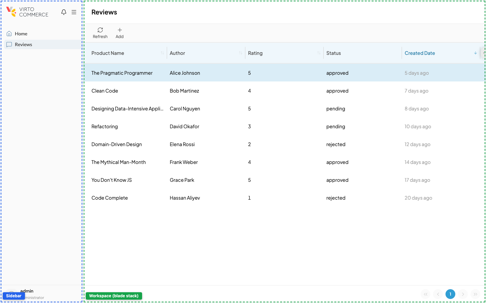
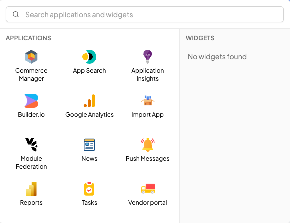
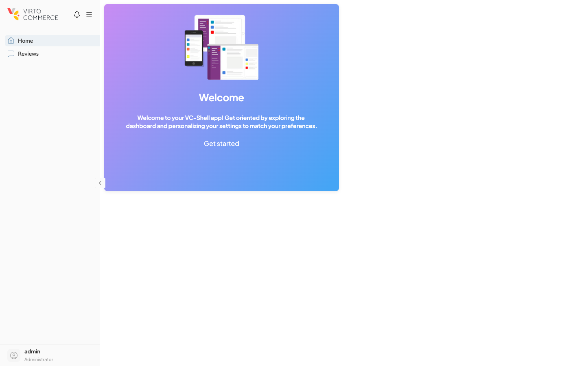
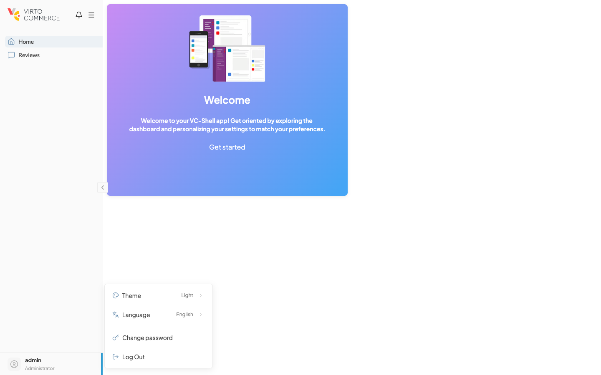
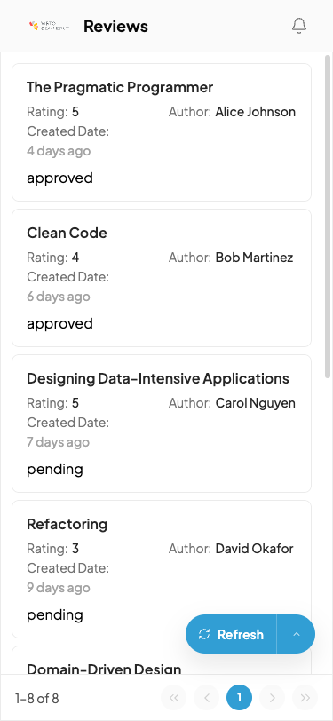

# Layout

VC-Shell ships a complete application chrome. Your app fills the regions; it does not redraw them.

The shell is composed by **VcApp**, which renders a desktop or mobile layout, a sidebar with menu, a top bar, and a workspace that hosts the blade stack. Apps customize the chrome by registering items through services such as `addMenuItem` and `registerDashboardWidget`, and by theming through CSS custom properties. You do not edit **VcApp** itself.

The shell separates structural layout from configurable content. The positions of the sidebar, top bar, and workspace stay constant, but their contents flow in from your bootstrap: menu entries, dashboard widgets, branding, and user-area buttons. Responsiveness is built in. **VcApp** swaps the internal desktop layout for the mobile layout based on viewport, and exposes the active state to every child component through `useResponsive`.

Theming flows through SCSS custom properties under **framework/assets/styles/theme/** and a Tailwind preset. Apps extend the framework Tailwind config and override CSS variables in their own stylesheet layer.

## The app chrome

The chrome combines a left sidebar (logo, app-bar trigger row, menu, user area) and a workspace that hosts the blade stack. The annotated view shows the regions in a running app:

{: style="display: block; margin: 0 auto;" }

- **Sidebar** (left, blue): logo and **app-bar** at the top (notification bell and the app-hub trigger button), then the menu driven by `addMenuItem`, then the user area at the bottom.
- **Workspace** (green): hosts the blade stack and the optional AI agent panel.

The **app hub** itself is not a visible region until the user opens it. Clicking the app-hub trigger button in the app-bar opens a popover panel anchored to it; the panel shows the apps grid and the registered widgets list. See [App hub](#app-hub) below.

**VcApp** renders the outer frame and provides a small set of named slots for the parts you can replace. Defaults exist for every slot, so most apps only set the props.

| Region | Default content | Slot |
| --- | --- | --- |
| Layout | Desktop or mobile shell with sidebar, top bar, and search. | `layout` |
| App hub | App switcher menu (when multiple apps are registered). | `app-hub` |
| Menu | Sidebar navigation list driven by `addMenuItem`. | `menu` |
| Sidebar header | Logo area. | `sidebar-header` |
| Sidebar footer | User avatar, name, role. | `sidebar-footer` |
| Workspace | Blade stack with optional AI agent panel. | `workspace` |

The default layout is picked automatically. `useResponsive` resolves `isDesktop` and `isMobile` from the viewport, and **VcApp** swaps between the desktop and mobile layouts on the fly. The workspace below the chrome hosts the blade navigation stack; the bootstrap arranges the wiring for you.

**VcApp** props in addition to branding (`logo`, `title`, `avatar`, `name`, `role`):

| Prop | Purpose |
| --- | --- |
| `isReady`. | Required. While `false`, **VcApp** renders a loader and skips chrome composition. Set it once the app has finished its bootstrap (modules loaded, user resolved). |
| `disableMenu`. | Hides the sidebar menu. Useful for fullscreen workflows. |
| `disableAppHub`. | Hides the app-switcher menu when only one app is registered. |
| `showSearch`. | Shows a global search input in the top bar. |
| `searchPlaceholder`. | Placeholder text for the search input. |
| `version`. | App version label, surfaced in the user-area UI. |

## Customizing the menu

Sidebar entries are added with the standalone `addMenuItem` function during bootstrap. Register them before the shell mounts; entries registered ahead of time flush into the menu once **VcApp** initializes. Use `bootstrap.ts` for cross-module menu items (shell-level entries that belong to no particular module).

```typescript title="bootstrap.ts"
import { App } from "vue";
import { addMenuItem } from "@vc-shell/framework";

export function bootstrap(app: App) {
  addMenuItem({
    title: "SHELL.MENU.DASHBOARD",
    icon: "lucide-home",
    priority: 0,
    url: "/",
  });
}
```

`priority` controls order; lower values appear higher in the list. Use `routeId` for items that resolve to a registered blade, or `url` for direct routes. Module-scoped menu entries usually come from `defineBlade({ menuItem })` on the blade itself, not from `addMenuItem`. To add or badge entries from inside a mounted component, use `useMenuService()` instead.

- [VcApp props, slots, and bootstrap contract.](../components/layout/vc-app.md)

- [Menu service API reference.](../composables/services/useMenuService.md)

## App hub

The app hub is a **popover panel** that opens from a trigger button in the app-bar (the small icon row at the top of the sidebar). The panel is the framework's cross-app surface; it has two sections side by side:

- **Applications** — an icon grid of every VC-Shell app the signed-in user is authorized for. Clicking an entry redirects the browser to that app's base URL.
- **Widgets** — a list of every widget registered through `useAppBarWidget()`. Clicking a widget either runs its `onClick` (for action widgets) or renders its `component` inline inside the popover with a back-arrow to return to the list (for component widgets). On mobile, the widget content flies out below the panel. See [Widgets](#widgets) below.

A search box at the top filters both sections at once.

{: style="display: block; margin: 0 auto;" }

The framework owns the popover and the apps query. At boot, `useAppHub` fetches the apps list from the Platform's `/api/platform/apps` endpoint and filters by per-app permission. You do not declare the apps in the app code itself — each app advertises its presence to the Platform through its host module's **module.manifest** (the `<apps>` element described in [Register an App in the Module Manifest](../../how-to-register-new-app.md)).

When only one app is registered, the trigger button still works but the Applications section is empty; the panel then shows just the widgets list. Pass `:disable-app-hub="true"` on **VcApp** to hide the trigger entirely, or use the `app-hub` named slot to substitute a custom switcher:

```vue title="src/pages/App.vue"
<VcApp :disable-app-hub="false">
  <!-- Override the entire app-hub popover with a custom component -->
  <template #app-hub="{ appsList, switchApp }">
    <MyCustomAppSwitcher :apps="appsList" @switch="switchApp" />
  </template>
</VcApp>
```

For apps that need to read or refresh the apps list themselves — for example, to log the current set on boot or to redirect on a custom event — `useAppHub` is exported from the framework:

```ts
import { useAppHub } from "@vc-shell/framework";

const { appsList, getApps, switchApp } = useAppHub();
await getApps();
```

`switchApp` performs the cross-app navigation and falls back to a permission-restricted toast when the user lacks the per-app permission.

- [Register an App in the Module Manifest.](../../how-to-register-new-app.md)

## Dashboard widgets

The dashboard view is a separate, ready-made page composed of registered widgets. The standalone scaffold mounts **DraggableDashboard** at the root route, which reads every widget from the dashboard service and renders it inside a Gridstack-powered grid.

{: style="display: block; margin: 0 auto;" }

```vue title="pages/Dashboard.vue"
<template>
  <DraggableDashboard />
</template>

<script lang="ts" setup>
import { DraggableDashboard } from "@vc-shell/framework";
</script>
```

You do not pass widgets through props. They flow in from `registerDashboardWidget` calls. Each module registers its own widgets from its **index.ts** next to `defineAppModule`, so the widget lives with the code it visualizes:

```ts title="src/modules/orders/index.ts"
import { defineAppModule, registerDashboardWidget } from "@vc-shell/framework";
import { markRaw } from "vue";
import OrdersDashboardCard from "./components/OrdersDashboardCard.vue";

registerDashboardWidget({
  id: "orders-widget",
  name: "Orders",
  component: markRaw(OrdersDashboardCard),
  size: { width: 6, height: 6 },
});

export default defineAppModule({ blades, locales });
```

The grid is 12 columns wide, so common widget widths are 3 (quarter), 4 (third), 6 (half), and 12 (full). The `position` you pass to `registerDashboardWidget` is the initial placement only. Once a user rearranges or resizes a widget, the new layout is persisted to localStorage and replayed on the next visit. Provide a "Reset layout" affordance through the component's exposed `useBuiltInPositions()` and `saveLayout()` methods if you want users to revert.

For visual consistency across widgets, wrap content in **DashboardWidgetCard**. The card supplies a header row, optional icon, loading state, and a small action area, so module widgets stay aligned with the framework look.

To filter widgets by role, set `permissions` on each registration. The dashboard service applies the same `usePermissions().hasAccess` check that gates menu items, so admins always see every widget and other users see only those they can access.

- [useDashboard API reference and recipes.](../composables/services/useDashboard.md)

## Widgets

Widgets are small interactive pieces that modules contribute to the shell — a sync status indicator, a language picker, a feature shortcut. In the default shell, they all live in the **Widgets** section of the [App hub](#app-hub) popover; the sidebar's app-bar itself only holds the notification bell and the app-hub trigger button.

Modules register a widget through `useAppBarWidget()`:

```typescript title="bootstrap.ts"
import { useAppBarWidget } from "@vc-shell/framework";
import { markRaw } from "vue";
import SyncStatusIndicator from "./components/SyncStatusIndicator.vue";

export function bootstrap() {
  const { register } = useAppBarWidget();

  register({
    id: "notifications",
    icon: "lucide-bell",
    title: "Notifications",
    order: 10,
    onClick: () => openNotifications(),
  });

  register({
    id: "sync-status",
    component: markRaw(SyncStatusIndicator),
    order: 1,
  });
}
```

Two registration shapes are supported:

- **Action widget** — pass `icon` plus `onClick`. The popover entry shows the icon and runs the handler when clicked.
- **Component widget** — pass a `component` (wrapped in `markRaw`). Clicking the popover entry expands the component inline inside the popover with a back-arrow to return to the list. On mobile, the content flies out below the panel.

Widgets are sorted by `order`; lower values render first. If the registering code runs before the service is provided, use the standalone `addAppBarWidget()` function instead — pre-registered items flush automatically when the shell bootstraps.

The `useAppBarWidget` name is a holdover from earlier versions of the shell, where these widgets rendered directly in the app-bar. Today the API name is the only place "app-bar" survives — the actual surface is the hub.

- [useAppBarWidget API reference.](../composables/services/useAppBarWidget.md)

## Settings menu

Clicking the user button at the bottom of the sidebar opens a settings popover with framework defaults (theme, language, change password, log out) and any entries modules registered through `useSettingsMenu()`.

{: style="display: block; margin: 0 auto;" }

The shell hosts a settings page with its own sidebar. Modules contribute entries to that sidebar through `useSettingsMenu()`; each entry points to a Vue component rendered in the settings workspace. Use it for module-level configuration that does not warrant a top-level menu item.

```typescript title="bootstrap.ts"
import { useSettingsMenu } from "@vc-shell/framework";
import { markRaw } from "vue";
import CatalogGeneralSettings from "./components/settings/CatalogGeneralSettings.vue";
import CatalogSeoSettings from "./components/settings/CatalogSeoSettings.vue";

export function bootstrap() {
  const { register } = useSettingsMenu();

  register({
    id: "catalog-general",
    title: "General",
    icon: "lucide-settings",
    component: markRaw(CatalogGeneralSettings),
    group: "Catalog",
    priority: 1,
  });

  register({
    id: "catalog-seo",
    title: "SEO Settings",
    icon: "lucide-search",
    component: markRaw(CatalogSeoSettings),
    group: "Catalog",
    priority: 2,
  });
}
```

`group` clusters related entries into a labeled section in the settings sidebar; `priority` orders entries within a group. Wrap component references in `markRaw` to keep Vue from making the definition reactive. Register entries conditionally if access depends on permissions; the service does not gate items by itself.

- [useSettingsMenu API reference.](../composables/services/useSettingsMenu.md)

## Theme and branding

Theming is driven by CSS custom properties scoped under `:root[data-theme="light"]` and `:root[data-theme="dark"]`. The framework ships full palettes for primary, secondary, accent, neutrals, plus state colors (warning, danger, success, info) and derived tokens for surfaces, shadows, overlays, and frosted glass.

```scss title="app.scss"
:root[data-theme="light"] {
  --primary-500: #0078d4;
  --primary-600: #006bbd;
  --app-background: var(--secondary-100);
}
```

Override variables in your own stylesheet layer rather than mutating framework files. Theme switching at runtime is wired through `useTheme`, which toggles the `data-theme` attribute on `:root` and persists the user choice.

Tailwind utilities are prefixed with `tw-` and inherit the framework preset. Extend the preset in your app's Tailwind config:

```typescript title="tailwind.config.ts"
import defaultConfig, { content } from "@vc-shell/framework/tailwind.config";

export default {
  prefix: "tw-",
  content: [...content, "./src/**/*.{vue,js,ts,jsx,tsx}"],
  theme: defaultConfig.theme,
};
```

Branding (logo, app title, user avatar) is passed as props to **VcApp**. The sidebar header and footer can be replaced entirely via named slots if the default layout is not enough.

## Mobile vs desktop

The shell ships separate internal layouts for desktop and mobile, selected automatically by `useResponsive`. The mobile layout collapses the sidebar behind a hamburger menu, renders blade content as a card list instead of a table, and condenses the blade toolbar into a floating action pill in the bottom-right corner:

{: style="display: block; margin: 0 auto; max-width: 300px;" }

Inside a blade or widget, read the same composable to swap content or interaction patterns:

```vue title="OrdersBlade.vue"
<script setup lang="ts">
import { useResponsive } from "@vc-shell/framework";

const { isMobile, isDesktop } = useResponsive();
</script>

<template>
  <VcBlade title="Orders">
    <div
      v-if="isDesktop"
      class="tw-flex tw-gap-4"
    >
      <OrdersTable />
      <OrdersSummary />
    </div>
    <OrdersTable v-else />
  </VcBlade>
</template>
```

For CSS-only responsive adjustments, prefer Tailwind breakpoint prefixes (`md:`, `lg:`) instead of JavaScript-driven conditionals. Reserve `useResponsive` for cases where the markup itself must differ, for example, collapsing a two-pane layout into a single stack or disabling drag-and-drop on touch devices.

- [useResponsive API reference.](../composables/ui-state/useResponsive.md)

## Common mistakes

!!! warning "Do not replace VcApp"
    The chrome is fixed by design. Customize through props, named slots, and services rather than forking **VcApp**. Replacing it bypasses the bootstrap that wires the menu service, sidebar state, blade stack, and notification store.

!!! warning "Forgetting markRaw on widget components"
    Dashboard widgets are stored in reactive registries. Wrap the component in `markRaw` when calling `registerDashboardWidget`, otherwise Vue makes the component definition reactive and console warnings flood the page.

!!! warning "Scoping theme overrides too narrowly"
    CSS custom properties propagate through inheritance. Declare overrides on `:root[data-theme="light"]` or `:root[data-theme="dark"]`, not on a single component selector. A scoped override changes one element but leaves nested shell pieces using framework defaults.
