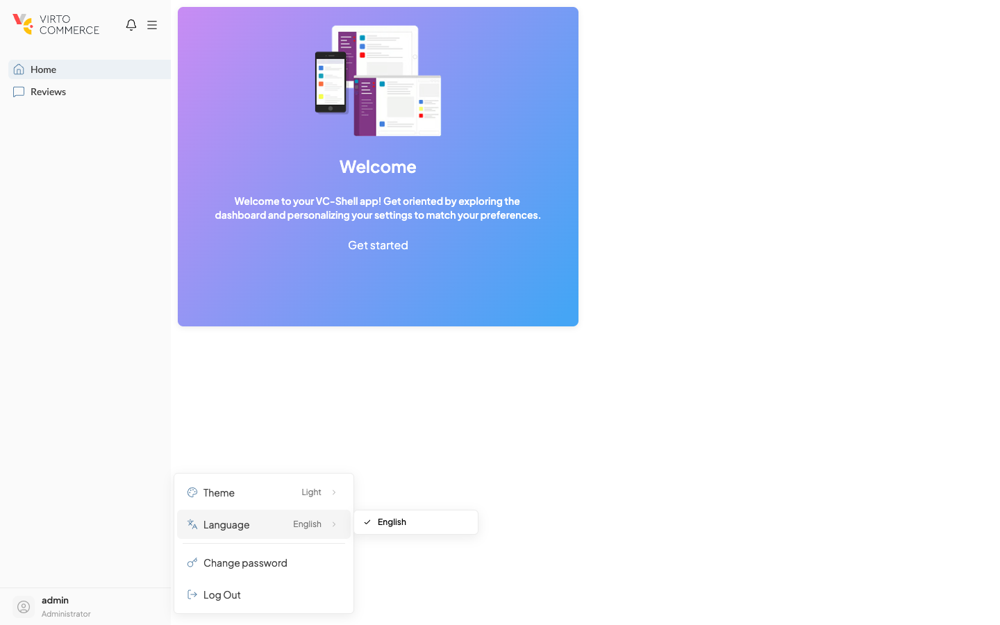

# Localization

Every module contributes translations to a single shared `vue-i18n` instance, so language switching propagates across the whole app in one step.

Modules do not own their i18n instance. Each module passes locale bundles to `defineAppModule({ locales })`, and the framework merges them into the running app per language code. Translation keys are nested JSON objects namespaced under the module's domain (`ORDERS.PAGES.LIST.TITLE`); the namespace prefix is what keeps two modules from overwriting each other's labels.

Runtime locale switching goes through `useLanguages()`. Calling `setLocale("de")` switches every translated label across the app, persists the choice so it survives a page reload, and reconfigures `vee-validate` error messages to match.

## Setting up locale bundles

A module keeps its translations in a `locales/` folder, one JSON file per language, plus an `index.ts` that re-exports them:

```text
src/modules/orders/locales/
├─ en.json
├─ de.json
└─ index.ts
```

```json title="src/modules/orders/locales/en.json"
{
  "ORDERS": {
    "MENU": { "TITLE": "Orders" },
    "PAGES": {
      "LIST": {
        "TITLE": "Orders list",
        "SEARCH_PLACEHOLDER": "Search by order number"
      },
      "DETAILS": {
        "TITLE": "Order details",
        "TABS": { "GENERAL": "General", "LINE_ITEMS": "Line items" }
      }
    }
  }
}
```

```ts title="src/modules/orders/locales/index.ts"
import * as en from "./en.json";
import * as de from "./de.json";
export { en, de };
```

```ts title="src/modules/orders/index.ts"
import { defineAppModule } from "@vc-shell/framework";
import * as blades from "./pages";
import * as locales from "./locales";

export default defineAppModule({ blades, locales });
```

The key shape is a free-form object tree; nesting is purely organizational. The framework uses `SCREAMING_SNAKE_CASE` by convention so that locale keys remain visually distinct from regular object access in templates.

## Namespacing

Every key in a module's bundle must sit under a single root that names the module. `ORDERS.PAGES.LIST.TITLE`, not `PAGES.LIST.TITLE`. Without a prefix, two modules that both ship a top-level `PAGES` object collide on shared sub-keys, and whichever installs later wins.

!!! warning "Namespace collisions are silent"
    Vue-i18n does not warn when a merge overwrites an existing key. A second module that declares `MENU.TITLE` simply replaces the first module's value, and the visible bug looks like "the wrong label". Prefix every key with the module domain to make this impossible.

!!! tip "Use the module name as the root key"
    Mirror the folder name: a module in `src/modules/orders/` owns the `ORDERS.*` namespace. Framework-level shared strings live under `COMMON.*` and `MESSAGES.*`, owned by the framework, not by any application module.

## Using translations

Because the i18n plugin sets `globalInjection: true`, `$t()` is available in every template without an import. In `<script setup>`, the same translation function is reached through `useI18n()`. Static blade properties consumed by `defineBlade` accept an i18n key, not a literal string, and the framework resolves it at render time.

```vue title="src/modules/orders/pages/OrdersList.vue"
<script setup lang="ts">
import { useI18n } from "vue-i18n";
import { VcBlade, VcDataTable, defineBlade } from "@vc-shell/framework";

defineBlade({
  name: "OrdersList",
  url: "/orders",
  isWorkspace: true,
  menuItem: { title: "ORDERS.MENU.TITLE", icon: "lucide-shopping-cart" },
});

const { t } = useI18n();
const greeting = t("ORDERS.COMMON.WELCOME", { name: "Maria" });
</script>

<template>
  <VcBlade :title="$t('ORDERS.PAGES.LIST.TITLE')">
    <VcDataTable :empty-text="$t('ORDERS.PAGES.LIST.SEARCH_PLACEHOLDER')" />
  </VcBlade>
</template>
```

For utilities, services, and other code that runs outside the component setup context, import the `i18n` singleton directly and use `i18n.global.t(...)`. Do not call `useI18n()` from non-component code.

- [i18n plugin reference for the full API.](../plugins/i18n.md)

## Switching the language at runtime

The shell ships a built-in language picker in the user-area Settings popover (Settings → **Language** opens a submenu of every locale a module has registered). End users switch without leaving the app:

{: style="display: block; margin: 0 auto; max-width: 540px;" }

`useLanguages()` exposes the current locale and a `setLocale` action programmatically. Calling `setLocale("de")` validates the input against the locales that have actually been registered, switches every translated label, and persists the choice so the next visit starts in the same language.

```vue
<script setup lang="ts">
import { useLanguages } from "@vc-shell/framework";

const { currentLocale, setLocale } = useLanguages();

function switchToGerman() {
  setLocale("de");
}
</script>

<template>
  <div>
    <span>Current locale: {{ currentLocale }}</span>
    <VcButton @click="switchToGerman">Deutsch</VcButton>
  </div>
</template>
```

If `setLocale` receives a tag no module has registered a bundle for, it falls back to `"en"` rather than throwing. Add new languages by shipping the bundle through `defineAppModule({ locales })` first, then the locale tag becomes selectable.

- [useLanguages composable reference.](../composables/user/useLanguages.md)

## Pluralization and formatting

Vue-i18n's pipe syntax handles plural forms inside a single key. The framework forwards the message untouched, so the standard `vue-i18n` rules apply:

```json title="src/modules/orders/locales/en.json"
{
  "ORDERS": {
    "PAGES": {
      "LIST": {
        "COUNT": "no orders | one order | {count} orders"
      }
    }
  }
}
```

```vue
<template>
  <span>{{ $t("ORDERS.PAGES.LIST.COUNT", orders.length, { count: orders.length }) }}</span>
</template>
```

Interpolation uses `{name}` placeholders resolved from the second argument. For number and date formatting, configure `numberFormats` and `datetimeFormats` on the i18n options. Module authors do not own those options directly; if a module needs a custom format, surface a feature request rather than mutating `i18n.global` ad hoc.

## Common mistakes

!!! warning "Missing namespace"
    Keys declared at the root level (`MENU.TITLE`, `PAGES.LIST.TITLE`) collide with every other module. Always wrap module keys in `MODULE_NAME.*`.

!!! warning "Hard-coded strings in `defineBlade`"
    `menuItem: { title: "Orders" }` ships a literal label; the menu service has no key to reresolve when the locale changes. Pass an i18n key (`"ORDERS.MENU.TITLE"`) and let the framework translate.

!!! warning "Forgetting to re-export a language from `locales/index.ts`"
    The file in `locales/de.json` exists, but `index.ts` only re-exports `en`. The German bundle never reaches the running app, and `setLocale("de")` falls back to `"en"`.

!!! warning "Fallback locale set but its bundle never loaded"
    Setting `APP_I18N_LOCALE=fr` in `.env` without providing a French bundle from any module leaves the app rendering raw keys (`MODULE.PAGE.LABEL`) wherever French was expected. Either ship the bundle or change the default.

!!! warning "Creating a local i18n instance"
    Calling `createI18n` inside a module gives you a private translator that the rest of the app cannot see. Other modules' strings disappear and `setLocale` has no effect on it. Use the framework's instance via `useI18n()`.
