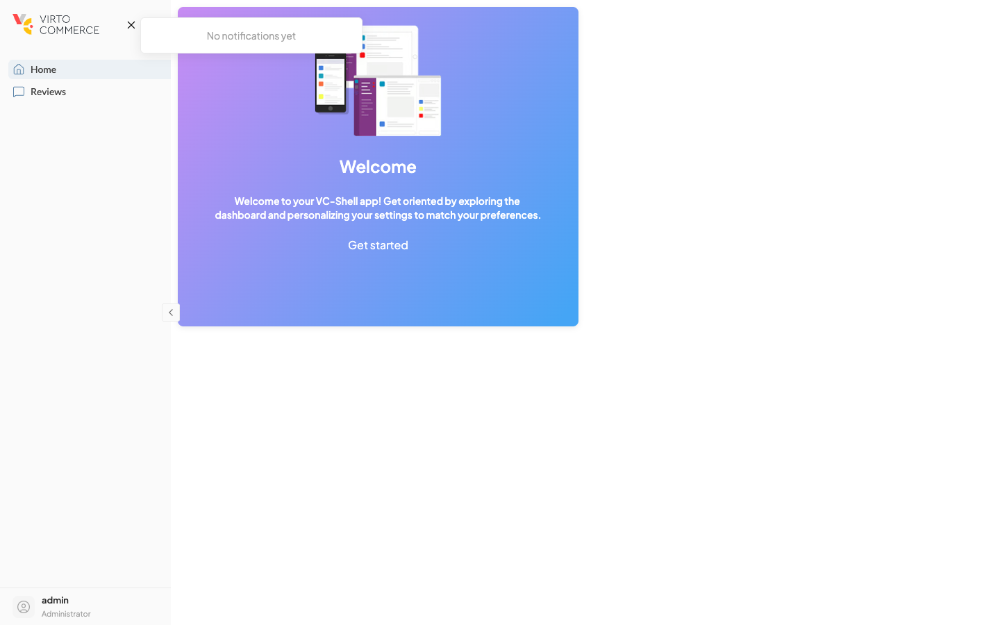

# Notifications

A VC-Shell app receives real-time push notifications from the Virto Commerce Platform: order placed, export completed, indexation progress, system alerts. The framework provides a single, unified pipeline for ingesting these events, showing toasts, persisting history, and letting individual blades react to events that matter to them.

The mental model is two-level. **Level 1** is module-wide and always-on: a notification type is registered once at module install time with a toast configuration, and every matching event automatically pops a toast and lands in the dropdown history. **Level 2** is blade-scoped: a blade subscribes to a list of types and runs a callback when one arrives, automatically cleaning up when the blade unmounts. The two levels coexist on the same event stream.

The notification bell in the sidebar app-bar opens a dropdown that lists past events grouped chronologically. A fresh app shows the empty state until the first event arrives:

{: style="display: block; margin: 0 auto; max-width: 540px;" }

## Three surfaces, three APIs

"Notification" covers three different things in VC-Shell. They are independent, often confused, and each has its own entry point. Pick the right surface up front.

| Surface | What it is | API |
| --- | --- | --- |
| In-app toast | Ephemeral feedback for a local action: "Order saved", "Validation failed". Not connected to the SignalR stream and does not appear in the bell dropdown. | `notification(message, opts)` and the typed shortcuts `notification.success / .error / .warning`, plus `notification.update(id, ...)` for progress. |
| Push notification | Real-time event broadcast by the Platform via SignalR. Renders as both a toast and a dropdown entry per the type's Level 1 config. Subscribable from blades via `useBladeNotifications`. | `defineAppModule({ notifications })` to register types, `useBladeNotifications` to react inside blades, `useBroadcastFilter` to gate broadcasts. |
| Confirmation popup | Synchronous modal asking the user to confirm a destructive action. Not a toast and not a push event. | `usePopup().showConfirmation(message)`. Covered in [forms guide](../guides/forms/index.md). |

The rest of this concept page covers the push pipeline. The in-app toast helper lives in `@vc-shell/framework` as the `notification` singleton — see the [cookbook recipe](../guides/cookbook/index.md#display-a-success-toast-after-save); the confirmation popup belongs to the form/close-guard story.

## Where events come from

The platform pushes events over a SignalR hub. The framework owns the connection, deserializes each message into a `PushNotification`, and feeds it into a singleton store. By the time a notification reaches your code, it is a plain reactive object you can read or filter without thinking about transport.

### Broadcast vs targeted

The hub delivers messages through two channels:

- **Targeted** (`Send`) — addressed to one user. The Platform side decides the recipient; you receive only messages meant for the signed-in user. Always accepted.
- **Broadcast** (`SendSystemEvents`) — sent to every connected client. By default, every broadcast lands in every user's history. This is the right default for system-wide alerts (indexation, deployment) but the wrong default for tenant-scoped events.

The broadcast filter lets a multi-tenant app keep only the broadcasts it cares about. Install it once at bootstrap (typically in `App.vue`'s `onMounted`):

```ts title="src/pages/App.vue"
import { useBroadcastFilter, useUser } from "@vc-shell/framework";
import { onMounted } from "vue";

const { user } = useUser();
const { setBroadcastFilter } = useBroadcastFilter();

onMounted(() => {
  setBroadcastFilter((msg) => msg.creator === user.value?.userName);
});
```

There is one filter slot per app; calling `setBroadcastFilter` again replaces it. Targeted messages bypass the filter entirely.

- [useBroadcastFilter reference.](../composables/notifications/useBroadcastFilter.md)

## Registering a notification type

Notification types are strings shared between the platform and the app. Each type is registered through the `notifications` option on `defineAppModule`, mapping the type name to its toast config and optional Vue template.

```ts title="src/modules/orders/index.ts"
import { defineAppModule } from "@vc-shell/framework";
import * as pages from "./pages";
import * as locales from "./locales";
import OrderCreatedTemplate from "./notifications/OrderCreatedDomainEvent.vue";

export default defineAppModule({
  blades: pages,
  locales,
  notifications: {
    OrderCreatedDomainEvent: {
      template: OrderCreatedTemplate,
      toast: { mode: "auto", severity: "info", timeout: 5000 },
    },
  },
});
```

Three toast modes cover the common shapes:

| Mode | Use it for |
| --- | --- |
| `auto` | A single, fire-and-forget toast that times out by severity. |
| `progress` | A long-running task that updates one toast as it advances. |
| `silent` | Persist the event in history but show no toast. Use this when a blade renders its own progress UI through `useBladeNotifications` and you do not want the auto-toast competing with it. |

### Custom templates

The `template` option supplies a Vue component that renders the notification in the dropdown row and the toast (both surfaces use the same component). Inside the template, read the current payload through [`useNotificationContext`](../composables/notifications/useNotificationContext.md) with the type generic that matches the type's extra fields:

```vue title="src/modules/orders/notifications/OrderCreatedDomainEvent.vue"
<script lang="ts" setup>
import { PushNotification, NotificationTemplate, useNotificationContext, useBlade } from "@vc-shell/framework";
import { computed } from "vue";

interface IOrderPush extends PushNotification {
  orderId?: string;
  total?: number;
}

const ctx = useNotificationContext<IOrderPush>();
const notification = computed(() => ctx.value);

const { openBlade } = useBlade();
function onClick() {
  if (notification.value.orderId) {
    openBlade({ name: "OrderDetails", param: notification.value.orderId });
  }
}
</script>

<template>
  <NotificationTemplate :title="notification.title ?? ''" :notification="notification" @click="onClick">
    <p v-if="notification.total">Order total: ${{ notification.total }}</p>
  </NotificationTemplate>
</template>
```

Templates are optional. Without one, the framework renders a default chrome using `title` and `description`.

## Reacting inside a blade

When a specific blade needs to refresh, switch state, or highlight a record in response to a notification, it subscribes through `useBladeNotifications`. The subscription is bound to the blade's effect scope and disappears the moment the blade closes.

```ts title="OrderDetails.vue"
import { useBladeNotifications } from "@vc-shell/framework";

const { messages, unreadCount, markAsRead } = useBladeNotifications({
  types: ["OrderStatusChanged"],
  filter: (msg) => msg.orderId === currentOrderId.value,
  onMessage: () => reloadOrder(),
});
```

The blade decides what "react" means. It can reload, toggle a flag, display an inline badge through `messages`, or mark the message as read once handled. The same notification can fan out to several blades simultaneously, each filtering for the slice it owns.

## Where notifications live in the app

The framework provides the notification dropdown, the unread badge, and the toasts. As an app developer you do not assemble these surfaces. You only decide which types exist, how they look in a toast, and which blades subscribe to which slice. A few advanced cases (tests that ingest synthetic messages, a custom shell that replaces the bell dropdown) drop down to [`useNotificationStore`](../composables/notifications/useNotificationStore.md) — but the facades cover everyday work.

- [Notifications plugin reference.](../plugins/notifications.md)
- [useBladeNotifications composable.](../composables/notifications/useBladeNotifications.md)
- [useBroadcastFilter composable.](../composables/notifications/useBroadcastFilter.md)
- [useNotificationContext composable.](../composables/notifications/useNotificationContext.md)
- [useNotificationStore composable](../composables/notifications/useNotificationStore.md) — advanced escape hatch.
- [Permissions model.](permissions-model.md)
