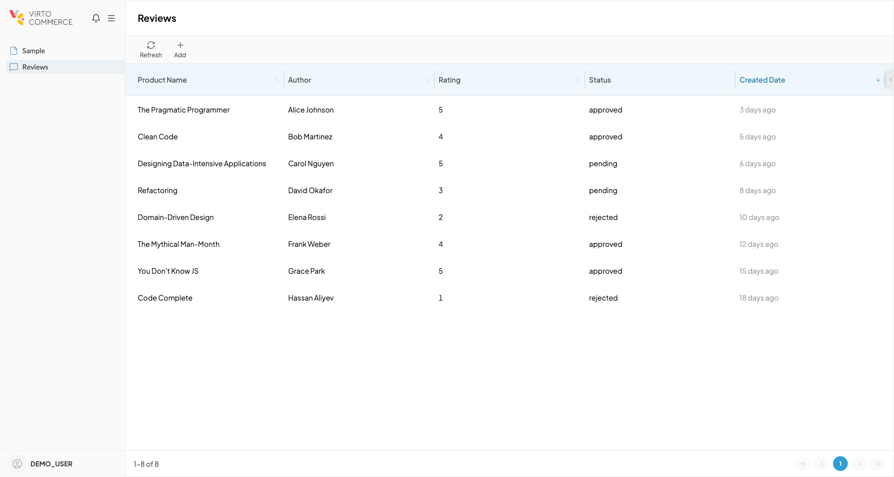
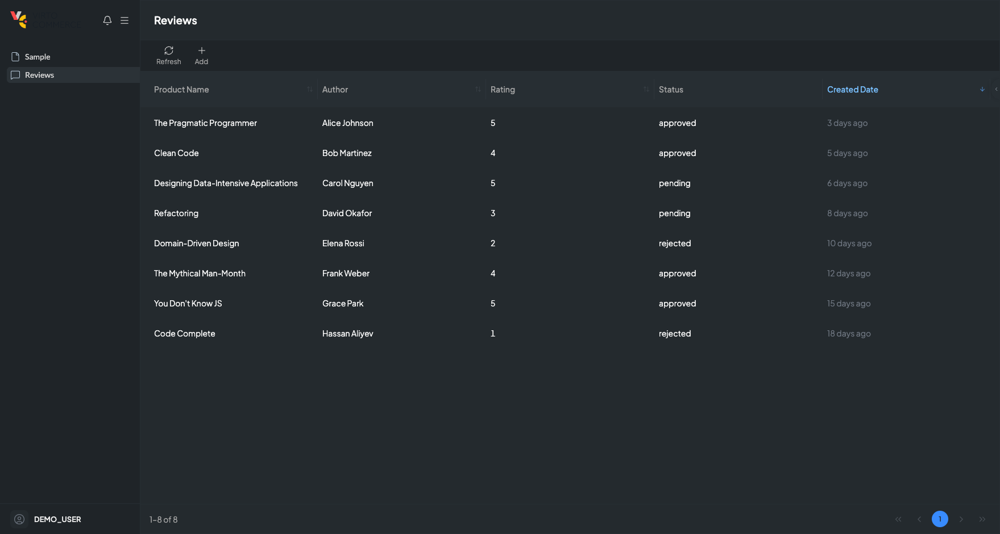

# Theming

A VC-Shell app is themed through three layers that work together: CSS custom properties that define a palette, a Tailwind preset that maps those properties into utility classes, and a runtime switcher that swaps the active theme on demand. The split keeps the visual system small (one palette, one preset) while letting an app or a module add as many themes as it needs.

Out of the box, every app ships with a `light` theme. Anything else is opt-in.

## Three layers, one palette

Color tokens live as CSS custom properties on the root element, scoped under a `data-theme` attribute. Switching `data-theme` between values like `light` and `dark` swaps every token at once. The Tailwind preset references those tokens through `var(--primary-500)` and similar, so utility classes like `bg-primary-500` follow the theme automatically.

```scss title="src/styles/themes.scss"
[data-theme="light"] {
  --primary-500: #2563eb;
  --bg-surface: #ffffff;
}

[data-theme="dark"] {
  --primary-500: #60a5fa;
  --bg-surface: #0f172a;
}
```

Custom components do not need to declare per-theme styles. They consume the token, and theming becomes a property of where the component renders, not how it is written. The same blade rendered under each value of `data-theme` reads identically in code but looks like two different products.

<div class="grid cards" markdown>

{: style="display: block; margin: 0 auto;" }
{: style="display: block; margin: 0 auto;" }

</div>

## Switching themes at runtime

The framework owns the switching through `useTheme`. The composable registers themes, lists the available ones, switches between them by key, and persists the choice in `localStorage` so it survives page reloads.

```ts title="theme-picker.vue"
import { useTheme } from "@vc-shell/framework";

const { themes, currentThemeKey, setTheme, next } = useTheme();
```

`next` cycles through registered themes for a one-button toggle. `setTheme(key)` jumps directly. The active key is reflected on `<html data-theme="...">` and is read by every consumer of the palette without further wiring.

## A module that ships its own theme

A module can register additional themes during its install hook. The framework keeps registrations in a global registry, deduplicates by key, and supports unregistration when the module is unloaded through Module Federation.

```ts title="modules/accessibility/index.ts"
import { useTheme } from "@vc-shell/framework";

export default {
  install() {
    const { register } = useTheme();
    register([
      { key: "high-contrast", localizationKey: "ACCESSIBILITY.THEMES.HIGH_CONTRAST" },
    ]);
  },
};
```

The matching CSS scoped under `[data-theme="high-contrast"]` ships with the module. Removing the module removes its theme registration and its styles together.

## What lives where

| Concern | Where it lives |
| --- | --- |
| Color tokens for a theme. | An SCSS file in the app or in a module under `[data-theme="<key>"]`. |
| Theme registration. | `useTheme().register(...)` at app boot or in a module's install. |
| Active theme. | A reactive ref on the composable; mirrored as `data-theme` on `<html>`. |
| Persistence. | `localStorage` under `vueuse-color-scheme`, handled by the composable. |

- [useTheme reference.](../composables/ui-state/useTheme.md)
- [Layout concept.](layout.md)
