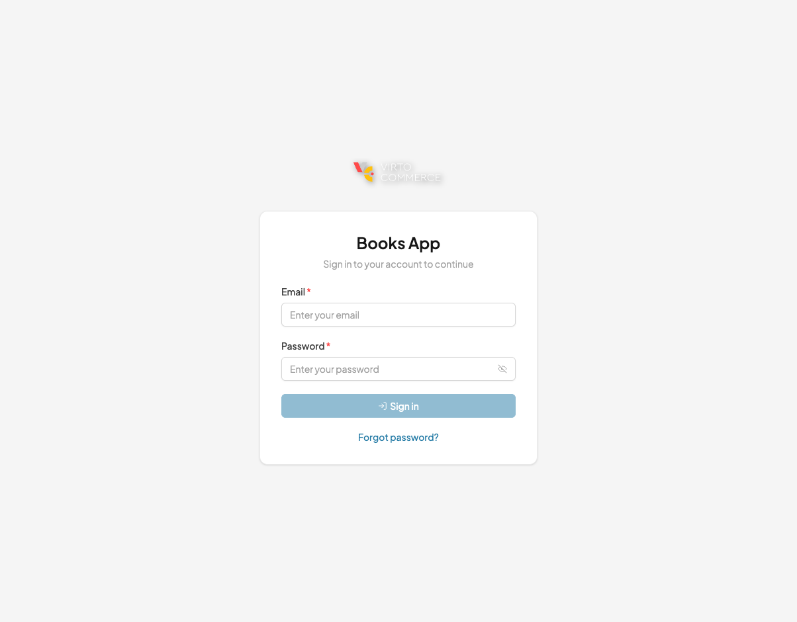
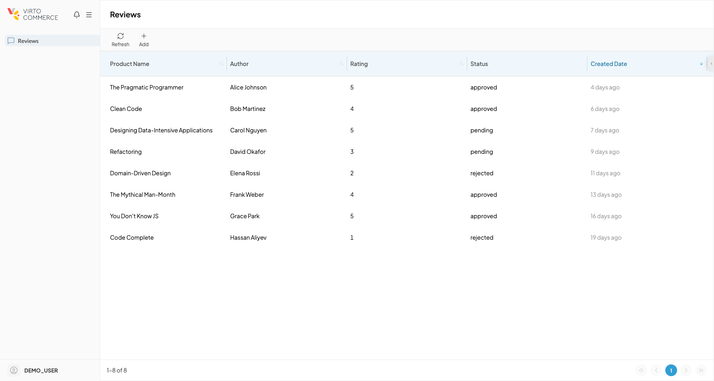
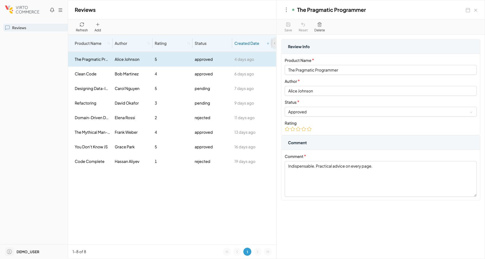
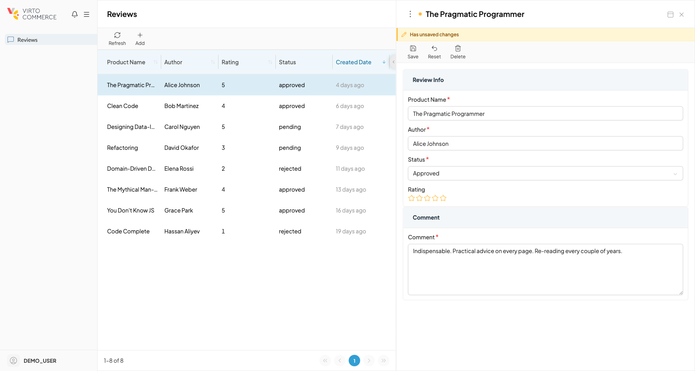

# Tutorial: Your First VC-Shell Module

In this tutorial you will use the AI-assisted `vc-app` skill to generate a complete VC-Shell app with a real ecommerce module (product reviews) — scaffold and module in a single command — then explore the running result. By the end you will have a working list-and-details flow built around an entity you decide on, not a prebuilt sample.

You will work against mock data, so no Virto Commerce Platform instance is required. The promotion path to a real Platform API is the last section.

## Prerequisites

Before starting, make sure you have:

- Node.js 22 or higher and Yarn installed.
- Familiarity with Vue 3 single-file components and the Composition API.
- A code editor with Vue and TypeScript support.
- Claude Code with the `vc-app` skill installed. See [Install the vc-app skill](install-vc-app-skill.md).

## 1. Generate the app and module

Create an empty folder for the project and open Claude Code in it. From an empty folder, the `/vc-app design` command scaffolds the standalone app **and** generates modules from your description in one pass. It detects that no `package.json` exists, runs the scaffold, then generates each module before installing dependencies.

```
/vc-app design "Books app: manage product reviews with rating, author, comment, and approval status"
```

The skill parses the prompt into an application plan, asks for confirmation, then runs the equivalent of `npx @vc-shell/create-vc-app` followed by `/vc-app generate` for each module. When it asks for the platform URL, you can skip — we are staying in mock mode for this tutorial.

After about a minute, the project is ready: scaffold installed, the **reviews** module wired into `src/modules/index.ts` and `src/main.ts`, type-checking green.

!!! tip "Two-step alternative"
    If you prefer to scaffold first and add the module later — useful when you want to inspect the empty project before generating anything — run `npx @vc-shell/create-vc-app@latest books-app --type standalone` and `yarn install` first, then `cd books-app` and call `/vc-app generate` interactively. The skill walks through four prompts (description, module name, blade types, menu config). The two-step path produces the same result as the one-shot `/vc-app design` above. Pinning `@latest` on the npx command avoids running an older cached CLI that uses different flag names.

We deliberately do not pass `--mocks` to the scaffold. The `--mocks` flag adds a sample products module that ships with the framework — useful as a reference for module patterns, but we are building our own module instead. The sample stays available in the [framework source](https://github.com/VirtoCommerce/vc-shell) when you want a second example to compare against.

## 2. Generated output

The skill reports a summary similar to this:

```text
Module "reviews" generated successfully!

Files created:
  src/modules/reviews/index.ts
  src/modules/reviews/pages/reviews-list.vue
  src/modules/reviews/pages/reviews-details.vue
  src/modules/reviews/composables/useReviews/index.ts
  src/modules/reviews/composables/useReview/index.ts
  src/modules/reviews/composables/index.ts
  src/modules/reviews/locales/en.json
  src/modules/reviews/locales/index.ts
  src/modules/reviews/pages/index.ts
  src/modules/reviews/.vc-app-prototype.json

The module has been registered in src/modules/index.ts.
Type checking passed with no errors.
```

The skill also patches **src/main.ts** so the new module is installed alongside the framework plugin. No manual wiring is needed.

## 3. Tour of what you got

Open **src/modules/reviews/index.ts**:

```ts title="src/modules/reviews/index.ts"
import * as blades from "./pages";
import * as locales from "./locales";
import { defineAppModule } from "@vc-shell/framework";

export default defineAppModule({
  blades,
  locales,
});

export * from "./pages";
export * from "./composables";
```

`defineAppModule` is the framework's module factory. It collects every exported blade component, every locale bundle, and ships them as one unit.

The module layout follows the standard VC-Shell shape:

```text
src/modules/reviews/
├─ index.ts                  defineAppModule({ blades, locales }).
├─ pages/                    Blade components.
│  ├─ reviews-list.vue       Workspace blade with the data table.
│  ├─ reviews-details.vue    Child blade with the edit form.
│  └─ index.ts               Re-exports the blade components.
├─ composables/              Module-scoped composables.
│  ├─ useReviews/            Plural composable for the list (search, pagination).
│  ├─ useReview/             Singular composable for one record (get, save, delete).
│  └─ index.ts               Re-exports both composables.
├─ locales/                  Translation bundles.
│  ├─ en.json                Keys under REVIEWS.*.
│  └─ index.ts               Bundle entry.
└─ .vc-app-prototype.json    Metadata used by /vc-app promote later.
```

The `.vc-app-prototype.json` marker is what lets `/vc-app promote` later replace the mock composables with real API clients without touching your blade templates or locales.

## 4. Run the app and find your module

The `/vc-app design` command scaffolded the project into a `books-app/` subfolder and installed dependencies. Move into it and start the dev server:

```bash
cd books-app
yarn serve
```

Vite prints a local URL such as **https://localhost:8080/apps/books-app/**. Open it in a browser.

{: style="display: block; margin: 0 auto;" }

The scaffold runs in a built-in demo mode whenever `APP_PLATFORM_URL` is not set. The login form accepts any credentials and routes you straight into the shell with a synthetic `DEMO_USER` session. Type anything into email and password, click **Sign in**, and the app loads with the **Reviews** entry visible in the left navigation.

{: style="display: block; margin: 0 auto;" }

Click **Reviews**. The list workspace blade opens with eight mock reviews.

{: style="display: block; margin: 0 auto;" }

Try the toolbar:

- The **Refresh** button reloads the table.
- The **Add** button opens an empty details blade for a new review.
- Click any column header to sort. Clicking the **Status** badge filters by value.

Open **src/modules/reviews/pages/reviews-list.vue** and find the toolbar binding:

```vue title="src/modules/reviews/pages/reviews-list.vue"
<VcBlade
  :title="title"
  width="50%"
  :toolbar-items="bladeToolbar"
>
```

The toolbar is a plain `ref<IBladeToolbar[]>` passed via the `toolbar-items` prop. This is the recommended toolbar pattern in VC-Shell. Edit the array, add or remove an entry, save the file. Vite hot-reloads and your change appears immediately.

## 5. Open a record's details

Click any row in the list. A second blade slides in from the right with a form prefilled with the row's data.

{: style="display: block; margin: 0 auto;" }

This is the blade navigation model in action: the list blade is the parent, the details blade is the child, and both stay visible side by side. The framework keeps an active item highlighted in the list while the details blade is open.

Look at the click handler in the parent:

```ts title="src/modules/reviews/pages/reviews-list.vue"
const onItemClick = (event: { data: { id?: string } }) => {
  openBlade({
    name: "ReviewsDetails",
    param: event.data.id,
    options: { item: event.data },
    onOpen() {
      selectedItemId.value = event.data.id;
    },
    onClose() {
      selectedItemId.value = undefined;
    },
  });
};
```

`openBlade` pushes a new blade onto the navigation stack by name. The `param` value is read on the child side through `useBlade().param`, which is what triggers the details blade to fetch the matching record from `useReview`.

## 6. Save a record

In the details blade, edit the **Comment** field. Notice the yellow **Has unsaved changes** banner appearing at the top, and the **Save** button in the toolbar becoming enabled the moment the form is dirty.

{: style="display: block; margin: 0 auto;" }

Click **Save**. The mock layer logs the saved payload to the console and the unsaved-changes state clears.

This loop is the core write path. Open **src/modules/reviews/pages/reviews-details.vue** and read the save toolbar entry:

```ts title="src/modules/reviews/pages/reviews-details.vue"
{
  id: "save",
  icon: "lucide-save",
  title: t("REVIEWS.PAGES.DETAILS.TOOLBAR.SAVE"),
  async clickHandler() {
    await updateReview(entity.value);
    callParent("reload");
    closeSelf();
  },
  disabled: computed(() => !canSave.value),
},
```

Three pieces coordinate this flow:

- `updateReview` from `useReview` calls the mock update function and resets the modification tracker.
- `callParent("reload")` invokes the `reload` function the list exposed through `exposeToChildren`.
- `closeSelf` pops the details blade off the stack.

Try editing a field and then clicking the close icon without saving. A confirmation prompt asks whether to discard changes. That prompt comes from the form lifecycle wired by `useBladeForm` under the hood.

## 7. Add a column

Time to extend the module. You will add a **Comment** column to the list to see at a glance what each reviewer wrote.

First, add the i18n key. Open **src/modules/reviews/locales/en.json** and add a header entry under `REVIEWS.PAGES.LIST.TABLE.HEADER`:

```json title="src/modules/reviews/locales/en.json"
"HEADER": {
  "PRODUCT_NAME": "Product Name",
  "AUTHOR": "Author",
  "RATING": "Rating",
  "STATUS": "Status",
  "CREATED_DATE": "Created Date",
  "COMMENT": "Comment"
}
```

Then declare the column in the list blade. Open **src/modules/reviews/pages/reviews-list.vue** and add a `<VcColumn>` slot before the closing `</VcDataTable>`:

```vue title="src/modules/reviews/pages/reviews-list.vue"
<VcColumn
  id="comment"
  :title="t('REVIEWS.PAGES.LIST.TABLE.HEADER.COMMENT')"
/>
```

Save the file. Vite reloads. The data table now shows a **Comment** column with values pulled directly from the `comment` field on each row. If the column does not appear immediately, open the column picker on the right edge of the header row and toggle it on; the picker uses `state-key="reviews_list"` on the table to persist visibility per blade.

## 8. What you have learned

In about thirty minutes you have:

- Scaffolded a VC-Shell standalone app without any sample modules.
- Generated a real ecommerce module (Reviews) end to end through the `vc-app` skill.
- Identified the parts of a module: `defineAppModule`, blades, composables, locales, prototype metadata.
- Read a list workspace blade with a data table, a toolbar bound through `:toolbar-items`, and search and pagination wired to a `useReviews` composable.
- Read a details blade with a form, an unsaved-changes banner, a save flow that calls back to the parent via `callParent`, and an unsaved-changes guard at close time.
- Added a column end to end across data, locales, and template.

The mental model to take to your next module: **a module is one or more blade pairs plus composables that own the data; blades render shells, composables run the work, and the framework coordinates navigation, locales, popups, and persistence around them.**

## Next steps

When you are ready to connect this module to a real backend, follow the promotion path:

1. [Connect to Platform](connect-to-platform.md) — point the app at a Virto Commerce Platform instance and generate typed API clients with `/vc-app connect`.
2. [Promote a prototype to API](promote-prototype-to-api.md) — replace the mock composables with the real API client through `/vc-app promote reviews`, preserving the blades and locales you just built.

For deeper reading on the underlying model:

- [Modules](../concepts/modules.md) — what an app module is and how the framework loads it.
- [Blade navigation](../concepts/blade-navigation.md) — how list and details blades coordinate as a stack.
- [Forms](../concepts/forms.md) — how `useBladeForm` ties validation, modification tracking, and the save guard together.
- [Sample module reference](https://github.com/VirtoCommerce/vc-shell/tree/main/cli/create-vc-app/src/templates/sample-module) — the canonical reference module shipped with `--mocks`, useful as a second example of the same patterns.
